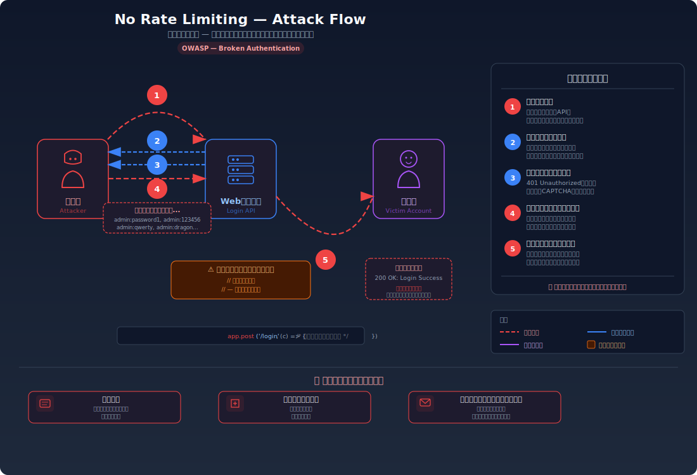
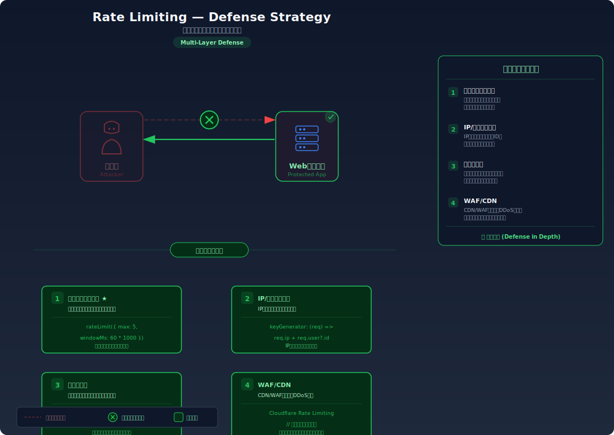

# Missing Rate Limiting — APIにレート制限がなくブルートフォース攻撃が可能

> ログイン試行やAPI呼び出しに回数制限がなく、攻撃者が辞書攻撃やブルートフォースでパスワードを突破できてしまう問題です。

---

## 対象ラボ

| 項目 | 内容 |
|------|------|
| **概要** | ログインAPIに回数制限がなく、攻撃者がパスワード辞書を使って無制限にログイン試行を繰り返せる |
| **攻撃例** | ログインAPIに辞書攻撃スクリプトを実行し、正しいパスワードを発見する |
| **技術スタック** | Hono API |
| **難易度** | ★☆☆ 入門 |
| **前提知識** | HTTPリクエストの基本、ブルートフォース攻撃の概念 |

---

## この脆弱性を理解するための前提

### 認証APIの通常の仕組み

Webアプリケーションのログイン処理は、以下の流れで動作する:

1. ユーザーがログインフォームにユーザー名とパスワードを入力する
2. クライアントがサーバーの認証APIにPOSTリクエストを送信する
3. サーバーがデータベースからユーザー情報を取得し、パスワードのハッシュを検証する
4. 一致すればJWTトークン等を返し、不一致であればエラーを返す

```
POST /api/labs/rate-limiting/vulnerable/login
Content-Type: application/json

{ "username": "admin", "password": "candidate_password" }

→ 200 OK + トークン: パスワードが正しい
→ 401 Unauthorized: パスワードが違う
```

通常のシステムでは、一定回数以上の認証失敗が検知された場合に試行を制限する。これにより、自動化ツールによる大量の試行が実用的でなくなる。

### どこに脆弱性が生まれるのか

問題は、認証エンドポイントに以下の3つの防御が**すべて欠如**している場合に発生する:

1. **試行回数の制限がない** -- 1秒に何千回でもリクエストを送信できる
2. **遅延の導入がない** -- 失敗しても次の試行に待ち時間が発生しない
3. **アカウントロックがない** -- 何百回失敗してもアカウントが凍結されない

```typescript
// ⚠️ レート制限なし — 1秒間に何千回でも試行可能
app.post("/login", async (c) => {
  const { username, password } = await c.req.json();
  const user = await db.query(
    "SELECT * FROM users WHERE username = $1",
    [username]
  );
  if (user && await verify(password, user.hash)) {
    return c.json({ token: generateToken(user) });
  }
  // ⚠️ 失敗しても何も記録しない。次のリクエストも同じように処理する
  return c.json({ error: "Invalid credentials" }, 401);
});
```

このコードは認証ロジック自体は正しいが、サーバーが「同じ送信元から短時間に大量のリクエストが来ている」という異常を一切検知しない。攻撃者は1秒に数百〜数千回のパスワード候補を試行でき、辞書に含まれるパスワードであれば短時間で突破される。

例えば、10,000語のパスワード辞書を毎秒100回の速度で試行した場合、わずか100秒（約1分40秒）で全候補を試し終える。

---

## 攻撃の仕組み



### 攻撃のシナリオ

1. **攻撃者** がターゲットのユーザー名を特定する

   公開プロフィール、ログインフォームのエラーメッセージ（「ユーザーが存在しません」と「パスワードが違います」を区別して返す場合）、または過去のデータ漏洩から、有効なユーザー名を収集する。管理者アカウントは `admin`、`administrator` 等の推測しやすい名前が使われていることが多い。

2. **攻撃者** が辞書ファイル（rockyou.txt等）からパスワードを順に試行する

   過去のデータ漏洩事件で流出したパスワードリスト（rockyou.txt には約1,400万エントリ）を用意し、自動化スクリプトや Hydra、Burp Suite Intruder 等のツールで認証APIに連続リクエストを送信する。

   ```bash
   # 辞書ファイルの各行をパスワード候補として順に送信
   while read password; do
     response=$(curl -s -o /dev/null -w "%{http_code}" \
       -X POST http://target/api/labs/rate-limiting/vulnerable/login \
       -H "Content-Type: application/json" \
       -d "{\"username\":\"admin\",\"password\":\"$password\"}")
     if [ "$response" = "200" ]; then
       echo "[+] パスワード発見: $password"
       break
     fi
   done < dictionary.txt
   ```

3. **サーバー** が全リクエストを制限なく処理する

   レート制限が存在しないため、1回目の試行も10,000回目の試行もまったく同じように処理される。サーバーは失敗回数を記録せず、アカウントをロックせず、応答遅延も導入しない。攻撃者のリクエストと正規ユーザーのリクエストを区別する手段がない。

4. **攻撃者** が正しいパスワードがヒットした時点でログインに成功する

   `password123`、`admin123`、`letmein` のような一般的に使われるパスワードは辞書の上位に含まれているため、数秒〜数分で発見される。

5. **被害者** のアカウントに不正アクセスされる

   攻撃者は取得したトークンを使って被害者になりすまし、個人情報の閲覧、データの改ざん、さらなる権限昇格を行う。

### なぜ成功するのか

| 条件 | 説明 |
|------|------|
| レート制限がない | 1秒に何百回でもログイン試行が可能。攻撃速度に一切の制約がない |
| アカウントロックがない | 連続失敗してもアカウントが一時停止されないため、攻撃を中断させる仕組みがない |
| 遅延の導入がない | 失敗後も即座に次の試行が可能で、攻撃者の効率が下がらない |
| 弱いパスワードの使用 | `123456`、`password`、`admin123` 等のよく使われるパスワードは辞書の上位にあり、短時間で発見される |

### 被害の範囲

- **機密性**: 攻撃者が正規ユーザーとしてログインし、個人情報や機密データにアクセスできる。管理者アカウントが突破された場合、全ユーザーのデータが漏洩するリスクがある
- **完全性**: 乗っ取ったアカウントでデータの改ざん、投稿の編集・削除、パスワードの変更が可能になる。攻撃者がパスワードを変更すると、正規ユーザーはアカウントへのアクセスを完全に失う
- **可用性**: 大量のログイン試行によりサーバーに過度な負荷がかかり、正規ユーザーのログインが遅延・失敗する。また、アカウント乗っ取りによりサービスが利用不能になる

---

## 対策



### 根本原因

認証エンドポイントにおいて、**リクエストの頻度と回数に制約がない**ことが根本原因。サーバーが「同一IPアドレスまたは同一アカウントに対して、短時間に異常な回数の認証リクエストが来ている」という状況を検知・遮断する仕組みを持っていない。

### 安全な実装

IPベースのレート制限（1分あたり5回まで）、アカウントロック、段階的遅延（Exponential Backoff）の3つを組み合わせて実装する。

レート制限により攻撃者の試行速度が大幅に制限される。例えば「1分間に5回まで」の制限を設けた場合、10,000語の辞書を試すのに約33時間かかり、攻撃が現実的でなくなる。さらにアカウントロックを組み合わせることで、IPアドレスを切り替えながら攻撃する場合にも対応できる。

```typescript
// ✅ IPベースレート制限 + アカウントロック + 段階的遅延
const ipAttempts = new Map<string, { count: number; lastAttempt: number }>();
const accountLocks = new Map<string, { count: number; lockedUntil: number }>();

app.post("/login", async (c) => {
  const ip = c.req.header("x-forwarded-for") || "unknown";
  const { username, password } = await c.req.json();

  // ✅ IPベースのレート制限: 1分間に5回まで
  const ipRecord = ipAttempts.get(ip);
  if (
    ipRecord &&
    ipRecord.count >= 5 &&
    Date.now() - ipRecord.lastAttempt < 60 * 1000
  ) {
    return c.json(
      { error: "試行回数の上限に達しました。1分後に再試行してください" },
      429
    );
  }

  // ✅ アカウントロック: 10回失敗で15分間ロック
  const lockRecord = accountLocks.get(username);
  if (lockRecord && lockRecord.lockedUntil > Date.now()) {
    const remaining = Math.ceil(
      (lockRecord.lockedUntil - Date.now()) / 60000
    );
    return c.json(
      { error: `アカウントがロックされています。${remaining}分後に再試行してください` },
      423
    );
  }

  // ✅ 段階的遅延: 失敗回数に応じて応答を遅延させる
  const failCount = lockRecord?.count || 0;
  if (failCount > 0) {
    const delay = Math.min(1000 * Math.pow(2, failCount - 1), 30000);
    await new Promise((resolve) => setTimeout(resolve, delay));
  }

  const user = await db.query(
    "SELECT * FROM users WHERE username = $1",
    [username]
  );

  if (user && (await verify(password, user.hash))) {
    // ✅ 成功時にカウントをリセット
    ipAttempts.delete(ip);
    accountLocks.delete(username);
    return c.json({ token: generateToken(user) });
  }

  // ✅ 失敗を記録
  const currentIp = ipAttempts.get(ip) || { count: 0, lastAttempt: 0 };
  ipAttempts.set(ip, {
    count: currentIp.count + 1,
    lastAttempt: Date.now(),
  });

  const currentAccount = accountLocks.get(username) || {
    count: 0,
    lockedUntil: 0,
  };
  const newCount = currentAccount.count + 1;
  accountLocks.set(username, {
    count: newCount,
    // 10回失敗で15分間ロック
    lockedUntil: newCount >= 10 ? Date.now() + 15 * 60 * 1000 : 0,
  });

  return c.json({ error: "Invalid credentials" }, 401);
});
```

**なぜ安全か**: 3つの防御層が攻撃を多角的に阻止する。IPベースのレート制限は攻撃速度を大幅に低下させ、アカウントロックはIP変更による回避を防ぎ、段階的遅延は失敗するたびに応答時間を倍増させて攻撃効率をさらに下げる。

#### 脆弱 vs 安全: コード比較

```diff
+ const ipAttempts = new Map<string, { count: number; lastAttempt: number }>();
+ const accountLocks = new Map<string, { count: number; lockedUntil: number }>();

  app.post("/login", async (c) => {
+   const ip = c.req.header("x-forwarded-for") || "unknown";
    const { username, password } = await c.req.json();

+   // IPベースのレート制限チェック
+   const ipRecord = ipAttempts.get(ip);
+   if (ipRecord && ipRecord.count >= 5 &&
+       Date.now() - ipRecord.lastAttempt < 60 * 1000) {
+     return c.json({ error: "試行回数の上限です" }, 429);
+   }
+
+   // アカウントロックチェック
+   const lockRecord = accountLocks.get(username);
+   if (lockRecord && lockRecord.lockedUntil > Date.now()) {
+     return c.json({ error: "アカウントがロックされています" }, 423);
+   }

    const user = await db.query("SELECT * FROM users WHERE username = $1", [username]);
    if (user && await verify(password, user.hash)) {
+     ipAttempts.delete(ip);        // 成功時にIPカウントをリセット
+     accountLocks.delete(username); // 成功時にロックをリセット
      return c.json({ token: generateToken(user) });
    }

+   // 失敗を記録（IP + アカウント）
+   const currentIp = ipAttempts.get(ip) || { count: 0, lastAttempt: 0 };
+   ipAttempts.set(ip, { count: currentIp.count + 1, lastAttempt: Date.now() });
+   const currentAccount = accountLocks.get(username) || { count: 0, lockedUntil: 0 };
+   const newCount = currentAccount.count + 1;
+   accountLocks.set(username, {
+     count: newCount,
+     lockedUntil: newCount >= 10 ? Date.now() + 15 * 60 * 1000 : 0,
+   });

    return c.json({ error: "Invalid credentials" }, 401);
  });
```

脆弱なコードでは認証の成功/失敗に関わらず次のリクエストをそのまま受け付ける。安全なコードでは、IPアドレスごとの試行回数とアカウントごとの失敗回数を追跡し、閾値を超えた場合にHTTP 429（Too Many Requests）または 423（Locked）でリクエストを拒否する。

### その他の防御策

| 対策 | 種類 | 説明 |
|------|------|------|
| IPベースレート制限 | 根本対策 | IPアドレスごとの試行回数を制限する。最も基本的で必須の対策 |
| アカウントロック | 根本対策 | 同一アカウントへの連続失敗でアカウントを一時停止する。IPを変えた分散攻撃にも対応できる |
| 段階的遅延 (Exponential Backoff) | 多層防御 | 失敗するたびに応答時間を指数的に増やし（1秒→2秒→4秒→...）、攻撃速度を大幅に低下させる |
| CAPTCHA | 多層防御 | reCAPTCHA等で自動化ツールによる試行を防ぐ。数回の失敗後に表示することでUXへの影響を最小化できる |
| 多要素認証 (MFA) | 多層防御 | パスワードが突破されても第二要素（TOTP、SMS等）で不正ログインを阻止する最終防衛線 |
| ログイン試行のログ記録・アラート | 検知 | 異常な量のログイン失敗をリアルタイムで検知し、セキュリティチームにアラートを発する |
| WAF (Web Application Firewall) | 多層防御 | ネットワーク層で異常なリクエストパターンを検知・ブロックし、アプリケーションに到達する前に遮断する |

---

## ハンズオン手順

### Step 1: 脆弱バージョンで攻撃を体験

**ゴール**: レート制限がない状態で、パスワード辞書による総当たりが成功することを確認する

1. 開発サーバーを起動する

   ```bash
   cd backend && pnpm dev
   ```

2. まず誤ったパスワードで連続してログインを試みる

   ```bash
   # 間違ったパスワードを10回連続で送信 — 全て受け付けられることを確認
   for pw in wrong1 wrong2 wrong3 wrong4 wrong5 wrong6 wrong7 wrong8 wrong9 wrong10; do
     curl -s -X POST http://localhost:3000/api/labs/rate-limiting/vulnerable/login \
       -H "Content-Type: application/json" \
       -d "{\"username\": \"admin\", \"password\": \"$pw\"}"
     echo
   done
   ```

3. 結果を確認する

   - 10回連続で失敗しても、すべて同じ `401` レスポンスが返される
   - ロック、遅延、CAPTCHAなどのペナルティは一切発生しない
   - **この結果が意味すること**: 攻撃者は好きなだけ試行を繰り返せる状態

4. 辞書攻撃で正しいパスワードを見つける

   ```bash
   # 小さな辞書で総当たり攻撃を実行
   for pw in password 123456 admin admin123 letmein qwerty; do
     result=$(curl -s -X POST http://localhost:3000/api/labs/rate-limiting/vulnerable/login \
       -H "Content-Type: application/json" \
       -d "{\"username\": \"admin\", \"password\": \"$pw\"}")
     echo "パスワード: $pw → $result"
     echo "$result" | grep -q "token" && echo "[+] ログイン成功!" && break
   done
   ```

5. 結果を確認する

   - 辞書に含まれるパスワードでログインが成功する
   - わずか数回の試行で正しいパスワードが発見された
   - 全試行が数秒以内に完了した（制限がないため）

### Step 2: 安全バージョンで防御を確認

**ゴール**: 同じ攻撃がレート制限・アカウントロックにより阻止されることを確認する

1. 安全なエンドポイントに対して同じ連続試行を実行する

   ```bash
   # 安全なエンドポイントに連続試行
   for pw in wrong1 wrong2 wrong3 wrong4 wrong5 wrong6; do
     result=$(curl -s -X POST http://localhost:3000/api/labs/rate-limiting/secure/login \
       -H "Content-Type: application/json" \
       -d "{\"username\": \"admin\", \"password\": \"$pw\"}")
     echo "試行: $pw → $result"
   done
   ```

2. 結果を確認する

   - 5回目の失敗後、6回目以降は `429 Too Many Requests` が返される
   - レスポンスに「試行回数の上限に達しました」というメッセージが表示される
   - 正しいパスワードを含む試行も、レート制限中はブロックされる

3. 段階的遅延の効果を観察する

   - 失敗回数が増えるにつれ、レスポンスの応答時間が長くなることを確認する
   - DevToolsのNetworkタブでリクエストの所要時間を比較する

4. コードの差分を確認する

   - `backend/src/labs/step07-design/rate-limiting.ts` の脆弱版と安全版を比較する
   - **どの行が違いを生んでいるか** に注目: IP追跡、失敗回数の記録、閾値チェック

### 確認ポイント

以下を自分の言葉で説明できれば、このラボは完了です:

- [ ] レート制限がない場合、辞書攻撃にかかる時間はどの程度か（辞書サイズと試行速度の関係）
- [ ] IPベースのレート制限だけでは不十分な場合があるのはなぜか（分散攻撃、プロキシ）
- [ ] アカウントロックには副作用があるか（正規ユーザーのロックアウト = DoS攻撃への転用）
- [ ] 段階的遅延（Exponential Backoff）が攻撃速度をどの程度低下させるか
- [ ] レート制限と多要素認証（MFA）を組み合わせるべき理由

---

## 実装メモ

| 項目 | パス |
|------|------|
| 脆弱エンドポイント | `/api/labs/rate-limiting/vulnerable/login` |
| 安全エンドポイント | `/api/labs/rate-limiting/secure/login` |
| バックエンド | `backend/src/labs/step07-design/rate-limiting.ts` |
| フロントエンド | `frontend/src/features/step07-design/pages/RateLimiting.tsx` |

- 脆弱版: ログイン失敗を一切記録せず、リクエスト回数に制限を設けない
- 安全版: IPごとの試行回数を `Map` で追跡し、1分間に5回を超えた場合に 429 を返す。さらにアカウント単位で10回失敗すると15分間ロック（423）する
- 段階的遅延: 失敗回数に応じて `Math.pow(2, failCount - 1)` 秒（最大30秒）の遅延を挿入
- 本番環境では `Map` の代わりに Redis 等の外部ストアを使用し、複数サーバーインスタンス間でレート制限状態を共有する

---

## 現実世界での事例

| 年 | インシデント | 概要 |
|----|-------------|------|
| 2014 | iCloud セレブリティ写真流出 (Celebgate) | iCloudの「Find My iPhone」APIにレート制限がなく、攻撃者がブルートフォースでセレブリティのApple IDパスワードを突破した。プライベート写真が大量に流出し、Appleはその後APIにレート制限を追加した |
| 2016 | Uber API不正利用 | UberのAPIにレート制限が不十分で、攻撃者が大量のAPIリクエストを送信してドライバーや乗客の個人情報を収集した。APIの設計上の欠陥が不正なデータ収集を可能にした |

---

## 関連ラボ

| ラボ | 関連性 |
|------|--------|
| [推測可能なパスワードリセット](password-reset.md) | パスワードリセットトークンが推測可能な場合、レート制限がなければトークンの総当たりによりパスワードリセットを乗っ取れる |
| [ビジネスロジックの欠陥](business-logic.md) | レート制限の欠如はビジネスロジック上の設計ミスの一種であり、クーポンの無制限適用等と同様に「回数制限すべき処理を制限していない」問題 |

---

## 参考資料

- [OWASP - Blocking Brute Force Attacks](https://owasp.org/www-community/controls/Blocking_Brute_Force_Attacks)
- [CWE-307: Improper Restriction of Excessive Authentication Attempts](https://cwe.mitre.org/data/definitions/307.html)
- [OWASP - Rate Limiting](https://owasp.org/www-community/controls/Rate_Limiting)
- [OWASP - Credential Stuffing Prevention](https://cheatsheetseries.owasp.org/cheatsheets/Credential_Stuffing_Prevention_Cheat_Sheet.html)
