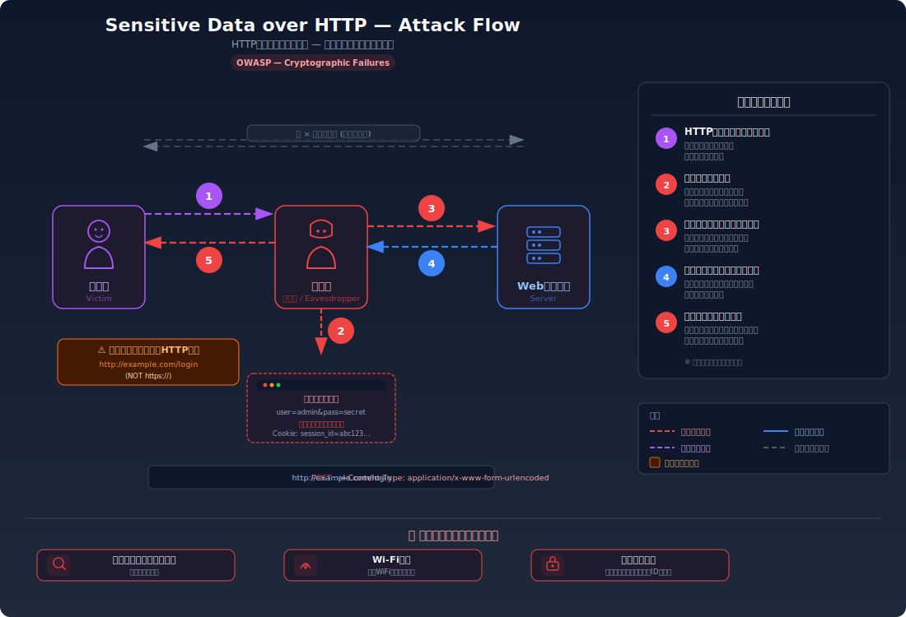
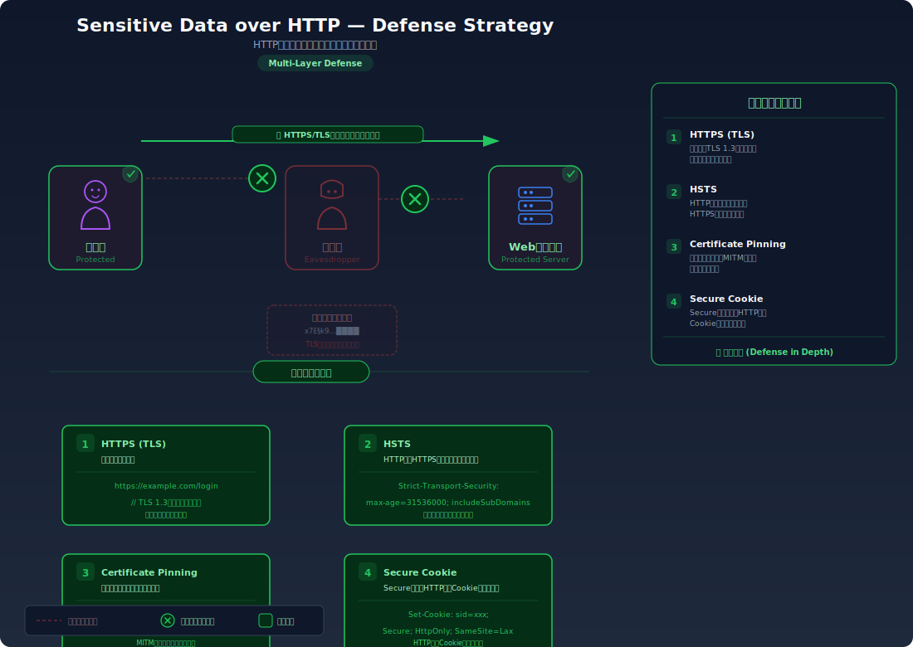

# Sensitive Data Exposure over HTTP — 暗号化されていないHTTP通信で機密データが平文で流れる

> ログインフォームがHTTPで送信され、パスワードやセッション情報が平文でネットワーク上を流れるため、盗聴により漏洩する問題です。

---

## 対象ラボ

| 項目 | 内容 |
|------|------|
| **概要** | ログインフォームが HTTP で送信され、パスワードが平文でネットワーク上を流れる |
| **攻撃例** | ブラウザの DevTools Network タブで通信内容を確認し、パスワードが平文で送信されていることを観察する |
| **技術スタック** | React フォーム + Hono API |
| **難易度** | ★☆☆ 入門 (概念の確認) |
| **前提知識** | HTTP vs HTTPS の違い、TLS/SSL の基本概念 |

---

## この脆弱性を理解するための前提

### HTTP と HTTPS の通信の仕組み

ブラウザがサーバーにデータを送信するとき、HTTP と HTTPS では通信の保護レベルが根本的に異なる。

**HTTP (HyperText Transfer Protocol)** は、リクエストとレスポンスのデータをそのまま平文（プレーンテキスト）でネットワーク上に送信する。ブラウザとサーバーの間を流れるすべてのデータ --- URL、ヘッダー、リクエストボディ（フォームデータを含む）--- が暗号化されずに転送される。

```
POST /api/login HTTP/1.1
Host: example.com
Content-Type: application/x-www-form-urlencoded

username=alice&password=my-secret-password123
↑ パスワードがそのままネットワーク上を流れる
```

**HTTPS (HTTP over TLS)** は、HTTP の通信を TLS (Transport Layer Security) プロトコルで暗号化する。ブラウザとサーバーの間で TLS ハンドシェイクを行い、共通鍵を確立した上で通信する。第三者がネットワーク上のパケットを傍受しても、暗号化されたデータしか見えない。

```
ネットワーク上を流れるデータ（TLS暗号化後）:
17 03 03 00 9a 2b 1f 4e c8 a3 ...（暗号化されたバイナリデータ）
↑ パスワードを含む通信内容は一切読み取れない
```

ブラウザのアドレスバーに鍵マークが表示されていれば HTTPS で通信している。鍵マークがない、または「保護されていない通信」と表示される場合は HTTP（平文通信）である。

### どこに脆弱性が生まれるのか

フォームの送信先（`action` 属性）が `http://` で始まるURLに設定されている場合、ユーザーが入力したパスワードや個人情報がネットワーク上を平文で流れる。特にログインフォームや決済フォームでこれが起きると、認証情報や金融情報が傍受される危険がある。

```html
<!-- ⚠️ HTTPでフォーム送信 — パスワードが平文でネットワーク上を流れる -->
<form action="http://example.com/api/login" method="POST">
  <input name="username" type="text" />
  <input name="password" type="password" />
  <button type="submit">ログイン</button>
</form>
```

`type="password"` はブラウザの画面上で入力を隠すだけであり、ネットワーク通信には一切影響しない。HTTP で送信されれば、パスワードは平文でそのままネットワークを流れる。

さらに、ログイン後のセッション Cookie も HTTP で送信されると、Cookie の値が平文で見えるため、セッションハイジャックが可能になる。

```
GET /api/profile HTTP/1.1
Host: example.com
Cookie: session_id=abc123def456
↑ セッションIDも平文で流れる — 傍受すれば被害者になりすませる
```

---

## 攻撃の仕組み



### 攻撃のシナリオ

1. **被害者** が HTTP のログインフォームにユーザー名とパスワードを入力し、送信する

   被害者はカフェや空港などの公衆 Wi-Fi に接続してWebサービスを利用する。ログインページが `http://` で提供されているため、フォームデータは暗号化されずにネットワークに送出される。

   ```
   POST /api/login HTTP/1.1
   Host: example.com
   Content-Type: application/json

   {"username": "alice", "password": "my-secret-password123"}
   ```

2. **攻撃者**（同一ネットワーク上）がネットワークパケットを傍受する

   攻撃者は同じ Wi-Fi ネットワークに接続し、パケットキャプチャツール（Wireshark、tcpdump 等）やARP スプーフィングツールを使って、ネットワーク上を流れる HTTP 通信を傍受する。HTTP は平文通信のため、特別な解読は不要で、キャプチャしたパケットの中身をそのまま読み取れる。

   ```
   # 攻撃者が Wireshark で傍受した内容
   Frame 1234: POST /api/login
   Content-Type: application/json

   {"username": "alice", "password": "my-secret-password123"}
   ↑ パスワードがそのまま表示される
   ```

3. **攻撃者** がパスワードを平文で取得する

   HTTP 通信は暗号化されていないため、攻撃者はリクエストボディからユーザー名とパスワードをそのまま読み取れる。`type="password"` による画面上のマスク表示はネットワーク通信には一切影響しない。

4. **攻撃者** がセッション Cookie も取得する

   ログイン成功後、サーバーが返すセッション Cookie（`Set-Cookie` ヘッダー）や、以降のリクエストで送信される Cookie も HTTP では平文で流れる。攻撃者はセッション ID を傍受し、被害者としてサイトにアクセスできる。

   ```
   # サーバーからのレスポンス（攻撃者が傍受）
   HTTP/1.1 200 OK
   Set-Cookie: session_id=abc123def456; Path=/

   # 以降のリクエスト（攻撃者が傍受）
   GET /api/profile HTTP/1.1
   Cookie: session_id=abc123def456
   ```

5. **攻撃者** が取得した認証情報でログインする

   攻撃者は窃取したパスワードで直接ログインするか、セッション ID を使って被害者になりすます。パスワードを取得した場合は他のサービスでもパスワードリスト攻撃（credential stuffing）に利用できる。

### なぜ成功するのか

| 条件 | 説明 |
|------|------|
| HTTP（平文通信）の使用 | フォーム送信先が `http://` であり、TLS による暗号化が行われないため、通信内容がそのまま読み取れる |
| 同一ネットワークへのアクセス | 攻撃者が被害者と同じネットワーク（公衆 Wi-Fi 等）に接続しているか、通信経路上にいる |
| HSTS 未設定 | `Strict-Transport-Security` ヘッダーが未設定のため、ブラウザが HTTP でのアクセスを許容する |
| Cookie に Secure 属性なし | セッション Cookie に `Secure` 属性が設定されていないため、HTTP 通信でも Cookie が送信される |

### 被害の範囲

- **機密性**: パスワード、セッション ID、個人情報（メールアドレス、住所、クレジットカード番号等）が平文で漏洩する。パスワードが他のサービスでも使い回されている場合、芋づる式に複数のアカウントが侵害される
- **完全性**: 攻撃者が窃取した認証情報でログインし、アカウント設定の変更、データの改ざん、不正な操作を行える。中間者攻撃（MITM）では通信内容を改ざんし、偽のレスポンスを被害者に返すことも可能
- **可用性**: 攻撃者がパスワードを変更してアカウントを乗っ取ると、被害者はサービスを利用できなくなる

---

## 対策



### 根本原因

通信が暗号化されていないこと。HTTP はデータを平文で送受信する設計であり、ネットワーク上の第三者が通信内容を読み取れることが根本的な問題。認証情報やセッション情報を扱う通信は、TLS による暗号化（HTTPS）が必須。

### 安全な実装

HTTPS を強制し、HTTP でのアクセスを HTTPS にリダイレクトする。さらに HSTS ヘッダーを設定してブラウザに HTTPS の使用を記憶させ、Cookie には `Secure` 属性を設定して HTTPS 通信時のみ送信されるようにする。

```typescript
// ✅ HTTPS リダイレクト — HTTP でのアクセスを強制的に HTTPS へ転送
// TLS で暗号化されるため、ネットワーク上でパスワードが読み取れなくなる
app.use("*", async (c, next) => {
  // X-Forwarded-Proto はリバースプロキシが設定するヘッダー
  const proto = c.req.header("x-forwarded-proto");
  if (proto === "http") {
    const url = new URL(c.req.url);
    url.protocol = "https:";
    return c.redirect(url.toString(), 301);
  }
  await next();
});

// ✅ HSTS ヘッダー — ブラウザに「今後は HTTPS のみ使用」と指示
// max-age=31536000 は1年間。一度設定されると、ブラウザが自動的に HTTPS を使用する
app.use("*", async (c, next) => {
  await next();
  c.header("Strict-Transport-Security", "max-age=31536000; includeSubDomains");
});

// ✅ Secure Cookie — HTTPS 通信時のみ Cookie を送信
// HTTP で通信した場合、ブラウザは Cookie を送信しないため、傍受されても Cookie は漏れない
setCookie(c, "session_id", sessionId, {
  path: "/",
  httpOnly: true,
  secure: true,       // HTTPS のみ送信
  sameSite: "Strict",
});
```

**なぜ安全か**: HTTPS では TLS ハンドシェイクによりブラウザとサーバー間で暗号鍵が確立され、以降のすべての通信が暗号化される。攻撃者がネットワークパケットを傍受しても、暗号化されたバイナリデータしか得られず、パスワードやセッション ID を読み取ることはできない。HSTS により、ユーザーが `http://` で URL を入力しても、ブラウザが自動的に `https://` に変換してからリクエストを送信する。

#### 脆弱 vs 安全: コード比較

```diff
  <!-- フォームの送信先 -->
- <form action="http://example.com/api/login" method="POST">
+ <form action="https://example.com/api/login" method="POST">
    <input name="password" type="password" />
  </form>
```

```diff
  // レスポンスヘッダー
  app.use("*", async (c, next) => {
    await next();
+   c.header("Strict-Transport-Security", "max-age=31536000; includeSubDomains");
  });
```

```diff
  // Cookie の設定
  setCookie(c, "session_id", sessionId, {
    path: "/",
-   // Secure 属性なし → HTTP でも Cookie が送信される
+   secure: true,       // HTTPS 通信時のみ Cookie を送信
+   httpOnly: true,     // JavaScript からアクセス不可
+   sameSite: "Strict", // クロスサイトリクエストで送信しない
  });
```

フォーム送信先を `https://` に変更することで通信が TLS で暗号化される。HSTS ヘッダーにより HTTP でのアクセス自体がブラウザレベルで防止され、`Secure` Cookie により万が一 HTTP 通信が発生しても Cookie が送信されない。

### その他の防御策

| 対策 | 種類 | 説明 |
|------|------|------|
| HTTPS の強制（TLS 暗号化） | 根本対策 | すべての通信を HTTPS で行い、HTTP でのアクセスは 301 リダイレクトで HTTPS に転送する。これが最も重要かつ必須の対策 |
| HSTS ヘッダー | 根本対策 | `Strict-Transport-Security` ヘッダーを設定し、ブラウザに HTTPS の使用を強制する。初回アクセス後は HTTP での通信を完全に防止できる |
| `Secure` Cookie 属性 | 多層防御 | Cookie に `Secure` 属性を設定し、HTTPS 通信時のみ送信する。HTTP へのダウングレード攻撃から Cookie を保護する |
| HSTS Preload | 多層防御 | ブラウザの HSTS プリロードリストにドメインを登録し、初回アクセスから HTTPS を強制する。初回アクセス時の HTTP 通信（TOFU 問題）を解消する |
| CSP `upgrade-insecure-requests` | 多層防御 | ページ内の `http://` リソース参照を自動的に `https://` にアップグレードする。Mixed Content を防止する |

---

## ハンズオン手順

### Step 1: 脆弱バージョンで攻撃を体験

**ゴール**: HTTP 通信でパスワードが平文で送信されていることを DevTools で確認する

1. 開発サーバーを起動する

   ```bash
   cd backend && pnpm dev
   cd frontend && pnpm dev
   ```

2. ブラウザで脆弱バージョンのログインページにアクセスする

   ```
   http://localhost:5173/labs/sensitive-data-http
   ```

3. ブラウザの DevTools を開き、**Network** タブを選択する

4. 脆弱バージョンのフォームにテストユーザー情報を入力して送信する

   - ユーザー名: `alice`
   - パスワード: `password123`

5. DevTools の Network タブでリクエストの中身を確認する

   ```bash
   # または curl で直接確認
   curl -v -X POST http://localhost:3000/api/labs/sensitive-data-http/vulnerable/login \
     -H "Content-Type: application/json" \
     -d '{"username": "alice", "password": "password123"}'
   ```

6. 結果を確認する

   - Network タブでリクエストを選択し、**Payload** タブを確認する
   - `password: "password123"` が平文で表示されていることを確認する
   - レスポンスヘッダーに `Strict-Transport-Security` が存在しないことを確認する
   - Cookie に `Secure` 属性が設定されていないことを確認する
   - **この結果が意味すること**: 同じネットワーク上の攻撃者がパケットキャプチャツールを使えば、このパスワードがそのまま見えてしまう

### Step 2: 安全バージョンで防御を確認

**ゴール**: HTTPS 強制・HSTS・Secure Cookie により、通信が保護されていることを確認する

1. 安全バージョンのフォームで同じログイン情報を送信する

   ```bash
   curl -v -X POST http://localhost:3000/api/labs/sensitive-data-http/secure/login \
     -H "Content-Type: application/json" \
     -d '{"username": "alice", "password": "password123"}'
   ```

2. レスポンスヘッダーを確認する

   - `Strict-Transport-Security: max-age=31536000; includeSubDomains` が設定されていることを確認する
   - `Set-Cookie` に `Secure` 属性が含まれていることを確認する

3. 脆弱バージョンと安全バージョンのレスポンスヘッダーを比較する

   ```bash
   # 脆弱バージョン
   curl -sI -X POST http://localhost:3000/api/labs/sensitive-data-http/vulnerable/login \
     -H "Content-Type: application/json" \
     -d '{"username": "alice", "password": "password123"}'

   # 安全バージョン
   curl -sI -X POST http://localhost:3000/api/labs/sensitive-data-http/secure/login \
     -H "Content-Type: application/json" \
     -d '{"username": "alice", "password": "password123"}'
   ```

4. コードの差分を確認する

   - `backend/src/labs/step07-design/sensitive-data-http.ts` の脆弱版と安全版を比較
   - HSTS ヘッダーの有無、Cookie の `Secure` 属性の有無に注目する

### 確認ポイント

以下を自分の言葉で説明できれば、このラボは完了です:

- [ ] HTTP と HTTPS でネットワーク上を流れるデータがどう異なるか
- [ ] `type="password"` がネットワーク通信を保護しない理由
- [ ] HSTS ヘッダーが「なぜ」HTTPS へのリダイレクトだけでは不十分な問題を解決するのか（初回アクセスの TOFU 問題を含む）
- [ ] `Secure` Cookie 属性が「なぜ」セッション Cookie の保護に必要なのか（HTTPS でも Secure なしだと何が起きるか）

---

## 実装メモ

| 項目 | パス |
|------|------|
| 脆弱エンドポイント | `/api/labs/sensitive-data-http/vulnerable/login` |
| 安全エンドポイント | `/api/labs/sensitive-data-http/secure/login` |
| バックエンド | `backend/src/labs/step07-design/sensitive-data-http.ts` |
| フロントエンド | `frontend/src/features/step07-design/pages/SensitiveDataHttp.tsx` |

- 脆弱版: HSTS ヘッダーなし、Cookie に `Secure` 属性なし。HTTP でフォームデータとCookie が平文で送信される
- 安全版: HSTS ヘッダー設定（`max-age=31536000; includeSubDomains`）、Cookie に `Secure; HttpOnly; SameSite=Strict` を付与
- 開発環境では実際の TLS 通信は行わないが、DevTools の Network タブでリクエストの内容とレスポンスヘッダーの差分を確認することで概念を学習する
- フロントエンドでは脆弱版と安全版のフォームを並べて表示し、送信先URLの違い（`http://` vs `https://`）とレスポンスヘッダーの違いを視覚的に比較できるようにする

---

## 現実世界での事例

| 年 | インシデント | 概要 |
|----|-------------|------|
| 2010-2011 | Firesheep | Firefox の拡張機能「Firesheep」が公開され、公衆 Wi-Fi 上で HTTP 通信のセッション Cookie を傍受する攻撃が誰でも数クリックで可能になった。Facebook、Twitter、Amazon 等の大手サービスが影響を受け、HTTPS 全面導入の契機となった |
| 2013 | NSA PRISM / MUSCULAR | 米国 NSA が通信事業者のバックボーンネットワークで暗号化されていない通信を大規模に傍受していたことがエドワード・スノーデンにより暴露された。Google や Yahoo のデータセンター間通信が HTTP（平文）で行われていた部分も対象であった |

---

## 関連ラボ

| ラボ | 関連性 |
|------|--------|
| [クリックジャッキング](clickjacking.md) | セキュリティヘッダーの未設定が脆弱性の原因となる点が共通。クリックジャッキングは `X-Frame-Options`、本ラボは `Strict-Transport-Security` というヘッダーの欠如が問題 |
| [署名なしデータ](unsigned-data.md) | 通信経路上でデータが保護されない問題という点で関連。署名なしデータはデータの完全性、本ラボは通信の機密性が主な論点 |
| [セッションハイジャック](../step04-session/session-hijacking.md) | HTTP 通信で傍受したセッション Cookie を使って被害者になりすます攻撃。本ラボで学ぶ平文通信の危険性がセッションハイジャックの一因となる |

---

## 参考資料

- [OWASP - Transport Layer Security Cheat Sheet](https://cheatsheetseries.owasp.org/cheatsheets/Transport_Layer_Security_Cheat_Sheet.html)
- [CWE-319: Cleartext Transmission of Sensitive Information](https://cwe.mitre.org/data/definitions/319.html)
- [MDN - Strict-Transport-Security](https://developer.mozilla.org/ja/docs/Web/HTTP/Headers/Strict-Transport-Security)
- [MDN - Secure Cookie](https://developer.mozilla.org/ja/docs/Web/HTTP/Cookies#secure_%E5%B1%9E%E6%80%A7)
- [OWASP - HTTP Strict Transport Security](https://cheatsheetseries.owasp.org/cheatsheets/HTTP_Strict_Transport_Security_Cheat_Sheet.html)
