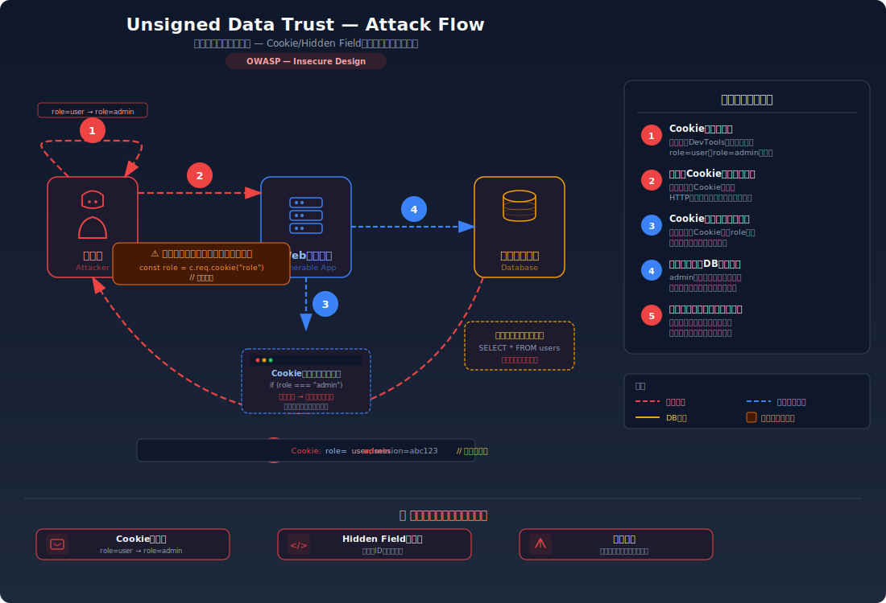
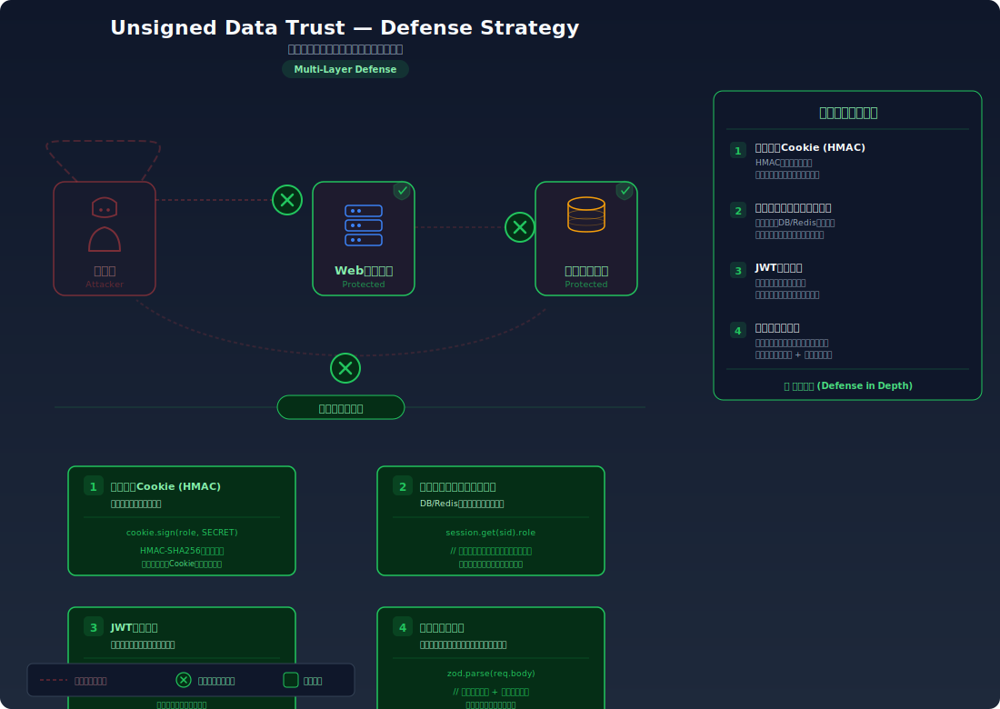

# Trusting Unsigned Client Data — クライアントデータを署名なしで信頼し権限昇格やデータ改ざんが可能

> CookieやhiddenフィールドにRole(権限)や価格を保存し、サーバー側で検証せずそのまま信頼するため、攻撃者が値を改ざんして不正な操作が可能な問題です。

---

## 対象ラボ

| 項目 | 内容 |
|------|------|
| **概要** | Cookieやhiddenフィールドの値をサーバー側で検証せずそのまま信頼する |
| **攻撃例** | Cookie内の`role=user`を`role=admin`に書き換え / hiddenフィールドの価格を変更 |
| **技術スタック** | Hono API + Cookie |
| **難易度** | ★★☆ 中級 |
| **前提知識** | Cookie・Hidden Fieldの仕組み、DevToolsの使い方 |

---

## この脆弱性を理解するための前提

### Cookie と Hidden Field の正常な仕組み

**Cookie** は、サーバーが `Set-Cookie` ヘッダーでブラウザに値を保存させ、ブラウザが後続のリクエストで自動的にその値を送信する仕組みである。セッション管理やユーザー設定の保持に広く使われている。

```
# サーバーがCookieを設定
HTTP/1.1 200 OK
Set-Cookie: role=user; Path=/

# ブラウザが次のリクエストで自動送信
GET /admin HTTP/1.1
Cookie: role=user
```

**Hidden Field** は、HTMLフォーム内の非表示フィールド(`<input type="hidden">`)であり、ユーザーには見えないがフォーム送信時にサーバーへ値が送られる。商品IDや価格などの情報をフォームに埋め込む用途で使用される。

```html
<form action="/api/purchase" method="POST">
  <input type="hidden" name="product_id" value="42">
  <input type="hidden" name="price" value="1000">
  <button type="submit">購入する</button>
</form>
```

どちらも正常な用途では便利な仕組みだが、**クライアント側に保存されるデータ**であるため、ユーザー（攻撃者を含む）が自由に閲覧・変更できるという性質を持つ。

### どこに脆弱性が生まれるのか

Cookie や hidden field の値を**署名や検証なしでサーバーがそのまま信頼する**と、攻撃者がDevToolsやプロキシツールで値を改ざんし、不正な操作が可能になる。

```typescript
// ⚠️ Cookie値をそのまま信頼 — 署名なし
app.get("/admin", (c) => {
  const role = getCookie(c, "role"); // ← 攻撃者が改ざん可能
  if (role === "admin") {
    return c.json({ data: "機密データ" });
  }
  return c.json({ error: "Forbidden" }, 403);
});
```

```html
<!-- ⚠️ hidden fieldの価格をクライアント側でそのまま保持 -->
<form action="/api/purchase" method="POST">
  <input type="hidden" name="price" value="1000">
  <!-- ↑ DevToolsで value="1" に書き換え可能 -->
  <button type="submit">購入する</button>
</form>
```

サーバーは受け取った値が「自分が元々設定した正しい値」であるかを確認する手段がない。クライアントから来るデータは**常に改ざんされている可能性がある**という前提で設計する必要がある。

---

## 攻撃の仕組み



### 攻撃のシナリオ

1. **攻撃者** がDevToolsでCookieを確認する

   ブラウザのDevTools（Application > Cookies）を開き、サーバーが設定した `role=user` のCookieを確認する。署名がないため、値は平文でそのまま保存されている。

   ```
   # DevToolsで確認できるCookie
   Name: role
   Value: user     ← 平文で保存されている
   ```

2. **攻撃者** が `role=admin` に書き換える

   DevToolsのCookie編集機能、またはブラウザの `document.cookie` API を使って値を変更する。署名がないため、どんな値にも自由に書き換えられる。

   ```javascript
   // DevToolsのConsoleで実行
   document.cookie = "role=admin; path=/";
   ```

3. **攻撃者** が改ざんしたCookieでリクエストを送信する

   ブラウザはCookieを自動的にリクエストに含めるため、次のページアクセスやAPIリクエストで改ざん後の値が送信される。

   ```
   GET /admin HTTP/1.1
   Cookie: role=admin   ← 改ざんされた値
   ```

4. **サーバー** が署名なしのCookieをそのまま信頼する

   サーバーはCookie値が改ざんされていないかを検証する仕組みを持たないため、`role=admin` を正当な管理者のリクエストとして受け入れてしまう。

5. **攻撃者** が管理者権限で機密データにアクセスする

   一般ユーザーが見られないはずの管理画面や機密情報に不正にアクセスできてしまう。

**Hidden Field の改ざん攻撃**:

同様に、hidden field の値もDevToolsのElements タブから直接編集できる。

```html
<!-- 元の価格 -->
<input type="hidden" name="price" value="1000">

<!-- ↓ DevToolsで改ざん -->
<input type="hidden" name="price" value="1">
```

この状態でフォームを送信すると、1,000円の商品が1円で購入できてしまう。

### なぜ成功するのか

| 条件 | 説明 |
|------|------|
| 署名なしCookie | Cookieに署名（HMAC等）が付与されておらず、改ざんを検知できない |
| クライアントデータの無条件信頼 | サーバーがCookieやhidden fieldの値をそのまま権限判定・価格計算に使用している |
| クライアント側でのデータ保持 | 権限や価格など重要な情報がクライアント側に平文で保存されている |
| サーバー側での再検証なし | 受け取った値をサーバー側のデータ（DB等）と照合していない |

### 被害の範囲

- **機密性**: 一般ユーザーが管理者用の機密データや他ユーザーの個人情報にアクセスできる
- **完全性**: 商品価格の改ざんによる不正購入、権限昇格による設定変更やデータ操作が可能
- **可用性**: 管理者権限を奪取してシステム設定を破壊、サービス停止に至る可能性がある

---

## 対策



### 根本原因

サーバーがクライアントから送られてくるデータ（Cookie、hidden field、リクエストパラメータ等）を**署名や検証なしでそのまま信頼している**こと。クライアント側のデータは常にユーザーが改ざんできるという前提が欠けていることが問題。

### 安全な実装

署名付きCookie（HMAC）を使用し、改ざんを検知する。権限情報はサーバー側のセッションストアで管理し、クライアント側には保存しない。

```typescript
// ✅ 署名付きCookieで改ざんを検知
import { getSignedCookie, setSignedCookie } from "hono/cookie";

const SECRET = c.env.COOKIE_SECRET; // 環境変数から秘密鍵を取得

// 署名付きCookieの設定
app.post("/login", async (c) => {
  const user = await authenticate(c);
  // ✅ HMACで署名されたCookieを設定 — 改ざんすると署名が一致しなくなる
  await setSignedCookie(c, "role", user.role, SECRET, {
    httpOnly: true,
    secure: true,
    sameSite: "Lax",
  });
  return c.json({ message: "ログイン成功" });
});

// 署名付きCookieの検証
app.get("/admin", async (c) => {
  // ✅ 署名を検証し、改ざんされていれば null を返す
  const role = await getSignedCookie(c, SECRET, "role");
  if (role === null) {
    // 署名が一致しない = 改ざんされている
    return c.json({ error: "Tampered" }, 403);
  }
  if (role !== "admin") {
    return c.json({ error: "Forbidden" }, 403);
  }
  return c.json({ data: "機密データ" });
});
```

**なぜ安全か**: 署名付きCookieは、Cookie値とサーバーだけが知る秘密鍵を使ってHMAC署名を生成する。攻撃者がCookieの値を書き換えると、署名と値が一致しなくなり、サーバーが改ざんを検知できる。秘密鍵を知らない攻撃者は正しい署名を生成できない。

#### 脆弱 vs 安全: コード比較

```diff
- import { getCookie } from "hono/cookie";
+ import { getSignedCookie } from "hono/cookie";

- app.get("/admin", (c) => {
-   const role = getCookie(c, "role");     // ⚠️ 署名なし — 改ざんを検知できない
-   if (role === "admin") {
+ app.get("/admin", async (c) => {
+   const role = await getSignedCookie(c, SECRET, "role");
+   if (role === null) {
+     return c.json({ error: "Tampered" }, 403); // ✅ 改ざん検知
+   }
+   if (role === "admin") {
      return c.json({ data: "機密データ" });
    }
    return c.json({ error: "Forbidden" }, 403);
  });
```

署名付きCookieの導入により、攻撃者がDevToolsで `role=admin` に書き換えても、署名が一致しないためサーバーが即座に拒否する。

**Hidden Field の安全な実装**:

価格などの重要な値はhidden fieldに頼らず、サーバー側でDBから取得する。

```diff
- app.post("/purchase", async (c) => {
-   const { price } = await c.req.parseBody();  // ⚠️ クライアントの値を信頼
-   await processPayment(price);
+ app.post("/purchase", async (c) => {
+   const { product_id } = await c.req.parseBody();
+   const product = await db.query("SELECT price FROM products WHERE id = $1", [product_id]);
+   await processPayment(product.rows[0].price);  // ✅ DBの正しい値を使用
  });
```

### その他の防御策

| 対策 | 種類 | 説明 |
|------|------|------|
| 署名付きCookie (HMAC) | 根本対策 | Cookie値にHMAC署名を付与し、改ざんを検知する |
| サーバー側セッション管理 | 根本対策 | 権限情報をサーバー側のセッションストア（DB/Redis等）で管理し、クライアントにはセッションIDのみ保持する |
| JWTトークン | 根本対策 | JSON Web Tokenで署名付きのトークンを発行し、改ざんを検知する。ただし失効管理に注意が必要 |
| サーバー側データ参照 | 根本対策 | 価格・数量等の重要値はhidden fieldに頼らず、サーバー側でDBから再取得する |
| `httpOnly` Cookie属性 | 多層防御 | JavaScriptからのCookieアクセスを防ぎ、XSSによる窃取リスクを低減する |
| 入力値バリデーション | 多層防御 | クライアントから受け取る全ての値をサーバー側で型・範囲・形式を検証する |

---

## ハンズオン手順

### Step 1: 脆弱バージョンで攻撃を体験

**ゴール**: 署名なしCookieとhidden fieldの改ざんによって権限昇格・価格改ざんが可能であることを確認する

1. 開発サーバーを起動する

2. ブラウザでラボページにアクセスし、一般ユーザーとしてログインする

   ```bash
   # ブラウザでアクセス
   open http://localhost:5173/labs/unsigned-data
   ```

3. DevToolsを開き、Cookieを確認する

   - Application > Cookies で `role=user` のCookieが設定されていることを確認
   - 値が平文で保存されており、署名がないことに注目する

4. Cookieの値を改ざんする

   ```javascript
   // DevToolsのConsoleで実行
   document.cookie = "role=admin; path=/";
   ```

5. 管理者エンドポイントにリクエストを送信する

   ```bash
   curl http://localhost:3000/api/labs/unsigned-data/vulnerable/admin \
     -H "Cookie: role=admin"
   ```

   - 管理者用の機密データが返ってくることを確認する
   - **この結果が意味すること**: 署名のないCookieはいくらでも改ざんでき、サーバーはそれを検知できない

6. Hidden Fieldの改ざんも試す

   - DevToolsのElements タブで `<input type="hidden" name="price" value="1000">` を見つける
   - `value` を `1` に変更し、フォームを送信する
   - 1,000円の商品が1円で購入できてしまうことを確認する

### Step 2: 安全バージョンで防御を確認

**ゴール**: 署名付きCookieが改ざんを検知し、サーバー側の値参照により不正購入を防ぐことを確認する

1. 安全なエンドポイントにアクセスする

   ```bash
   # 署名付きCookieで正規のリクエスト
   curl http://localhost:3000/api/labs/unsigned-data/secure/admin \
     -H "Cookie: role=user"
   ```

   - 一般ユーザーとして403エラーが返ることを確認する

2. Cookie値を改ざんして再度リクエストする

   ```bash
   # 署名なしで role=admin に改ざん
   curl http://localhost:3000/api/labs/unsigned-data/secure/admin \
     -H "Cookie: role=admin"
   ```

   - `Tampered` エラー（403）が返り、改ざんが検知されていることを確認する

3. 価格改ざんも試す

   - 安全版では hidden field の価格ではなくサーバー側のDB値が使われることを確認する
   - DevToolsで hidden field を書き換えてフォームを送信しても、正規の価格で処理されることを確認する

4. コードの差分を確認する

   - `backend/src/labs/step07-design/unsigned-data.ts` の脆弱版と安全版を比較
   - **署名付きCookieの導入とサーバー側データ参照** が攻撃を防いでいることに注目する

### 確認ポイント

以下を自分の言葉で説明できれば、このラボは完了です:

- [ ] CookieやHidden Fieldがクライアント側で自由に改ざんできる理由は何か
- [ ] 署名なしCookieと署名付きCookieの違いは何か（HMACの仕組みを含む）
- [ ] 攻撃者がDevToolsでCookieを改ざんしたとき、サーバーはどのように検知するか
- [ ] 価格や権限などの重要な値を安全に扱うための設計原則は何か（サーバー側が正の情報源）
- [ ] JWTとセッション管理のそれぞれの利点・欠点は何か

---

## 実装メモ

| 項目 | パス |
|------|------|
| 脆弱エンドポイント | `/api/labs/unsigned-data/vulnerable/admin`, `/api/labs/unsigned-data/vulnerable/purchase` |
| 安全エンドポイント | `/api/labs/unsigned-data/secure/admin`, `/api/labs/unsigned-data/secure/purchase` |
| バックエンド | `backend/src/labs/step07-design/unsigned-data.ts` |
| フロントエンド | `frontend/src/features/step07-design/pages/UnsignedData.tsx` |

- 脆弱版: `getCookie()` で署名なしCookieをそのまま読み取り、権限判定に使用。Hidden Fieldの価格をサーバー側で再検証せずに処理
- 安全版: `getSignedCookie()` でHMAC署名を検証し、改ざんを検知。価格はDBから再取得して使用
- 攻撃デモ: フロントエンドにCookie編集UI・Hidden Field表示を用意し、改ざん前後の動作を視覚的に比較

---

## 現実世界での事例

| 年 | インシデント | 概要 |
|----|-------------|------|
| 2010 | ASP.NET Padding Oracle (CVE-2010-3332) | ASP.NETのViewState（hidden fieldに埋め込まれるサーバー状態）の暗号化に対するPadding Oracle攻撃。暗号化の不備により攻撃者がViewStateを復号・改ざんし、サーバー設定の読み取りやリモートコード実行が可能になった。Microsoftが緊急パッチを発行 |
| 各年 | ECサイトのhidden field価格改ざん | 複数のECサイトで商品価格をhidden fieldに保持し、サーバー側で再検証していなかったため、攻撃者が価格を変更して不正に安価で商品を購入する事例が繰り返し報告されている |
| 各年 | Cookie ベースの権限管理の悪用 | ユーザーの権限レベルを署名なしCookieで管理し、`isAdmin=false` を `isAdmin=true` に書き換えるだけで管理者機能にアクセスできてしまう脆弱性が多数のWebアプリケーションで報告されている |

---

## 関連ラボ

| ラボ | 関連性 |
|------|--------|
| [ビジネスロジックの欠陥](business-logic.md) | 価格改ざんはビジネスロジックの欠陥とも密接に関連する。サーバー側でのバリデーション不足が共通の根本原因 |
| [CSRF](../step04-session/csrf.md) | CSRFもCookieの自動送信を悪用する攻撃。署名なしデータの信頼ではCookie値の改ざんが、CSRFではCookieの自動送信がそれぞれ問題となる |
| [Cookie操作](../step04-session/cookie-manipulation.md) | Cookieの仕組みと改ざん手法を詳しく学べるラボ。本ラボの前提知識として有用 |

---

## 参考資料

- [OWASP - Software and Data Integrity Failures (A08:2021)](https://owasp.org/Top10/A08_2021-Software_and_Data_Integrity_Failures/)
- [CWE-565: Reliance on Cookies without Validation and Integrity Checking](https://cwe.mitre.org/data/definitions/565.html)
- [OWASP - Insecure Direct Object Reference Prevention](https://cheatsheetseries.owasp.org/cheatsheets/Insecure_Direct_Object_Reference_Prevention_Cheat_Sheet.html)
- [MDN - HTTP Cookie](https://developer.mozilla.org/ja/docs/Web/HTTP/Cookies)
- [Hono - Cookie Helper (Signed Cookie)](https://hono.dev/helpers/cookie#signed-cookie)
