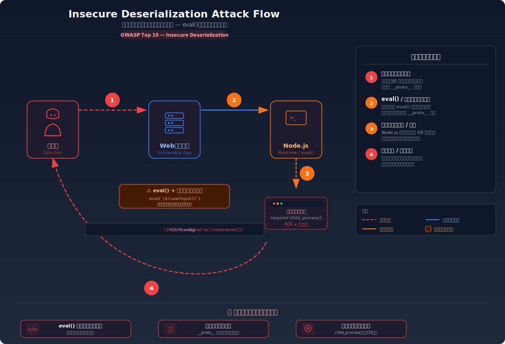
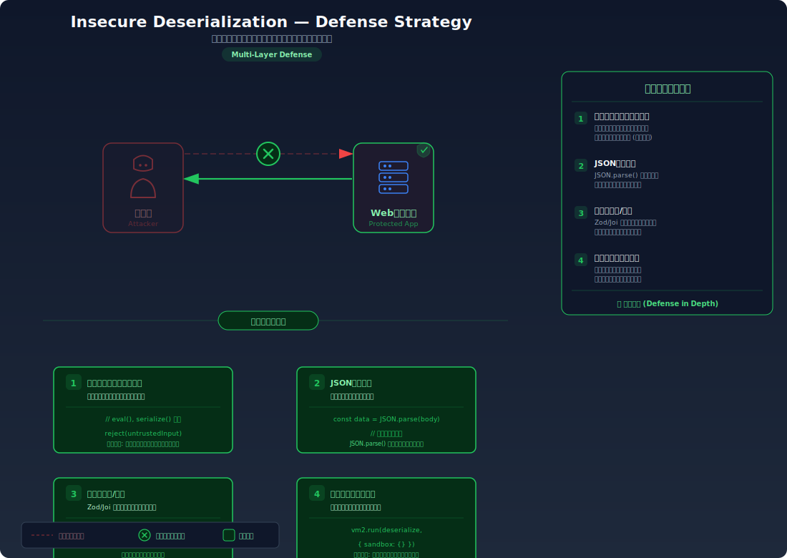

# Insecure Deserialization — 信頼できないデータの復元でコードが実行される

> ユーザーから送信されたシリアライズデータを検証なしにそのまま復元（デシリアライズ）することで、サーバー上で任意のコードが実行されてしまう脆弱性を学びます。

---

## 対象ラボ

| 項目 | 内容 |
|------|------|
| **概要** | クライアントから送信された JSON やシリアライズデータを `eval()` や安全でないデシリアライザで処理することで、攻撃者が仕込んだコードがサーバーで実行される |
| **攻撃例** | JSON 内に `{"__proto__": {"isAdmin": true}}` を送信してプロトタイプ汚染、または `eval()` で処理されるデータに `require('child_process').exec('...')` を仕込む |
| **技術スタック** | Hono API + Node.js |
| **難易度** | ★★★ 上級 |
| **前提知識** | JavaScript のオブジェクトとプロトタイプチェーン、JSON のパース処理、Node.js の `eval()` の危険性 |

---

## この脆弱性を理解するための前提

### シリアライゼーションとデシリアライゼーションの仕組み

シリアライゼーション（直列化）は、オブジェクトをネットワーク転送や保存に適した文字列形式に変換すること。デシリアライゼーション（逆直列化）はその逆で、文字列からオブジェクトを復元する処理。

```typescript
// 正常なシリアライゼーション/デシリアライゼーション
const user = { name: 'Alice', role: 'user' };

// シリアライズ: オブジェクト → 文字列
const serialized = JSON.stringify(user);
// → '{"name":"Alice","role":"user"}'

// デシリアライズ: 文字列 → オブジェクト
const deserialized = JSON.parse(serialized);
// → { name: 'Alice', role: 'user' }
```

`JSON.parse()` 自体は安全なデシリアライザであり、JSON 文字列をデータ構造に変換するだけでコードの実行は行わない。

### どこに脆弱性が生まれるのか

問題は、デシリアライズの過程で **データがコードとして実行される** 場合に発生する。Node.js では主に 2 つのパターンで発生する:

**パターン 1: `eval()` によるデシリアライズ**

```typescript
// ⚠️ この部分が問題 — eval() でユーザー入力を「コード」として実行してしまう
app.post('/api/config', async (c) => {
  const body = await c.req.text();
  // eval() は文字列を JavaScript コードとして実行する
  // ユーザーが任意のコードを送信できる
  const config = eval(`(${body})`);
  return c.json({ config });
});
```

**パターン 2: プロトタイプ汚染**

```typescript
// ⚠️ この部分が問題 — 深いマージがプロトタイプチェーンを汚染する
function deepMerge(target: any, source: any) {
  for (const key in source) {
    if (typeof source[key] === 'object') {
      target[key] = target[key] || {};
      deepMerge(target[key], source[key]);  // __proto__ も再帰的にマージされる
    } else {
      target[key] = source[key];
    }
  }
  return target;
}

app.post('/api/settings', async (c) => {
  const userInput = await c.req.json();
  deepMerge(defaultSettings, userInput);
  // userInput に {"__proto__": {"isAdmin": true}} が含まれると
  // すべてのオブジェクトの isAdmin が true になる
});
```

---

## 攻撃の仕組み



### 攻撃のシナリオ

#### シナリオ 1: eval() を使ったコード実行

1. **攻撃者** が設定データとして悪意あるコードを送信する

   設定データの投入エンドポイントが `eval()` でデータを処理していることを利用する。

   ```bash
   curl -X POST http://localhost:3000/api/labs/deserialization/vulnerable/config \
     -H "Content-Type: text/plain" \
     -d '(function(){ return {result: require("child_process").execSync("id").toString()} })()'
   ```

2. **サーバー** が `eval()` で文字列を実行し、`require('child_process')` を通じて OS コマンドが実行される

   ```javascript
   // サーバー内部で実行されるコード
   eval('(function(){ return {result: require("child_process").execSync("id").toString()} })()');
   // → OS の `id` コマンドが実行され、ユーザー情報が返される
   ```

   `eval()` は任意の JavaScript を実行できるため、ファイルの読み取り、環境変数の取得、外部へのデータ送信、さらには永続的なバックドアの設置まで可能になる。

3. **攻撃者** がサーバーのユーザー情報やファイルシステムの情報を取得する

#### シナリオ 2: プロトタイプ汚染

1. **攻撃者** が `__proto__` を含む JSON を送信する

   ```bash
   curl -X POST http://localhost:3000/api/labs/deserialization/vulnerable/settings \
     -H "Content-Type: application/json" \
     -d '{"__proto__": {"isAdmin": true}}'
   ```

2. **サーバー** が深いマージ処理で `__proto__` を再帰的にマージし、`Object.prototype` が汚染される

   ```javascript
   // マージ後、すべてのオブジェクトが isAdmin: true を持つ
   const obj = {};
   console.log(obj.isAdmin);  // → true（本来は undefined）
   ```

3. **攻撃者** が通常のリクエストで管理者として認識される

   サーバーのコードが `if (user.isAdmin)` のようなチェックを行っている場合、プロトタイプ汚染により全ユーザーが管理者として扱われる。

### なぜ成功するのか

| 条件 | 説明 |
|------|------|
| `eval()` の使用 | ユーザー入力を `eval()` で処理すると、任意の JavaScript コードがサーバーのコンテキストで実行される。`eval()` はデータとコードの区別をしない |
| 安全でない深いマージ | `__proto__`、`constructor`、`prototype` 等の特殊プロパティをフィルタリングせずにマージすると、プロトタイプチェーンが汚染される |
| 入力データの検証なし | デシリアライズする前にデータの構造やスキーマを検証していないため、悪意あるプロパティが処理される |

### 被害の範囲

- **機密性**: `eval()` 経由でファイルシステムの読み取り、環境変数の取得、ネットワーク情報の漏洩。プロトタイプ汚染による認可バイパスで機密データへのアクセス
- **完全性**: 任意のコード実行によるファイル改ざん、データベース操作、バックドアの設置。プロトタイプ汚染によるアプリケーション全体の挙動の変更
- **可用性**: `process.exit()` によるサーバー停止、無限ループによるリソース枯渇、ファイル削除によるサービス破壊

---

## 対策



### 根本原因

ユーザーから送信されたデータが **コードとして実行される** か、**アプリケーションの内部構造（プロトタイプチェーン）を変更できる** 設計になっていることが根本原因。信頼できないデータは常に「データ」としてのみ処理し、コードとして解釈させてはならない。

### 安全な実装

`eval()` を使わず `JSON.parse()` でデータを処理する。深いマージでは `__proto__` 等の特殊プロパティをフィルタリングする。

```typescript
// ✅ eval() を使わず JSON.parse() で安全にパースする
app.post('/api/config', async (c) => {
  const body = await c.req.text();
  try {
    // JSON.parse() はデータ構造の復元のみを行い、コードの実行はしない
    const config = JSON.parse(body);
    return c.json({ config });
  } catch {
    return c.json({ error: '無効な JSON 形式です' }, 400);
  }
});

// ✅ 特殊プロパティをフィルタリングした安全なマージ
function safeMerge(target: any, source: any) {
  const BLOCKED_KEYS = ['__proto__', 'constructor', 'prototype'];
  for (const key in source) {
    if (BLOCKED_KEYS.includes(key)) continue;  // 危険なキーをスキップ
    if (typeof source[key] === 'object' && source[key] !== null) {
      target[key] = target[key] || {};
      safeMerge(target[key], source[key]);
    } else {
      target[key] = source[key];
    }
  }
  return target;
}
```

`JSON.parse()` は純粋なデータパーサーであり、関数呼び出しやコード実行は行わない。`eval()` と違い、`require()` や `process` 等のランタイム API にアクセスする手段がない。

#### 脆弱 vs 安全: コード比較

```diff
  app.post('/api/config', async (c) => {
    const body = await c.req.text();
-   // eval() で文字列をコードとして実行
-   const config = eval(`(${body})`);
+   // JSON.parse() でデータとしてのみ解釈
+   const config = JSON.parse(body);
    return c.json({ config });
  });
```

`eval()` → `JSON.parse()` の変更により、入力は JavaScript コードではなく JSON データとしてのみ解釈される。`require('child_process')` のようなコードを送信しても、JSON として不正な形式なのでパースエラーになる。

### その他の防御策

| 対策 | 種類 | 説明 |
|------|------|------|
| `eval()` の禁止 | 根本対策 | ユーザー入力に対して `eval()`、`new Function()`、`vm.runInNewContext()` 等を使用しない。ESLint の `no-eval` ルールで静的に検知 |
| `JSON.parse()` の使用 | 根本対策 | データのデシリアライズには `JSON.parse()` を使用する。コード実行の可能性がない安全なパーサー |
| 入力のスキーマ検証 | 多層防御 | Zod や Joi 等のバリデーションライブラリでデータ構造を厳密に検証し、想定外のプロパティを除去する |
| プロトタイプ汚染対策 | 多層防御 | `Object.create(null)` でプロトタイプのないオブジェクトを使用、または `Object.freeze(Object.prototype)` で汚染を防止 |
| CSP / サンドボックス | 検知 | コンテンツセキュリティポリシーや `eval()` の使用を制限するサンドボックス環境を検討する |

---

## ハンズオン手順

### Step 1: 脆弱バージョンで攻撃を体験

**ゴール**: `eval()` 経由でサーバー上のコードが実行されること、およびプロトタイプ汚染で認可が回避されることを確認する

1. 開発サーバーを起動する

   ```bash
   cd backend && pnpm dev
   ```

2. eval() によるコード実行を試す

   ```bash
   # サーバーで任意のコードを実行
   curl -X POST http://localhost:3000/api/labs/deserialization/vulnerable/config \
     -H "Content-Type: text/plain" \
     -d '({result: 1+1})'
   ```

   - レスポンスに `{"config": {"result": 2}}` が返される — 式が **評価** されている

3. より危険なペイロードを試す

   ```bash
   # OS コマンドの実行を試みる
   curl -X POST http://localhost:3000/api/labs/deserialization/vulnerable/config \
     -H "Content-Type: text/plain" \
     -d '({result: require("os").hostname()})'
   ```

   - サーバーのホスト名がレスポンスに含まれる
   - **この結果が意味すること**: `eval()` は入力を JavaScript コードとして実行するため、Node.js の全 API にアクセスできる

4. プロトタイプ汚染を試す

   ```bash
   curl -X POST http://localhost:3000/api/labs/deserialization/vulnerable/settings \
     -H "Content-Type: application/json" \
     -d '{"__proto__": {"isAdmin": true}}'

   # 通常ユーザーとして管理者チェックを試みる
   curl http://localhost:3000/api/labs/deserialization/vulnerable/admin-check
   ```

   - プロトタイプ汚染により管理者として認識される

### Step 2: 安全バージョンで防御を確認

**ゴール**: 同じ攻撃が失敗することを確認する

1. 同じペイロードを安全なエンドポイントに送信する

   ```bash
   curl -X POST http://localhost:3000/api/labs/deserialization/secure/config \
     -H "Content-Type: text/plain" \
     -d '({result: 1+1})'
   ```

2. 結果を確認する

   - `400 Bad Request`（無効な JSON 形式）が返される
   - `JSON.parse()` は JavaScript コードをパースできないため、エラーになる

3. プロトタイプ汚染攻撃も試す

   ```bash
   curl -X POST http://localhost:3000/api/labs/deserialization/secure/settings \
     -H "Content-Type: application/json" \
     -d '{"__proto__": {"isAdmin": true}}'
   ```

   - `__proto__` がフィルタリングされ、プロトタイプは汚染されない

4. コードの差分を確認する

   - `backend/src/labs/step08-advanced/deserialization.ts` の脆弱版と安全版を比較
   - **どの行が違いを生んでいるか** に注目: `eval()` vs `JSON.parse()`、マージ時のフィルタリング

### 確認ポイント

以下を自分の言葉で説明できれば、このラボは完了です:

- [ ] `eval()` と `JSON.parse()` の根本的な違いは何か（コード実行 vs データパース）
- [ ] プロトタイプ汚染が成立するメカニズムを説明できるか（`__proto__` がなぜ特別なのか）
- [ ] なぜ `JSON.parse()` では任意コード実行が不可能なのか
- [ ] シリアライゼーション/デシリアライゼーションが他の脆弱性（XSS、RCE）につながるケースは何か

---

## 実装メモ

| 項目 | パス |
|------|------|
| 脆弱エンドポイント (eval) | `/api/labs/deserialization/vulnerable/config` |
| 脆弱エンドポイント (prototype) | `/api/labs/deserialization/vulnerable/settings` |
| 安全エンドポイント (parse) | `/api/labs/deserialization/secure/config` |
| 安全エンドポイント (merge) | `/api/labs/deserialization/secure/settings` |
| バックエンド | `backend/src/labs/step08-advanced/deserialization.ts` |
| フロントエンド | `frontend/src/features/step08-advanced/pages/Deserialization.tsx` |

- 脆弱版 (eval): `eval()` でユーザー入力を JavaScript として実行する設定投入エンドポイント
- 脆弱版 (prototype): 安全でない深いマージで `__proto__` を受け入れる設定更新エンドポイント
- 安全版 (parse): `JSON.parse()` でデータとしてのみ処理する
- 安全版 (merge): `__proto__`、`constructor`、`prototype` をフィルタリングしたマージ

---

## 現実世界での事例

| 年 | インシデント | 概要 |
|----|-------------|------|
| 2017 | Equifax | Apache Struts の Java デシリアライゼーション脆弱性（CVE-2017-5638）により、1.43 億人の個人情報が流出。デシリアライゼーション攻撃の被害としては史上最大規模 |
| 2019 | npm event-stream | Node.js パッケージに悪意あるコードが注入され、特定のビットコインウォレットの秘密鍵を盗むデシリアライゼーション攻撃が仕込まれた |
| 2021 | Log4Shell (Log4j) | Java の Log4j ライブラリの JNDI ルックアップ機能を悪用したリモートコード実行。広義にはデシリアライゼーション問題の一種 |

---

## 関連ラボ

| ラボ | 関連性 |
|------|--------|
| [SSTI](./ssti.md) | どちらもサーバーサイドでの任意コード実行に発展する脆弱性。SSTI はテンプレートエンジン経由、デシリアライゼーションはデータ復元処理経由 |
| [コマンドインジェクション](../step02-injection/command-injection.md) | `eval()` 経由で `child_process` にアクセスすると OS コマンドインジェクションと同等の被害。攻撃の入り口は異なるが、最終的な影響は同じ |
| [Mass Assignment](../step05-access-control/mass-assignment.md) | プロトタイプ汚染と Mass Assignment は「意図しないプロパティの設定」という共通パターン。入力データのフィルタリングが対策の要 |

---

## 参考資料

- [OWASP - Deserialization Cheat Sheet](https://cheatsheetseries.owasp.org/cheatsheets/Deserialization_Cheat_Sheet.html)
- [CWE-502: Deserialization of Untrusted Data](https://cwe.mitre.org/data/definitions/502.html)
- [CWE-1321: Improperly Controlled Modification of Object Prototype Attributes](https://cwe.mitre.org/data/definitions/1321.html)
