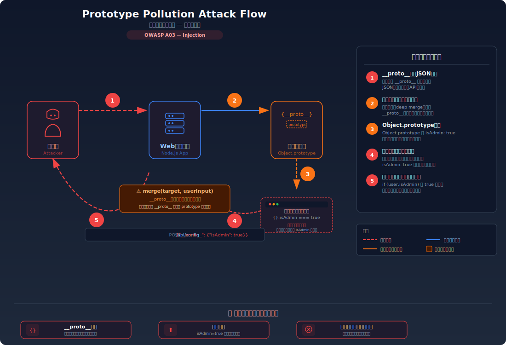
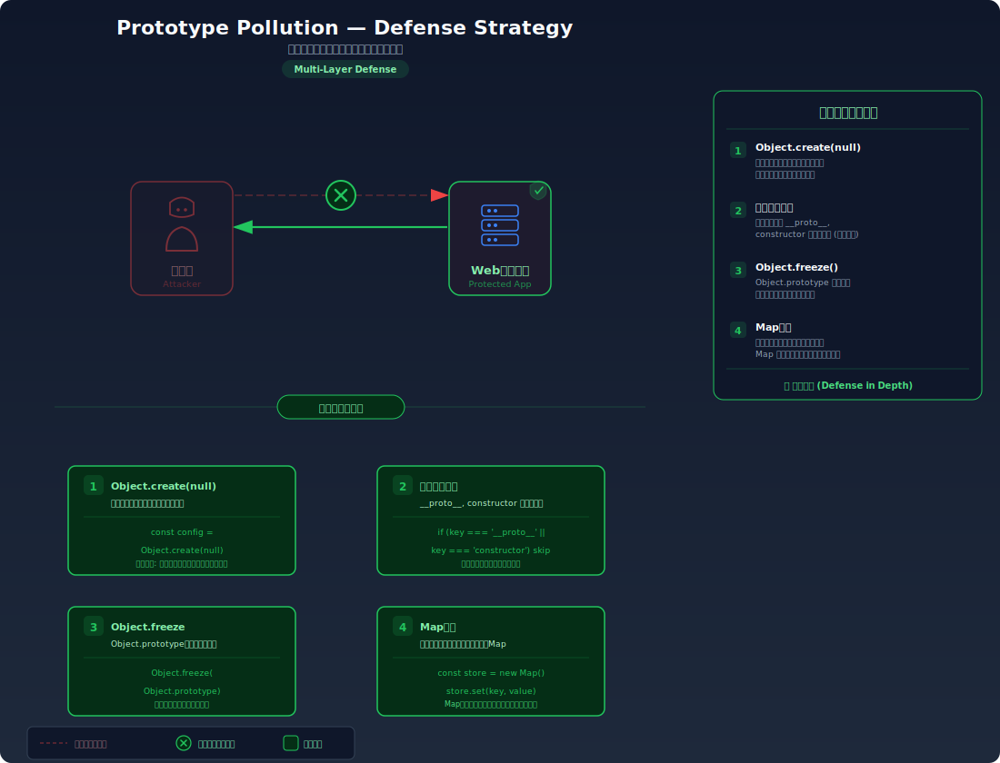

# Prototype Pollution — オブジェクトの原型を汚染して全体に影響を与える

> JavaScriptの全オブジェクトが共有するprototypeに不正なプロパティを注入し、アプリ全体の挙動を改ざんする攻撃手法を学びます。

---

## 対象ラボ

| 項目 | 内容 |
|------|------|
| **概要** | `__proto__` や `constructor.prototype` を通じて `Object.prototype` を汚染し、アプリケーション内のすべてのオブジェクトに意図しないプロパティを注入する |
| **攻撃例** | `{"__proto__": {"isAdmin": true}}` をマージ関数に渡す |
| **技術スタック** | Hono API (Node.js) |
| **難易度** | ★★★ 上級 |
| **前提知識** | JavaScriptのプロトタイプチェーン、オブジェクトのプロパティ解決の仕組み |

---

## この脆弱性を理解するための前提

### JavaScript のプロトタイプチェーンの仕組み

JavaScript のすべてのオブジェクトは、内部リンク `[[Prototype]]` を通じて別のオブジェクトを参照している。このリンクが連なったものを **プロトタイプチェーン** と呼ぶ。通常のオブジェクトのプロトタイプチェーンは以下のようになっている:

```
obj → Object.prototype → null
```

あるオブジェクトのプロパティにアクセスすると、JavaScript エンジンは以下の順序で値を探す:

1. オブジェクト自身が持つプロパティ（own property）を確認する
2. 見つからなければ、`[[Prototype]]` が参照するオブジェクトを確認する
3. さらに見つからなければ、チェーンを辿って `Object.prototype` まで確認する
4. `Object.prototype` にもなければ `undefined` を返す

```typescript
// プロトタイプチェーンによるプロパティ解決の例
const obj = { name: 'Alice' };

console.log(obj.name);       // → 'Alice'     （own property）
console.log(obj.toString);   // → [Function]  （Object.prototype から継承）
console.log(obj.isAdmin);    // → undefined    （チェーン上のどこにもない）
```

`__proto__` は `[[Prototype]]` 内部リンクへのアクセサプロパティであり、オブジェクトのプロトタイプを読み書きできる。歴史的経緯から多くの JavaScript エンジンでサポートされている:

```typescript
const obj = {};
console.log(obj.__proto__ === Object.prototype);  // → true

// __proto__ を通じて Object.prototype にプロパティを追加すると...
obj.__proto__.polluted = 'yes';

// すべてのオブジェクトからアクセスできてしまう
const another = {};
console.log(another.polluted);  // → 'yes'
```

この仕組みにより、`Object.prototype` に一度プロパティを注入すれば、そのプロセス内の **すべてのオブジェクト** がそのプロパティを持つかのように振る舞う。

### どこに脆弱性が生まれるのか

問題は、ユーザーからの入力を **再帰的なマージ関数（deep merge）や深いクローン関数（deep clone）** で処理する際に、`__proto__` や `constructor` といった特殊なキーを通常のデータプロパティと同様に処理してしまうことで発生する。

`JSON.parse()` は `__proto__` をキーとして持つ JSON を正しくパースする。パース結果のオブジェクトには `__proto__` という **文字列キー** が存在するが、これ自体は無害。問題が発生するのは、このオブジェクトを再帰的にマージする処理で `target[key] = source[key]` が `target["__proto__"]` として実行されるとき — JavaScript エンジンはこれをプロトタイプへの代入として解釈する。

```typescript
// ⚠️ この部分が問題 — __proto__ キーを特別扱いせずマージしている
function deepMerge(target: any, source: any): any {
  for (const key in source) {
    if (typeof source[key] === 'object' && source[key] !== null) {
      if (!target[key]) target[key] = {};
      deepMerge(target[key], source[key]);  // key が "__proto__" のとき汚染が発生
    } else {
      target[key] = source[key];
    }
  }
  return target;
}

// ユーザー入力をそのままマージすると...
const userInput = JSON.parse('{"__proto__": {"isAdmin": true}}');
deepMerge({}, userInput);

// すべてのオブジェクトが汚染される
const newObj = {};
console.log(newObj.isAdmin);  // → true（本来は undefined）
```

---

## 攻撃の仕組み



### 攻撃のシナリオ

#### シナリオ 1: isAdmin による権限昇格

1. **攻撃者** がユーザー設定の更新エンドポイントに `__proto__` を含む JSON を送信する

   アプリケーションのマージ関数がユーザー入力をサーバーの設定オブジェクトにマージしていることを利用する。

   ```bash
   curl -X POST http://localhost:3000/api/labs/prototype-pollution/vulnerable/merge \
     -H "Content-Type: application/json" \
     -d '{"__proto__": {"isAdmin": true}}'
   ```

2. **サーバー** が `deepMerge()` で入力を処理し、`Object.prototype` が汚染される

   サーバー内部では以下の処理が起きる:

   ```typescript
   // deepMerge(target, source) の再帰処理で
   // key = "__proto__", source[key] = { isAdmin: true }
   // target["__proto__"] への代入 → Object.prototype に isAdmin: true が設定される

   // 汚染後のメモリ状態:
   // Object.prototype.isAdmin === true
   ```

   `for...in` ループは `__proto__` キーをプロトタイプチェーン上のアクセサとして扱うため、`target["__proto__"]["isAdmin"] = true` は実質的に `Object.prototype.isAdmin = true` と同じ効果を持つ。

3. **攻撃者** が通常のリクエストを送ると管理者として認識される

   ```bash
   # 汚染後にステータスを確認
   curl http://localhost:3000/api/labs/prototype-pollution/vulnerable/status
   # → {"isAdmin": true, "message": "管理者としてログインしています"}
   ```

   サーバーのコードが `if (user.isAdmin)` で権限チェックを行っている場合、`user` オブジェクト自身には `isAdmin` が定義されていなくても、プロトタイプチェーンを辿って `Object.prototype.isAdmin` の `true` が返される。これにより、すべてのユーザーが管理者として扱われる。

#### シナリオ 2: child_process 経由のリモートコード実行 (RCE)

1. **攻撃者** が `child_process.spawn()` のオプションを汚染するペイロードを送信する

   Node.js の `child_process.spawn()` や `child_process.fork()` はオプションオブジェクトを受け取る。このオプションに `shell` や `env` が定義されていない場合、プロトタイプチェーンから値を取得する仕組みを悪用する。

   ```bash
   curl -X POST http://localhost:3000/api/labs/prototype-pollution/vulnerable/merge \
     -H "Content-Type: application/json" \
     -d '{"__proto__": {"shell": true, "env": {"NODE_OPTIONS": "--require /proc/self/cmdline"}}}'
   ```

2. **サーバー** のどこかで `child_process.spawn()` が呼ばれた際、汚染されたオプションが使用される

   ```typescript
   // サーバー内部のコード（攻撃者が直接触れない部分）
   import { spawn } from 'child_process';

   // opts を明示的に渡していないため、プロトタイプから取得される
   const proc = spawn('echo', ['hello']);
   // shell: true が Object.prototype から取得され、シェル経由で実行される
   // env も汚染されているため、環境変数が書き換えられる
   ```

   `spawn()` の内部実装では、`options.shell` や `options.env` が明示的に設定されていない場合に `undefined` となる。しかし Prototype Pollution により `Object.prototype.shell = true` が設定されていると、`options.shell` は `true` と評価される。

3. **攻撃者** がサーバー上で任意のコマンドを実行できる状態になる

   `shell: true` が有効な状態では、コマンド引数がシェルで解釈されるため、コマンドインジェクションが可能になる。さらに `env` を汚染して `NODE_OPTIONS` 等を設定すれば、Node.js プロセスの起動時に任意のモジュールを読み込ませることもできる。

### なぜ成功するのか

| 条件 | 説明 |
|------|------|
| 安全でない再帰マージ | `deepMerge()` が `__proto__`、`constructor`、`prototype` を通常のキーとして処理し、プロトタイプチェーンへの代入を許可している |
| プロパティルックアップのフォールバック | JavaScript のプロパティ解決は own property がなければプロトタイプチェーンを辿る。コードが `obj.isAdmin` のように直接プロパティを参照している場合、汚染された値を取得してしまう |
| 入力データのキー検証なし | `__proto__` や `constructor` がユーザー入力のキーとして許可されており、フィルタリングやホワイトリスト検証が行われていない |
| グローバルな影響範囲 | `Object.prototype` はプロセス内のすべてのオブジェクトが共有するため、一度汚染すると影響がアプリケーション全体に波及する |

### 被害の範囲

- **機密性**: プロトタイプ汚染により権限チェックがバイパスされ、管理者専用のデータや機能に不正アクセスされる。`child_process` 経由の RCE によりファイルシステムや環境変数の読み取りが可能になる
- **完全性**: `isAdmin` 等のフラグ汚染により全ユーザーの権限が改ざんされる。RCE が成立した場合はデータベースの操作、ファイルの改ざん、バックドアの設置が可能になる
- **可用性**: `Object.prototype` の汚染により `toString()` や `valueOf()` 等の基本メソッドが上書きされると、アプリケーション全体がクラッシュする。RCE による `process.exit()` でサーバーが停止する

---

## 対策



### 根本原因

ユーザーが送信したデータの中に含まれる `__proto__` や `constructor` といったキーを、**通常のデータプロパティと区別せずにオブジェクトのマージ・クローン処理で使用している** ことが根本原因。JavaScript においてこれらのキーはオブジェクトの内部構造（プロトタイプチェーン）にアクセスするための特殊なプロパティであり、データとしてではなくメタデータとして機能する。

### 安全な実装

`__proto__`、`constructor`、`prototype` を危険なキーとしてフィルタリングし、マージ処理から除外する。さらに、マージ先のオブジェクトとして `Object.create(null)` を使用することで、プロトタイプチェーンを持たないオブジェクトを利用する。

```typescript
// ✅ 危険なキーをフィルタリングし、プロトタイプのないオブジェクトを使用する
const DANGEROUS_KEYS = new Set(['__proto__', 'constructor', 'prototype']);

function safeMerge(target: Record<string, unknown>, source: Record<string, unknown>): Record<string, unknown> {
  for (const key of Object.keys(source)) {
    // __proto__, constructor, prototype を明示的にスキップ
    if (DANGEROUS_KEYS.has(key)) continue;

    const sourceVal = source[key];
    if (typeof sourceVal === 'object' && sourceVal !== null && !Array.isArray(sourceVal)) {
      // マージ先が存在しなければ、プロトタイプのないオブジェクトを作成
      if (!target[key] || typeof target[key] !== 'object') {
        target[key] = Object.create(null);
      }
      safeMerge(
        target[key] as Record<string, unknown>,
        sourceVal as Record<string, unknown>
      );
    } else {
      target[key] = sourceVal;
    }
  }
  return target;
}

// ✅ Map を使用する方法 — プロトタイプ汚染が構造的に不可能
function mergeToMap(source: Record<string, unknown>): Map<string, unknown> {
  const result = new Map<string, unknown>();
  for (const [key, value] of Object.entries(source)) {
    result.set(key, value);
  }
  return result;
}
```

`DANGEROUS_KEYS` によるフィルタリングは、`__proto__` キーがマージ処理に到達する前にブロックする。`__proto__` がスキップされるため、`target["__proto__"]` への代入は発生せず、`Object.prototype` は汚染されない。

`Object.create(null)` で作成したオブジェクトはプロトタイプチェーンを持たない（`[[Prototype]]` が `null`）。そのため、万が一 `__proto__` への代入が発生しても、`Object.prototype` には影響しない。

`Map` を使用する方法では、キーと値が `Map` の内部スロットに格納されるため、プロトタイプチェーンとは完全に独立した構造になる。

#### 脆弱 vs 安全: コード比較

```diff
  function merge(target: any, source: any): any {
-   for (const key in source) {
+   const DANGEROUS_KEYS = new Set(['__proto__', 'constructor', 'prototype']);
+   for (const key of Object.keys(source)) {
+     if (DANGEROUS_KEYS.has(key)) continue;
      if (typeof source[key] === 'object' && source[key] !== null) {
-       if (!target[key]) target[key] = {};
+       if (!target[key]) target[key] = Object.create(null);
        merge(target[key], source[key]);
      } else {
        target[key] = source[key];
      }
    }
    return target;
  }
```

3 つの変更が防御を構成している:

1. **`for...in` → `Object.keys()`**: `for...in` はプロトタイプチェーン上のプロパティも列挙するが、`Object.keys()` は own property のみを返す
2. **`DANGEROUS_KEYS` のフィルタリング**: `__proto__`、`constructor`、`prototype` を明示的にスキップし、プロトタイプチェーンへのアクセスパスを遮断する
3. **`{}` → `Object.create(null)`**: 新規オブジェクトがプロトタイプチェーンを持たないため、万が一の汚染も `Object.prototype` に波及しない

### その他の防御策

| 対策 | 種類 | 説明 |
|------|------|------|
| 危険なキーのフィルタリング | 根本対策 | `__proto__`、`constructor`、`prototype` をマージ・クローン処理から除外する。最も直接的で効果的な対策 |
| `Object.create(null)` の使用 | 根本対策 | プロトタイプチェーンを持たないオブジェクトを使用し、`__proto__` への代入が `Object.prototype` に影響しない構造にする |
| `Map` の使用 | 根本対策 | キーバリューストアとして `Map` を使用する。プロトタイプチェーンと無関係なデータ構造のため、構造的に汚染が不可能 |
| スキーマバリデーション | 多層防御 | Zod や Joi で入力データのスキーマを厳密に定義し、許可されたキーのみを受け入れる。想定外のキーは除去される |
| `Object.freeze(Object.prototype)` | 多層防御 | テスト環境で `Object.prototype` を凍結し、汚染の試みを検知する。本番環境ではサードパーティライブラリとの互換性に注意が必要 |
| 安全なライブラリの使用 | 多層防御 | lodash 4.17.12 以降の `_.merge()`、`structuredClone()` 等、Prototype Pollution 対策済みのユーティリティを使用する |
| ランタイム検知 | 検知 | `Object.prototype` の変更を `Proxy` で監視し、汚染が発生した場合にアラートを発する |

---

## ハンズオン手順

### Step 1: 脆弱バージョンで攻撃を体験

**ゴール**: `__proto__` を含む JSON を送信して `Object.prototype` を汚染し、別のエンドポイントで汚染の影響を確認する

1. 開発サーバーを起動する

   ```bash
   cd backend && pnpm dev
   ```

2. まず現在の状態を確認する

   ```bash
   # 汚染前の状態を確認
   curl http://localhost:3000/api/labs/prototype-pollution/vulnerable/status
   ```

   - `isAdmin` が `false`（またはプロパティが存在しない）であることを確認する

3. Prototype Pollution 攻撃を実行する

   ```bash
   # __proto__ を含む JSON をマージ関数に渡す
   curl -X POST http://localhost:3000/api/labs/prototype-pollution/vulnerable/merge \
     -H "Content-Type: application/json" \
     -d '{"__proto__": {"isAdmin": true}}'
   ```

4. 汚染の影響を確認する

   ```bash
   # 汚染後の状態を確認
   curl http://localhost:3000/api/labs/prototype-pollution/vulnerable/status
   ```

   - `isAdmin` が `true` に変わっていることを確認する
   - **この結果が意味すること**: 自分のリクエストとは無関係に、サーバー上のすべてのオブジェクトが `isAdmin: true` を持つようになった。攻撃者のリクエスト 1 つで、全ユーザーの権限が変わってしまう

5. DevTools のネットワークタブで確認する

   - リクエストボディに `__proto__` が含まれていること
   - レスポンスには通常のマージ成功メッセージが返されること（サーバーはエラーを返さない）

### Step 2: 安全バージョンで防御を確認

**ゴール**: 同じ攻撃が失敗することを確認する

1. 同じペイロードを安全なエンドポイントに送信する

   ```bash
   # 安全なマージエンドポイントに同じペイロードを送信
   curl -X POST http://localhost:3000/api/labs/prototype-pollution/secure/merge \
     -H "Content-Type: application/json" \
     -d '{"__proto__": {"isAdmin": true}}'
   ```

2. ステータスを確認する

   ```bash
   curl http://localhost:3000/api/labs/prototype-pollution/secure/status
   ```

   - `isAdmin` が `false` のままであることを確認する
   - `__proto__` キーがフィルタリングされ、`Object.prototype` は汚染されていない

3. コードの差分を確認する

   - `backend/src/labs/step08-advanced/prototype-pollution.ts` の脆弱版と安全版を比較
   - **どの行が違いを生んでいるか** に注目: `DANGEROUS_KEYS` によるフィルタリング、`Object.create(null)` の使用、`Object.keys()` の使用

### 確認ポイント

以下を自分の言葉で説明できれば、このラボは完了です:

- [ ] JavaScript のプロトタイプチェーン（`obj → Object.prototype → null`）がプロパティ解決にどう関わるか
- [ ] `__proto__` への代入がなぜ `Object.prototype` を汚染するのか
- [ ] 再帰マージ関数のどの行で汚染が発生するのか（`target[key] = source[key]` の `key` が `__proto__` のとき）
- [ ] `Object.create(null)` や `DANGEROUS_KEYS` フィルタリングが「なぜ」汚染を防ぐのか（「安全だから安全」ではダメ）

---

## 実装メモ

| 項目 | パス |
|------|------|
| 脆弱エンドポイント (merge) | `/api/labs/prototype-pollution/vulnerable/merge` |
| 安全エンドポイント (merge) | `/api/labs/prototype-pollution/secure/merge` |
| 汚染確認エンドポイント (vulnerable) | `/api/labs/prototype-pollution/vulnerable/status` |
| 汚染確認エンドポイント (secure) | `/api/labs/prototype-pollution/secure/status` |
| バックエンド | `backend/src/labs/step08-advanced/prototype-pollution.ts` |
| フロントエンド | `frontend/src/labs/step08-advanced/pages/PrototypePollution.tsx` |

- 脆弱版 (`/vulnerable/merge`): 安全でない `deepMerge()` でユーザー入力をサーバー設定にマージする。`__proto__` のフィルタリングなし
- 安全版 (`/secure/merge`): `DANGEROUS_KEYS` フィルタリング + `Object.create(null)` + `Object.keys()` による安全なマージ
- `/status` エンドポイント: 新規に作成した空オブジェクト `{}` の `isAdmin` プロパティを返す。汚染されていれば `true`、されていなければ `undefined` / `false`
- 注意: 脆弱版で汚染が発生するとプロセス全体に影響するため、テスト後にサーバーを再起動する必要がある

---

## 現実世界での事例

| 年 | インシデント | 概要 |
|----|-------------|------|
| 2018 | lodash `_.merge()` (CVE-2018-16487) | JavaScript で最も広く使われるユーティリティライブラリ lodash の `merge`、`mergeWith`、`defaultsDeep` 関数に Prototype Pollution 脆弱性が発見された。npm の週間ダウンロード数が数千万を超えるパッケージであり、影響範囲は極めて広かった |
| 2019 | jQuery `$.extend()` (CVE-2019-11358) | jQuery の `$.extend(true, ...)` （deep extend）に Prototype Pollution 脆弱性が発見された。世界中のWebサイトの約 74% が jQuery を使用していたため、インターネット全体に影響する脆弱性として注目された |
| 2021 | Snyk 調査レポート | Snyk の調査により、npm レジストリ上のパッケージの Prototype Pollution 脆弱性が 2018 年から 2021 年にかけて年々増加していることが報告された。再帰マージやディープクローン処理を含むユーティリティライブラリが主な発生源 |

---

## 関連ラボ

| ラボ | 関連性 |
|------|--------|
| [Mass Assignment](../step05-access-control/mass-assignment.md) | Prototype Pollution と Mass Assignment は「ユーザーが意図しないプロパティを設定する」という共通パターン。Mass Assignment は DB フィールドへの注入、Prototype Pollution はプロトタイプチェーンへの注入 |
| [安全でないデシリアライゼーション](./deserialization.md) | デシリアライゼーション処理の中で深いマージが使われる場合、Prototype Pollution が発生する。また、Prototype Pollution から RCE に発展するシナリオはデシリアライゼーション攻撃と被害が重なる |
| [SSTI](./ssti.md) | どちらもサーバーサイドでの RCE に発展し得る脆弱性。SSTI はテンプレートエンジン経由、Prototype Pollution はプロトタイプチェーン経由で攻撃が成立する |

---

## 参考資料

- [OWASP - Prototype Pollution](https://cheatsheetseries.owasp.org/cheatsheets/Prototype_Pollution_Prevention_Cheat_Sheet.html)
- [CWE-1321: Improperly Controlled Modification of Object Prototype Attributes ('Prototype Pollution')](https://cwe.mitre.org/data/definitions/1321.html)
- [Snyk - Prototype Pollution Research](https://snyk.io/vuln/SNYK-JS-LODASH-450202)
- [CVE-2018-16487: lodash merge Prototype Pollution](https://nvd.nist.gov/vuln/detail/CVE-2018-16487)
- [CVE-2019-11358: jQuery extend Prototype Pollution](https://nvd.nist.gov/vuln/detail/CVE-2019-11358)
