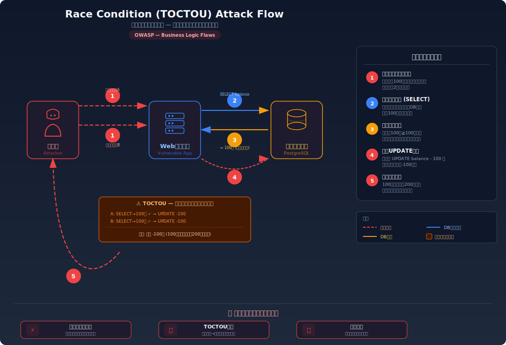
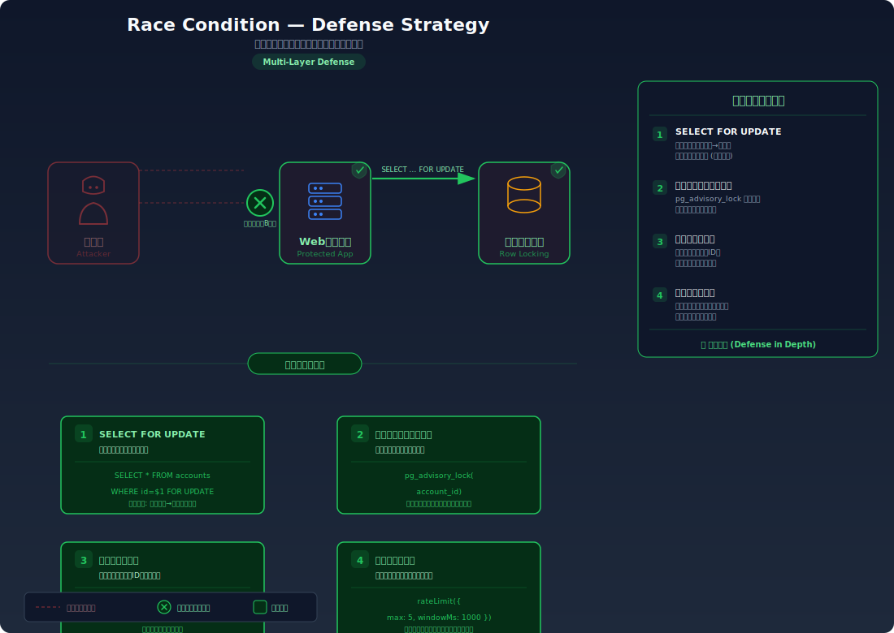

# Race Condition (TOCTOU) — チェックと処理のタイミング差を悪用して制約を回避する

> 残高チェックと購入処理の間にわずかなタイミング差があることを悪用し、同時リクエストで残高以上の買い物を成功させてしまう脆弱性を学びます。

---

## 対象ラボ

| 項目 | 内容 |
|------|------|
| **概要** | 残高確認（Check）と購入処理（Use）の間に排他制御がなく、同時リクエストで両方の残高チェックが通過し、二重購入が成立してしまう |
| **攻撃例** | 残高 100 円で 100 円の商品に対して同時に 2 リクエスト送信 → 両方成功し、残高が -100 円になる |
| **技術スタック** | Hono API + PostgreSQL |
| **難易度** | ★★★ 上級 |
| **前提知識** | HTTP リクエストの並行処理、PostgreSQL のトランザクション基礎、非同期処理の概念 |

---

## この脆弱性を理解するための前提

### データベーストランザクションと排他制御の仕組み

Web アプリケーションでは、「データを読み取り、条件を確認し、データを更新する」という一連の操作が頻繁に行われる。例えば購入処理では:

1. ユーザーの残高を読み取る（SELECT）
2. 残高が商品価格以上かチェックする
3. 残高を減らして購入を確定する（UPDATE）

```sql
-- 正常な購入フロー（1リクエストずつ処理される前提）
SELECT balance FROM users WHERE id = 1;        -- → 100円
-- アプリ側: 100 >= 100 なので購入OK
UPDATE users SET balance = balance - 100 WHERE id = 1;
INSERT INTO purchases (user_id, item) VALUES (1, '商品A');
```

単一リクエストならこのフローに問題はない。しかし、Web サーバーは複数のリクエストを **同時に処理する** ことが前提の設計になっている。

### どこに脆弱性が生まれるのか

問題は、SELECT（チェック）と UPDATE（処理）の間に **排他制御がない** 場合に発生する。2 つのリクエストが「ほぼ同時に」残高を読み取ると、両方とも「残高 100 円 ≥ 価格 100 円」の条件を通過してしまう。これが TOCTOU（Time of Check to Time of Use）問題。

```typescript
// ⚠️ この部分が問題 — チェックと更新の間に排他制御がない
app.post('/purchase', async (c) => {
  const userId = c.get('userId');
  const { itemId, price } = await c.req.json();

  // 残高を読み取り（Time of Check）
  const result = await pool.query('SELECT balance FROM users WHERE id = $1', [userId]);
  const balance = result.rows[0].balance;

  // 残高チェック — 同時リクエストでは両方ここを通過する
  if (balance < price) {
    return c.json({ error: '残高不足' }, 400);
  }

  // 残高を更新（Time of Use）— チェックから時間が経過している
  await pool.query('UPDATE users SET balance = balance - $1 WHERE id = $2', [price, userId]);
  await pool.query('INSERT INTO purchases (user_id, item_id) VALUES ($1, $2)', [userId, itemId]);

  return c.json({ message: '購入完了' });
});
```

---

## 攻撃の仕組み



### 攻撃のシナリオ

1. **攻撃者** が残高 100 円の状態で、100 円の商品に対する購入リクエストを **同時に 2 つ** 送信する

   並行リクエストは `curl` の並列実行や、スクリプトで容易に実現できる。ネットワークのタイミングにより、2 つのリクエストがほぼ同時にサーバーに到達する。

   ```bash
   # 2つのリクエストを同時に送信
   curl -X POST http://localhost:3000/api/labs/race-condition/vulnerable/purchase \
     -H "Content-Type: application/json" \
     -d '{"itemId": 1, "price": 100}' &
   curl -X POST http://localhost:3000/api/labs/race-condition/vulnerable/purchase \
     -H "Content-Type: application/json" \
     -d '{"itemId": 1, "price": 100}' &
   wait
   ```

2. **サーバー** がリクエスト A とリクエスト B をそれぞれ処理し、**両方が同じタイミングで残高を読み取る**

   ```
   時間 →
   リクエストA: SELECT balance → 100円  (チェック通過)  → UPDATE balance - 100
   リクエストB: SELECT balance → 100円  (チェック通過)  → UPDATE balance - 100
   ```

   リクエスト A が UPDATE を実行する前に、リクエスト B の SELECT が完了してしまう。B が読み取る時点ではまだ残高は 100 円のままであるため、B のチェックも通過する。

3. **両方のリクエスト** が UPDATE を実行し、残高が -100 円になる

   ```sql
   -- リクエストA の UPDATE
   UPDATE users SET balance = balance - 100 WHERE id = 1;  -- 100 - 100 = 0
   -- リクエストB の UPDATE（Aの直後に実行）
   UPDATE users SET balance = balance - 100 WHERE id = 1;  -- 0 - 100 = -100
   ```

   結果として、100 円の残高で 200 円分の商品を購入できてしまう。

### なぜ成功するのか

| 条件 | 説明 |
|------|------|
| 排他制御の欠如 | SELECT と UPDATE が別々のステートメントとして実行され、その間に他のトランザクションが介入できる。`SELECT FOR UPDATE` やアドバイザリーロックが使われていない |
| 非アトミックな操作 | 「チェック→更新」が単一のアトミック操作として実行されていない。2 ステップに分かれているため、間にタイミング差が生まれる |
| 並行リクエストの受け入れ | Web サーバーは複数リクエストを並行処理するため、同一ユーザーからの同時リクエストも制限なく処理される |

### 被害の範囲

- **機密性**: 直接的な情報漏洩はないが、不正購入により他ユーザーの在庫が減少する等の間接的影響
- **完全性**: 残高がマイナスになる、在庫が実際より多く減少する、ポイントが二重付与される等、データの整合性が破壊される
- **可用性**: 在庫の枯渇、金融システムでの不正な資金移動によるサービス運営への影響

---

## 対策



### 根本原因

「条件チェック」と「状態更新」が **アトミック（不可分）な操作として実行されていない** ことが根本原因。2 つの操作の間に他のプロセスが介入できる隙間（ウィンドウ）が存在するため、チェック時の前提が更新時には無効になっている。

### 安全な実装

PostgreSQL の `SELECT ... FOR UPDATE` を使い、残高の読み取り時に行ロックを取得する。これにより、同じ行を読み取ろうとする他のトランザクションは、最初のトランザクションが完了するまで待機する。

```typescript
// ✅ SELECT FOR UPDATE でチェックから更新まで排他制御する
app.post('/purchase', async (c) => {
  const userId = c.get('userId');
  const { itemId, price } = await c.req.json();

  const client = await pool.connect();
  try {
    await client.query('BEGIN');

    // FOR UPDATE で行ロックを取得 — 他のトランザクションはここで待機する
    const result = await client.query(
      'SELECT balance FROM users WHERE id = $1 FOR UPDATE',
      [userId]
    );
    const balance = result.rows[0].balance;

    if (balance < price) {
      await client.query('ROLLBACK');
      return c.json({ error: '残高不足' }, 400);
    }

    await client.query(
      'UPDATE users SET balance = balance - $1 WHERE id = $2',
      [price, userId]
    );
    await client.query(
      'INSERT INTO purchases (user_id, item_id) VALUES ($1, $2)',
      [userId, itemId]
    );

    await client.query('COMMIT');
    return c.json({ message: '購入完了' });
  } catch (e) {
    await client.query('ROLLBACK');
    throw e;
  } finally {
    client.release();
  }
});
```

`SELECT ... FOR UPDATE` により、リクエスト B がリクエスト A のトランザクション完了を待つため、B が残高を読み取る時点では既に A の UPDATE が反映されている。B は残高 0 円を読み取り、「残高不足」として正しく拒否される。

#### 脆弱 vs 安全: コード比較

```diff
- // 排他制御なし — 複数リクエストが同じ残高を読み取れる
- const result = await pool.query('SELECT balance FROM users WHERE id = $1', [userId]);
+ // FOR UPDATE で行ロック — 他のトランザクションは待機する
+ await client.query('BEGIN');
+ const result = await client.query(
+   'SELECT balance FROM users WHERE id = $1 FOR UPDATE',
+   [userId]
+ );
```

`FOR UPDATE` の 2 語を追加するだけで、SELECT 時に行レベルのロックが取得される。これにより「チェック」と「更新」の間に他のトランザクションが介入できなくなる。

### その他の防御策

| 対策 | 種類 | 説明 |
|------|------|------|
| SELECT FOR UPDATE | 根本対策 | 行レベルロックでチェックから更新まで排他制御する。最も確実で推奨される方法 |
| アドバイザリーロック | 根本対策 | `pg_advisory_lock` を使い、特定のリソースに対する操作を直列化する。行ロックが使えない場合の代替 |
| べき等性の確保 | 多層防御 | リクエストに一意な ID を付与し、同じ操作の重複実行を検知・拒否する |
| レートリミット | 検知 | 同一ユーザーからの短時間の大量リクエストを制限する。根本対策にはならないが、攻撃の試行を困難にする |

---

## ハンズオン手順

### Step 1: 脆弱バージョンで攻撃を体験

**ゴール**: 同時リクエストにより、残高以上の購入が成功することを確認する

1. 開発サーバーを起動し、テストデータを投入する

   ```bash
   cd backend && pnpm dev
   pnpm db:seed
   ```

2. 残高を確認する

   ```bash
   curl http://localhost:3000/api/labs/race-condition/vulnerable/balance
   # → { "balance": 100 }
   ```

3. 同時に 2 つの購入リクエストを送信する

   ```bash
   # 100円の商品を同時に2回購入（残高は100円しかない）
   curl -X POST http://localhost:3000/api/labs/race-condition/vulnerable/purchase \
     -H "Content-Type: application/json" \
     -d '{"itemId": 1, "price": 100}' &
   curl -X POST http://localhost:3000/api/labs/race-condition/vulnerable/purchase \
     -H "Content-Type: application/json" \
     -d '{"itemId": 1, "price": 100}' &
   wait
   ```

4. 結果を確認する

   - 両方のリクエストが `200 OK`（購入完了）を返す
   - 残高を再度確認すると `-100` になっている
   - **この結果が意味すること**: 排他制御がないため、2 つのリクエストが同じ残高（100 円）を読み取り、両方が「残高十分」と判断してしまった

### Step 2: 安全バージョンで防御を確認

**ゴール**: 同じ攻撃が排他制御により失敗することを確認する

1. テストデータをリセットし、安全なエンドポイントに対して同じ攻撃を試みる

   ```bash
   pnpm db:seed
   curl -X POST http://localhost:3000/api/labs/race-condition/secure/purchase \
     -H "Content-Type: application/json" \
     -d '{"itemId": 1, "price": 100}' &
   curl -X POST http://localhost:3000/api/labs/race-condition/secure/purchase \
     -H "Content-Type: application/json" \
     -d '{"itemId": 1, "price": 100}' &
   wait
   ```

2. 結果を確認する

   - 1 つ目のリクエストは `200 OK`、2 つ目は `400 Bad Request`（残高不足）を返す
   - 残高は `0` で、マイナスにはならない

3. コードの差分を確認する

   - `backend/src/labs/step08-advanced/race-condition.ts` の脆弱版と安全版を比較
   - **どの行が違いを生んでいるか** に注目: `SELECT` vs `SELECT ... FOR UPDATE`

### 確認ポイント

以下を自分の言葉で説明できれば、このラボは完了です:

- [ ] TOCTOU 問題とは何か（「チェック時」と「使用時」の状態が異なる問題）
- [ ] なぜ同時リクエストで両方のチェックが通過してしまうのか
- [ ] `SELECT FOR UPDATE` は「なぜ」この攻撃を無効化するのか（行ロックがどう機能するか）
- [ ] レートリミットだけでは根本対策にならない理由は何か

---

## 実装メモ

| 項目 | パス |
|------|------|
| 脆弱エンドポイント | `/api/labs/race-condition/vulnerable/purchase` |
| 安全エンドポイント | `/api/labs/race-condition/secure/purchase` |
| バックエンド | `backend/src/labs/step08-advanced/race-condition.ts` |
| フロントエンド | `frontend/src/features/step08-advanced/pages/RaceCondition.tsx` |
| DB | `docker/db/init.sql` に `users`（残高）、`purchases`（購入履歴）テーブルを使用 |

- 脆弱版: トランザクションなしで SELECT → チェック → UPDATE を実行
- 安全版: `BEGIN` + `SELECT FOR UPDATE` + `COMMIT` で排他制御
- 並行リクエスト用のスクリプトを `labs/` に用意し、コピペで攻撃を再現可能にする
- フロントエンドに「同時購入」ボタンを設け、ブラウザからも体験できるようにする

---

## 現実世界での事例

| 年 | インシデント | 概要 |
|----|-------------|------|
| 2018 | Starbucks | ギフトカードのレースコンディションにより、同一カードの残高を複数回転送できる脆弱性がバグバウンティで報告された |
| 2023 | Various DeFi | 分散型金融プロトコルでのレースコンディションにより、トークンの二重交換やフラッシュローン攻撃が頻発 |

---

## 関連ラボ

| ラボ | 関連性 |
|------|--------|
| [SQL インジェクション](../step02-injection/sql-injection.md) | どちらも DB 操作に関わる脆弱性。SQL インジェクションはクエリの改ざん、レースコンディションはクエリの実行順序の問題 |
| [ビジネスロジックの欠陥](../step07-design/business-logic.md) | レースコンディションはビジネスロジックの制約をタイミング攻撃で回避する手法。設計レベルの防御が共通して重要 |

---

## 参考資料

- [OWASP - Race Conditions](https://owasp.org/www-community/vulnerabilities/Race_Conditions)
- [CWE-367: Time-of-check Time-of-use (TOCTOU) Race Condition](https://cwe.mitre.org/data/definitions/367.html)
