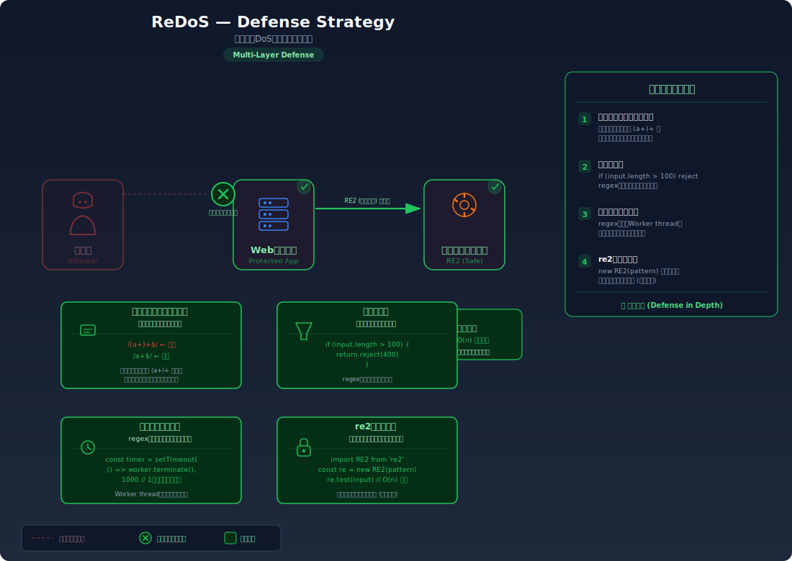

# ReDoS (Regular Expression DoS) — 正規表現の処理時間を爆発させてサービスを停止する

> 特定のパターンの正規表現に対して細工した入力を送ることで、マッチング処理が指数関数的に遅くなりサーバーが応答不能になる脆弱性を学びます。

---

## 対象ラボ

| 項目 | 内容 |
|------|------|
| **概要** | メールアドレスのバリデーションに脆弱な正規表現を使用しており、細工された入力でマッチング処理が指数関数的に遅くなる。Node.js のメインスレッドがブロックされ、全リクエストが停止する |
| **攻撃例** | `{"email": "aaaaaaaaaaaaaaaaaaaaaaaa!"}` を送信し、正規表現エンジンのバックトラッキングを爆発させる |
| **技術スタック** | Hono API (Node.js) |
| **難易度** | ★★★ 上級 |
| **前提知識** | 正規表現の基本、Node.js のシングルスレッドモデル |

---

## この脆弱性を理解するための前提

### NFA ベースの正規表現エンジンとバックトラッキング

JavaScript（V8 エンジン）を含む多くのプログラミング言語は、正規表現の実装に **NFA（非決定性有限オートマトン）** ベースのエンジンを採用している。NFA ベースのエンジンは、入力文字列に対してパターンがマッチするかどうかを判定する際に **バックトラッキング（後戻り）** という手法を使う。

バックトラッキングとは、パターンのある部分でマッチに失敗したとき、前のステップに戻って別の分岐を試す動作のこと。簡単なパターンと入力であれば、バックトラッキングは数回で終わり問題にならない。

```
正規表現: /^abc$/
入力: "abc"

マッチング:
  a → a ✓
  b → b ✓
  c → c ✓
  $ → 文字列末尾 ✓ → マッチ成功

バックトラッキング: 0回（全ステップが一度で成功）
```

しかし、パターンに **繰り返しの入れ子** や **重複する選択肢** が含まれると、バックトラッキングの回数が入力長に対して指数関数的に増加する場合がある。

### 「悪い正規表現パターン」とは

以下のようなパターンは ReDoS に対して脆弱であることが知られている:

| パターン | 問題点 |
|----------|--------|
| `(a+)+$` | 繰り返し `+` の入れ子。内側の `a+` と外側の `+` が同じ文字を異なる分割で消費しようとする |
| `(a\|a)+$` | 重複する選択肢。`a` にマッチする方法が 2 通りあり、各文字で分岐が発生する |
| `(.*a){x}` | `.*` が貪欲にマッチした後、`a` を見つけるために大量のバックトラッキングが発生する |
| `([a-zA-Z0-9]+\.)+[a-zA-Z]{2,}$` | メールアドレスのドメイン部分にありがちなパターン。`[a-zA-Z0-9]+` と `\.` の境界で大量のバックトラッキングが発生する |

これらに共通するのは、**同じ入力文字を消費する方法が複数存在し、入力の末尾でマッチが失敗する** 場合に、エンジンがすべての組み合わせを試行する点にある。

### Node.js のイベントループがブロックされる仕組み

Node.js はシングルスレッドのイベントループモデルで動作する。正規表現のマッチング処理は **同期的（ブロッキング）** に実行されるため、1 つのリクエストで正規表現の処理が数秒〜数分かかると、その間メインスレッドが完全に占有される。

```
通常時:
  リクエストA → 正規表現マッチ(1ms) → レスポンスA → リクエストB → ...

ReDoS 発生時:
  リクエストA(攻撃) → 正規表現マッチ(数分間ブロック...) → ★この間、全リクエストが待機状態
  リクエストB(正規) → キューで待機...
  リクエストC(正規) → キューで待機...
  リクエストD(正規) → キューで待機...
```

つまり、たった 1 つの攻撃リクエストで **サーバー全体が応答不能になる**。データベースへの接続タイムアウトやヘルスチェックの失敗も連鎖的に発生し、サービス全体がダウンする。

### どこに脆弱性が生まれるのか

問題は、ユーザーの入力値を **脆弱な正規表現で検証する** 場合に発生する。開発者が「正しい入力かどうかをチェックしているだけだから安全」と考えがちだが、正規表現のパターン自体に脆弱性があると、検証処理そのものが攻撃の入り口になる。

```typescript
// ⚠️ この部分が問題 — 脆弱な正規表現でユーザー入力を検証している
app.post('/validate', async (c) => {
  const { email } = await c.req.json();

  // ⚠️ この正規表現は繰り返しの入れ子を含み、ReDoS に脆弱
  // ([a-zA-Z0-9]+\.)+ の部分で、英数字とドットの境界で
  // 指数関数的なバックトラッキングが発生する
  const emailRegex = /^([a-zA-Z0-9]+\.)+[a-zA-Z]{2,}$/;

  if (emailRegex.test(email)) {
    return c.json({ valid: true });
  }
  return c.json({ valid: false }, 400);
});
```

この正規表現は通常のメールアドレス（`user.name@example.com` のドメイン部分パターン）ではすぐにマッチが完了する。しかし、`aaaaaaaaaaaaaaaaaaaaaaaa!` のような「ほぼマッチするが最後の 1 文字で失敗する」入力が与えられると、バックトラッキングが爆発する。

---

## 攻撃の仕組み


### 攻撃のシナリオ

1. **攻撃者** がメールアドレスバリデーションの入力フィールドに、細工した文字列を送信する

   攻撃者はエンドポイントの正規表現パターンを知らなくても、一般的に脆弱なパターン（メールアドレス、URL、ファイルパス等のバリデーション）を推測し、長い繰り返し文字列 + 不正文字の組み合わせを試行できる。

   ```bash
   # 攻撃入力: 'a' を24回繰り返し + マッチしない '!' で終了
   curl -X POST http://localhost:3000/api/labs/redos/vulnerable/validate \
     -H "Content-Type: application/json" \
     -d '{"email": "aaaaaaaaaaaaaaaaaaaaaaaa!"}'
   ```

2. **サーバー** の正規表現エンジンがバックトラッキングを開始し、指数関数的に処理時間が増大する

   パターン `([a-zA-Z0-9]+\.)+[a-zA-Z]{2,}$` に対して入力 `aaaaaaaaaaaaaaaaaaaaaaaa!` が与えられると、エンジンは以下のように動作する:

   ```
   入力: "aaaaaaaaaaaaaaaaaaaaaaaa!"
   パターン: ([a-zA-Z0-9]+\.)+[a-zA-Z]{2,}$

   試行1: [aaaaaaaaaaaaaaaaaaaaaaaa]. → '.' がない → 失敗
   試行2: [aaaaaaaaaaaaaaaaaaaaaaa][a]. → '.' がない → 失敗
   試行3: [aaaaaaaaaaaaaaaaaaaaaa][aa]. → '.' がない → 失敗
   試行4: [aaaaaaaaaaaaaaaaaaaaaa][a][a]. → '.' がない → 失敗
   ...

   内側の [a-zA-Z0-9]+ が消費する文字数の「分割パターン」が
   指数関数的に増加する:
     24文字の場合: 約 2^24 = 16,777,216 通りの分割を試行
     30文字の場合: 約 2^30 = 1,073,741,824 通りの分割を試行
   ```

   入力の長さ n に対してバックトラッキングの回数は O(2^n) で増加する。24 文字で数秒、30 文字で数分、40 文字で数時間以上かかる計算になる。

3. **サーバーのメインスレッドが完全にブロック** され、他の全リクエストが応答不能になる

   Node.js は正規表現のマッチングを同期的に実行する。メインスレッドが 1 つの正規表現マッチングで占有されている間:

   - 他のすべての HTTP リクエストはイベントキューで待機する
   - ヘルスチェックに応答できなくなり、ロードバランサーがノードを異常と判定する
   - データベース接続がタイムアウトし、復帰後も大量のリトライが集中する
   - 結果として、たった 1 つのリクエストでサービス全体が停止する

### なぜ成功するのか

| 条件 | 説明 |
|------|------|
| 脆弱な正規表現パターンの使用 | 繰り返しの入れ子 `(a+)+` や重複する選択肢 `(a\|a)+` を含むパターンが使われている。これらのパターンでは、マッチ失敗時にバックトラッキングが指数関数的に増加する |
| NFA ベースの正規表現エンジン | JavaScript の正規表現エンジンは NFA ベースであり、最悪ケースで指数関数的な計算量になりうる。DFA ベースのエンジン（RE2 等）であればこの問題は発生しない |
| Node.js のシングルスレッドモデル | Node.js のメインスレッドは 1 つしかないため、1 つの同期処理がブロックするだけで全リクエストが停止する。マルチスレッドのサーバーでは影響が 1 スレッドに限定される場合もあるが、Node.js では致命的になる |
| 入力長の制限がない | ユーザー入力の文字数に上限がないため、攻撃者はバックトラッキングを十分に爆発させる長さの入力を送信できる |

### 被害の範囲

- **機密性**: 直接的な情報漏洩はないが、サーバーが応答不能の間にタイムアウトしたリクエストのエラーメッセージから内部情報が漏洩する可能性がある
- **完全性**: 直接的なデータ改ざんはないが、処理中のトランザクションがタイムアウトで中途半端な状態になり、データの整合性が損なわれる可能性がある
- **可用性**: **最も深刻な影響**。たった 1 つのリクエストで Node.js のメインスレッドが数秒〜数分間ブロックされ、サーバー上の全リクエストが応答不能になる。複数の攻撃リクエストを送信すれば、サービスを長時間にわたって完全に停止させることが可能

---

## 対策



### 根本原因

ユーザー入力を検証する正規表現のパターンに **最悪ケースで指数関数的な計算量を持つ構造（繰り返しの入れ子、重複する選択肢）** が含まれていることが根本原因。さらに、Node.js のシングルスレッドモデルにおいて正規表現のマッチングが同期的にメインスレッドで実行されるため、1 つの脆弱なマッチングがサービス全体に波及する。

### 安全な実装

最も確実な対策は、**線形時間保証のある正規表現エンジン（RE2）を使用する** こと。RE2 は DFA ベースのアルゴリズムを採用しており、入力長に対して常に線形時間（O(n)）でマッチングが完了する。バックトラッキングが発生しないため、どのような入力を与えても処理時間が爆発することがない。

```typescript
import RE2 from 're2';

// ✅ RE2 を使用 — 線形時間でマッチングが完了し、ReDoS が原理的に発生しない
app.post('/validate', async (c) => {
  const { email } = await c.req.json();

  // ✅ 入力長の制限 — 不必要に長い入力を早期に拒否
  if (email.length > 254) {
    return c.json({ error: 'メールアドレスが長すぎます' }, 400);
  }

  // ✅ RE2 はバックトラッキングを使わない DFA ベースのエンジン
  // 同じパターンでも入力長に対して線形時間 O(n) で処理が完了する
  const emailRegex = new RE2(/^([a-zA-Z0-9]+\.)+[a-zA-Z]{2,}$/);

  if (emailRegex.test(email)) {
    return c.json({ valid: true });
  }
  return c.json({ valid: false }, 400);
});
```

RE2 を使えない場合は、**安全な正規表現の書き方** に修正する。バックトラッキングが爆発しないよう、繰り返しの入れ子を排除し、同じ文字列を消費する方法が一意になるようにパターンを設計する。

```typescript
// ✅ 安全な正規表現 — 繰り返しの入れ子がなく、バックトラッキングが限定的
app.post('/validate', async (c) => {
  const { email } = await c.req.json();

  if (email.length > 254) {
    return c.json({ error: 'メールアドレスが長すぎます' }, 400);
  }

  // ✅ 安全なパターン: 繰り返しの入れ子を排除
  // [a-zA-Z0-9]+(\.[a-zA-Z0-9]+)* は各 '.' の位置が一意に決まるため
  // バックトラッキングが限定的になる
  const safeEmailRegex = /^[a-zA-Z0-9]+(\.[a-zA-Z0-9]+)*@[a-zA-Z0-9]+(\.[a-zA-Z0-9]+)*\.[a-zA-Z]{2,}$/;

  if (safeEmailRegex.test(email)) {
    return c.json({ valid: true });
  }
  return c.json({ valid: false }, 400);
});
```

また、メールアドレスなどの一般的なバリデーションには、**専用のバリデーションライブラリ**（validator.js 等）を使うことで、正規表現の設計ミスによる ReDoS リスクを回避できる。

```typescript
import validator from 'validator';

// ✅ validator.js を使用 — ReDoS 耐性がテストされたバリデーション
app.post('/validate', async (c) => {
  const { email } = await c.req.json();

  if (validator.isEmail(email)) {
    return c.json({ valid: true });
  }
  return c.json({ valid: false }, 400);
});
```

#### 脆弱 vs 安全: コード比較

```diff
+ import RE2 from 're2';

  app.post('/validate', async (c) => {
    const { email } = await c.req.json();

+   // 入力長の制限
+   if (email.length > 254) {
+     return c.json({ error: 'メールアドレスが長すぎます' }, 400);
+   }

-   // ⚠️ 脆弱な正規表現 — 繰り返しの入れ子でバックトラッキングが爆発
-   const emailRegex = /^([a-zA-Z0-9]+\.)+[a-zA-Z]{2,}$/;
+   // ✅ RE2 で線形時間保証 — バックトラッキングが原理的に発生しない
+   const emailRegex = new RE2(/^([a-zA-Z0-9]+\.)+[a-zA-Z]{2,}$/);

    if (emailRegex.test(email)) {
      return c.json({ valid: true });
    }
    return c.json({ valid: false }, 400);
  });
```

脆弱なコードでは JavaScript 標準の正規表現エンジン（NFA ベース）を使用しており、パターン内の繰り返しの入れ子が原因で入力長に対して指数関数的なバックトラッキングが発生する。安全なコードでは RE2（DFA ベース）を使用することで、同じパターンでも線形時間での処理を保証する。さらに入力長の制限を追加することで、仮に標準エンジンに戻しても被害を最小限に抑えられる。

### その他の防御策

| 対策 | 種類 | 説明 |
|------|------|------|
| RE2 ライブラリの使用 | 根本対策 | DFA ベースの正規表現エンジンで線形時間保証。バックトラッキングが原理的に発生しないため、最も確実な対策 |
| 安全な正規表現の設計 | 根本対策 | 繰り返しの入れ子を排除し、各文字を消費する方法が一意になるようにパターンを設計する。`(a+)+` を `a+` に、`([a-zA-Z0-9]+\.)+` を `[a-zA-Z0-9]+(\.[a-zA-Z0-9]+)*` に書き換える |
| 入力長の制限 | 多層防御 | ユーザー入力に文字数の上限を設ける。メールアドレスなら RFC 5321 で 254 文字が上限。短い入力ではバックトラッキングが爆発する前に完了する |
| バリデーションライブラリの使用 | 多層防御 | validator.js 等の広く使われているライブラリは ReDoS 耐性がテストされている。自前で正規表現を書くよりも安全 |
| タイムアウト付き実行 | 検知 | 正規表現のマッチングに時間制限を設け、超過した場合は処理を中断する。Node.js では Worker Thread で実行してタイムアウトを設定できる |
| 静的解析ツール | 検知 | `eslint-plugin-regexp` や `safe-regex` ライブラリを CI に組み込み、脆弱な正規表現パターンをコードレビュー前に自動検知する |

---

## ハンズオン手順

### Step 1: 脆弱バージョンで攻撃を体験

**ゴール**: 細工された入力で正規表現の処理がブロックされ、サーバーが応答不能になることを確認する

1. 開発サーバーを起動する

   ```bash
   cd backend && pnpm dev
   ```

2. まず正常な入力でバリデーションが機能することを確認する

   ```bash
   # 正常なメールアドレス — 即座にレスポンスが返る
   curl -w "\n応答時間: %{time_total}秒\n" \
     -X POST http://localhost:3000/api/labs/redos/vulnerable/validate \
     -H "Content-Type: application/json" \
     -d '{"email": "user.name.example.com"}'
   ```

   - レスポンスは数ミリ秒で返る

3. ReDoS 攻撃入力を送信する

   ```bash
   # 攻撃入力: 'a' を24回繰り返し + '!' — 処理が数秒間ブロックされる
   curl -w "\n応答時間: %{time_total}秒\n" \
     -X POST http://localhost:3000/api/labs/redos/vulnerable/validate \
     -H "Content-Type: application/json" \
     -d '{"email": "aaaaaaaaaaaaaaaaaaaaaaaa!"}'
   ```

4. 別のターミナルからサーバーの応答を確認する

   ```bash
   # ReDoS 処理中にヘルスチェック的なリクエストを送信
   curl -w "\n応答時間: %{time_total}秒\n" \
     http://localhost:3000/api/labs/redos/vulnerable/validate \
     -X POST \
     -H "Content-Type: application/json" \
     -d '{"email": "normal.user.example.com"}'
   ```

5. 結果を確認する

   - 攻撃リクエストのレスポンスに数秒〜数十秒かかる
   - 攻撃処理中に送信した正常なリクエストも、攻撃の処理が完了するまで応答が返らない
   - **この結果が意味すること**: Node.js のメインスレッドが正規表現のバックトラッキングで完全にブロックされ、他のリクエストを処理できない状態になっている

6. 入力長と処理時間の関係を確認する

   ```bash
   # 16文字 — ほぼ即座
   curl -w "\n応答時間: %{time_total}秒\n" \
     -X POST http://localhost:3000/api/labs/redos/vulnerable/validate \
     -H "Content-Type: application/json" \
     -d '{"email": "aaaaaaaaaaaaaaaa!"}'

   # 20文字 — 数百ミリ秒
   curl -w "\n応答時間: %{time_total}秒\n" \
     -X POST http://localhost:3000/api/labs/redos/vulnerable/validate \
     -H "Content-Type: application/json" \
     -d '{"email": "aaaaaaaaaaaaaaaaaaaa!"}'

   # 24文字 — 数秒
   curl -w "\n応答時間: %{time_total}秒\n" \
     -X POST http://localhost:3000/api/labs/redos/vulnerable/validate \
     -H "Content-Type: application/json" \
     -d '{"email": "aaaaaaaaaaaaaaaaaaaaaaaa!"}'
   ```

   - 入力が 4 文字増えるごとに処理時間が約 16 倍になる（2^4 = 16）
   - これが指数関数的増加の実証: O(2^n)

### Step 2: 安全バージョンで防御を確認

**ゴール**: 同じ攻撃入力でもサーバーが即座に応答することを確認する

1. 同じ攻撃入力を安全なエンドポイントに送信する

   ```bash
   # 同じ攻撃入力 — 安全バージョンでは即座にレスポンスが返る
   curl -w "\n応答時間: %{time_total}秒\n" \
     -X POST http://localhost:3000/api/labs/redos/secure/validate \
     -H "Content-Type: application/json" \
     -d '{"email": "aaaaaaaaaaaaaaaaaaaaaaaa!"}'
   ```

2. 結果を確認する

   - レスポンスが数ミリ秒で返る（脆弱バージョンの数千倍高速）
   - サーバーの他のリクエストにも一切影響がない

3. さらに長い入力でも試す

   ```bash
   # 100文字でも即座に応答（脆弱バージョンでは天文学的な時間がかかる）
   curl -w "\n応答時間: %{time_total}秒\n" \
     -X POST http://localhost:3000/api/labs/redos/secure/validate \
     -H "Content-Type: application/json" \
     -d '{"email": "aaaaaaaaaaaaaaaaaaaaaaaaaaaaaaaaaaaaaaaaaaaaaaaaaaaaaaaaaaaaaaaaaaaaaaaaaaaaaaaaaaaaaaaaaaaaaaaaaaaa!"}'
   ```

4. コードの差分を確認する

   - `backend/src/labs/step08-advanced/redos.ts` の脆弱版と安全版を比較
   - **どの行が違いを生んでいるか** に注目: JavaScript 標準の正規表現 vs RE2、入力長チェックの有無

### 確認ポイント

以下を自分の言葉で説明できれば、このラボは完了です:

- [ ] NFA ベースの正規表現エンジンで、なぜ `(a+)+$` のようなパターンがバックトラッキング爆発を引き起こすのか
- [ ] 入力長 n に対してバックトラッキング回数が O(2^n) になる理由を、分割パターンの数で説明できるか
- [ ] Node.js のシングルスレッドモデルにおいて、ReDoS が他の全リクエストを停止させる仕組み
- [ ] RE2（DFA ベース）がなぜ ReDoS に対して安全なのか（「バックトラッキングをしない」で終わらず、DFA のマッチング方式の違いまで説明できるか）
- [ ] 入力長の制限だけでは根本対策にならない理由は何か（短い入力でも脆弱なパターンによっては問題になるケース）

---

## 実装メモ

| 項目 | パス |
|------|------|
| 脆弱エンドポイント | `/api/labs/redos/vulnerable/validate` |
| 安全エンドポイント | `/api/labs/redos/secure/validate` |
| バックエンド | `backend/src/labs/step08-advanced/redos.ts` |
| フロントエンド | `frontend/src/features/step08-advanced/pages/ReDoS.tsx` |

- 脆弱版: JavaScript 標準の正規表現 `/^([a-zA-Z0-9]+\.)+[a-zA-Z]{2,}$/` でメールアドレス（ドメイン部分）をバリデーション。入力長の制限なし
- 安全版: RE2 ライブラリを使用して同じパターンを線形時間で処理。加えて入力長の制限（254 文字）を実装
- フロントエンドに「攻撃入力の生成」ボタンと「処理時間の計測表示」を設け、ブラウザから処理時間の増加を可視化できるようにする
- Worker Thread でのタイムアウト付き実行のデモも安全版に含めることを検討

---

## 現実世界での事例

| 年 | インシデント | 概要 |
|----|-------------|------|
| 2016 | Stack Overflow 障害 | 投稿のトリミング処理に使用されていた正規表現が ReDoS に脆弱であり、特定の投稿内容がサーバーの CPU を 100% 使用させ、サービスが約 30 分間ダウンした。原因の正規表現は空白文字の繰り返しに関するパターンだった |
| 2019 | Cloudflare 障害 | WAF（Web Application Firewall）ルールに追加された正規表現が脆弱であり、デプロイ直後に CPU 使用率が 100% に達して全世界の Cloudflare ネットワークが約 27 分間ダウンした。原因のパターンは `(?:(?:\"|'|\]|\}|\\|\d|(?:nan|infinity|true|false|null|undefined|symbol|math)|\`|\-|\+)+[)]*;?((?:\s|-|~|!|\{\}|\|\||\+)*.*(?:.*=.*)))` だった |

---

## 関連ラボ

| ラボ | 関連性 |
|------|--------|
| [レート制限なし](../step07-design/rate-limiting.md) | レート制限があれば ReDoS 攻撃リクエストの送信頻度を制限できるが、ReDoS は 1 リクエストでもサーバーをブロックするため根本対策にはならない。多層防御として組み合わせる |
| [ビジネスロジックの欠陥](../step07-design/business-logic.md) | どちらもアプリケーション層の設計・実装上の問題。入力値の検証（バリデーション）処理自体が攻撃面になりうるという点で共通する |

---

## 参考資料

- [OWASP - Regular expression Denial of Service](https://owasp.org/www-community/attacks/Regular_expression_Denial_of_Service_-_ReDoS)
- [CWE-1333: Inefficient Regular Expression Complexity](https://cwe.mitre.org/data/definitions/1333.html)
- [GitHub - google/re2](https://github.com/google/re2) — 線形時間保証の正規表現エンジン
- [npm - safe-regex](https://www.npmjs.com/package/safe-regex) — 脆弱な正規表現パターンの検出ツール
