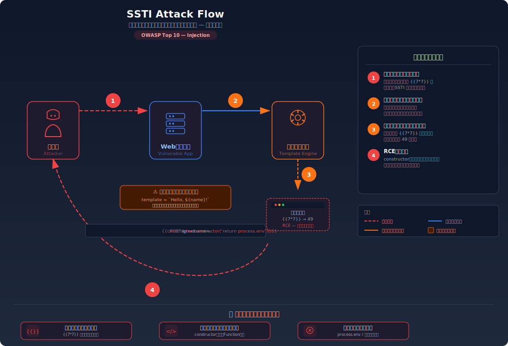

# Server-Side Template Injection (SSTI) — テンプレートエンジンを悪用してサーバーでコードを実行する

> ユーザーの入力がテンプレートエンジンの構文として解釈されることで、サーバー上で任意のコードが実行されてしまう脆弱性を学びます。

---

## 対象ラボ

| 項目 | 内容 |
|------|------|
| **概要** | ユーザー入力がテンプレートエンジンのテンプレート文字列に直接結合され、テンプレート構文として解釈・実行されてしまう |
| **攻撃例** | 名前入力に `{{7*7}}` を入力 → レスポンスに `49` が表示される。さらに `{{constructor.constructor('return process')().exit()}}` でサーバー停止も可能 |
| **技術スタック** | Hono API + 簡易テンプレートエンジン |
| **難易度** | ★★★ 上級 |
| **前提知識** | テンプレートエンジンの基本概念、JavaScript の `eval` の危険性、Step 2: XSS（クライアント側のインジェクションとの比較） |

---

## この脆弱性を理解するための前提

### テンプレートエンジンの仕組み

テンプレートエンジンは、HTML 等の静的なテンプレートに動的なデータを埋め込むための仕組み。テンプレート内の特殊な構文（`{{ }}`、`<%= %>` 等）を解釈し、変数の値に置き換えてレスポンスを生成する。

```typescript
// 正常な使い方: テンプレートは固定、データだけが動的
const template = 'こんにちは、{{name}} さん！';
const result = engine.render(template, { name: 'Alice' });
// → 'こんにちは、Alice さん！'
```

テンプレートエンジンは内部でテンプレート構文を **JavaScript のコードに変換して実行する**。`{{name}}` は `data.name` を参照するコードに変換される。テンプレート文字列自体が「実行されるコード」の一部であることが重要なポイント。

### どこに脆弱性が生まれるのか

問題は、開発者が **ユーザー入力をテンプレートのデータではなく、テンプレート文字列自体に結合してしまう** 場合に発生する。テンプレートエンジンはその文字列をコードとして解釈するため、攻撃者が任意のテンプレート構文を注入できる。

```typescript
// ⚠️ この部分が問題 — ユーザー入力をテンプレート文字列に直接結合している
app.post('/greet', async (c) => {
  const { name } = await c.req.json();
  // name がテンプレート構文の一部として解釈される
  const template = `こんにちは、${name} さん！`;
  const result = engine.render(template, {});
  return c.html(result);
});
```

`name` に `{{7*7}}` が入力されると、テンプレートエンジンは `こんにちは、{{7*7}} さん！` をテンプレートとして解釈し、`{{7*7}}` を計算して `49` を出力する。これはサーバーサイドでのコード実行を意味する。

---

## 攻撃の仕組み



### 攻撃のシナリオ

1. **攻撃者** がテンプレートインジェクションの可能性を探るため、名前入力フィールドに `{{7*7}}` を送信する

   まずテンプレートエンジンが入力を構文として解釈するかを確認する偵察フェーズ。この入力が `49` として表示されれば、テンプレートインジェクションが可能だと判明する。

   ```bash
   curl -X POST http://localhost:3000/api/labs/ssti/vulnerable/greet \
     -H "Content-Type: application/json" \
     -d '{"name": "{{7*7}}"}'
   ```

2. **サーバー** がユーザー入力をテンプレート文字列に結合し、テンプレートエンジンに渡す

   サーバー内部では以下のようなテンプレートが構築される:

   ```
   こんにちは、{{7*7}} さん！
   ```

   テンプレートエンジンは `{{7*7}}` を式として評価し、結果の `49` に置き換える。レスポンスは「こんにちは、49 さん！」となる。

3. **攻撃者** がテンプレートインジェクションの成功を確認し、より危険なペイロードを送信する

   ```bash
   # サーバーの環境変数を読み取る
   curl -X POST http://localhost:3000/api/labs/ssti/vulnerable/greet \
     -H "Content-Type: application/json" \
     -d '{"name": "{{constructor.constructor(\"return JSON.stringify(process.env)\")()}}"}'
   ```

   テンプレートエンジンが JavaScript ベースの場合、`constructor.constructor` を経由して `Function` コンストラクタにアクセスし、任意の JavaScript コードを実行できる。これにより `process.env`（環境変数）、ファイルシステムへのアクセス、さらにはリモートコード実行（RCE）が可能になる。

4. **サーバー** が環境変数やシステム情報を含むレスポンスを返す

   攻撃者はデータベース接続文字列、API キー、内部ネットワーク情報など、サーバー上の機密情報を取得する。

### なぜ成功するのか

| 条件 | 説明 |
|------|------|
| ユーザー入力のテンプレート文字列への結合 | ユーザー入力がテンプレートの「データ」ではなく「コード」の一部として扱われている。テンプレートエンジンは入力を構文として解釈・実行する |
| テンプレートエンジンのサンドボックス欠如 | 多くのテンプレートエンジンはテンプレート内から `constructor` や `process` 等のグローバルオブジェクトにアクセスできる。実行環境が分離されていない |
| 入力値の検証なし | テンプレート構文に使われる `{{`、`}}`、`<%`、`%>` 等の文字列がフィルタリングされていない |

### 被害の範囲

- **機密性**: サーバーの環境変数（DB 接続文字列、API キー、秘密鍵）の漏洩。ファイルシステムの読み取りによるソースコードや設定ファイルの流出
- **完全性**: 任意のコード実行によるファイルの改ざん、バックドアの設置、データベースの操作
- **可用性**: `process.exit()` によるサーバー停止、無限ループによるリソース枯渇、ファイル削除によるサービス破壊

---

## 対策


### 根本原因

ユーザー入力が **テンプレートのコード（構文）** として解釈される設計になっていることが根本原因。テンプレート文字列は「実行されるプログラム」の一部であり、そこにユーザー入力を結合することは `eval()` にユーザー入力を渡すことと本質的に同じ。

### 安全な実装

ユーザー入力はテンプレート文字列に結合するのではなく、テンプレートエンジンの **データ（コンテキスト変数）** として渡す。テンプレート文字列自体は開発者が定義した固定値のみで構成する。

```typescript
// ✅ ユーザー入力をテンプレートのデータとして渡す（構文に結合しない）
app.post('/greet', async (c) => {
  const { name } = await c.req.json();
  // テンプレートは固定文字列 — ユーザー入力を含まない
  const template = 'こんにちは、{{name}} さん！';
  // ユーザー入力はデータとして渡す — テンプレート構文として解釈されない
  const result = engine.render(template, { name });
  return c.html(result);
});
```

この方法では、`name` に `{{7*7}}` が入力されても、テンプレートエンジンはそれを `name` 変数の **値** として扱う。結果は「こんにちは、{{7*7}} さん！」というテキストが表示されるだけで、式の評価は行われない。

#### 脆弱 vs 安全: コード比較

```diff
- // ユーザー入力をテンプレート文字列に結合
- const template = `こんにちは、${name} さん！`;
- const result = engine.render(template, {});
+ // テンプレートは固定、ユーザー入力はデータとして渡す
+ const template = 'こんにちは、{{name}} さん！';
+ const result = engine.render(template, { name });
```

脆弱なコードでは `${name}` によりユーザー入力がテンプレート文字列の一部になるため、テンプレート構文として解釈される。安全なコードではテンプレートが固定文字列であり、ユーザー入力は `{ name }` としてデータ経由で渡されるため、構文として解釈されることがない。

### その他の防御策

| 対策 | 種類 | 説明 |
|------|------|------|
| ユーザー入力をデータとして渡す | 根本対策 | テンプレート文字列にユーザー入力を結合せず、コンテキスト変数として渡す。これが最も効果的 |
| サンドボックス化されたテンプレートエンジン | 多層防御 | Nunjucks の sandbox モード等、テンプレート内からアクセスできるオブジェクトを制限するエンジンを使用する |
| 入力値のバリデーション | 多層防御 | `{{`、`<%` 等のテンプレート構文文字列を入力から除去またはエスケープする。バイパス手法が多いため根本対策にはならない |
| WAF / 入力パターン検知 | 検知 | テンプレート構文を含むリクエストを検知・ブロックする |

---

## ハンズオン手順

### Step 1: 脆弱バージョンで攻撃を体験

**ゴール**: テンプレート構文を含む入力がサーバーサイドで評価・実行されることを確認する

1. 開発サーバーを起動する

   ```bash
   cd backend && pnpm dev
   ```

2. テンプレートインジェクションを試す — 算術式を注入する

   ```bash
   # テンプレート構文 {{7*7}} を名前として送信
   curl -X POST http://localhost:3000/api/labs/ssti/vulnerable/greet \
     -H "Content-Type: application/json" \
     -d '{"name": "{{7*7}}"}'
   ```

3. 結果を確認する

   - レスポンスに「こんにちは、49 さん！」と表示される
   - `{{7*7}}` がテキストではなく式として評価され、計算結果の `49` に置き換わっている
   - **この結果が意味すること**: テンプレートエンジンがユーザー入力を構文として解釈している。算術式が実行できるということは、より危険なコードも実行できる可能性が高い

4. より危険なペイロードを試す

   ```bash
   # サーバーサイドでの情報漏洩を試みる
   curl -X POST http://localhost:3000/api/labs/ssti/vulnerable/greet \
     -H "Content-Type: application/json" \
     -d '{"name": "{{constructor.constructor(\"return process.version\")()}}"}'
   ```

   - Node.js のバージョン情報がレスポンスに含まれることを確認する

### Step 2: 安全バージョンで防御を確認

**ゴール**: 同じ攻撃が失敗することを確認する

1. 同じペイロードを安全なエンドポイントに送信する

   ```bash
   curl -X POST http://localhost:3000/api/labs/ssti/secure/greet \
     -H "Content-Type: application/json" \
     -d '{"name": "{{7*7}}"}'
   ```

2. 結果を確認する

   - レスポンスに「こんにちは、{{7*7}} さん！」とテキストがそのまま表示される
   - テンプレート構文が評価されず、ただの文字列として出力されている

3. コードの差分を確認する

   - `backend/src/labs/step08-advanced/ssti.ts` の脆弱版と安全版を比較
   - **どの行が違いを生んでいるか** に注目: テンプレート文字列への結合 vs データとしての渡し方

### 確認ポイント

以下を自分の言葉で説明できれば、このラボは完了です:

- [ ] SSTI と XSS の違いは何か（実行される場所: サーバー vs ブラウザ）
- [ ] なぜ `{{7*7}}` がテキストではなく式として評価されてしまうのか
- [ ] 安全な実装は「なぜ」この攻撃を無効化するのか（テンプレート文字列 vs データの違い）
- [ ] SSTI が成功した場合、XSS よりも被害が深刻になり得る理由は何か

---

## 実装メモ

| 項目 | パス |
|------|------|
| 脆弱エンドポイント | `/api/labs/ssti/vulnerable/greet` |
| 安全エンドポイント | `/api/labs/ssti/secure/greet` |
| バックエンド | `backend/src/labs/step08-advanced/ssti.ts` |
| フロントエンド | `frontend/src/features/step08-advanced/pages/SSTI.tsx` |

- 簡易テンプレートエンジン（`{{expr}}` 構文）を自前で実装して脆弱性を再現
- 脆弱版: ユーザー入力をテンプレート文字列に結合してから `render()` に渡す
- 安全版: テンプレートは固定文字列とし、ユーザー入力はコンテキスト変数として渡す
- EJS / Eta 等の実際のテンプレートエンジンでも同様のパターンで SSTI が発生することを補足説明する

---

## 現実世界での事例

| 年 | インシデント | 概要 |
|----|-------------|------|
| 2016 | Uber | Jinja2 テンプレートインジェクションにより、サーバー上でリモートコード実行が可能だった。バグバウンティで報告され $10,000 の報奨金 |
| 2020 | Shopify | Liquid テンプレートエンジンの SSTI により、内部情報が漏洩する脆弱性がバグバウンティで発見された |

---

## 関連ラボ

| ラボ | 関連性 |
|------|--------|
| [XSS](../step02-injection/xss.md) | XSS はブラウザ側でのスクリプト実行、SSTI はサーバー側でのコード実行。どちらも「入力がコードとして解釈される」パターン |
| [コマンドインジェクション](../step02-injection/command-injection.md) | コマンドインジェクションは OS コマンドへの注入、SSTI はテンプレートエンジンへの注入。どちらもサーバーサイド RCE に発展する |
| [安全でないデシリアライゼーション](./deserialization.md) | どちらもサーバーサイドでの任意コード実行に発展する高リスクな脆弱性 |

---

## 参考資料

- [OWASP - SSTI](https://owasp.org/www-project-web-security-testing-guide/latest/4-Web_Application_Security_Testing/07-Input_Validation_Testing/18-Testing_for_Server-side_Template_Injection)
- [CWE-1336: Improper Neutralization of Special Elements Used in a Template Engine](https://cwe.mitre.org/data/definitions/1336.html)
