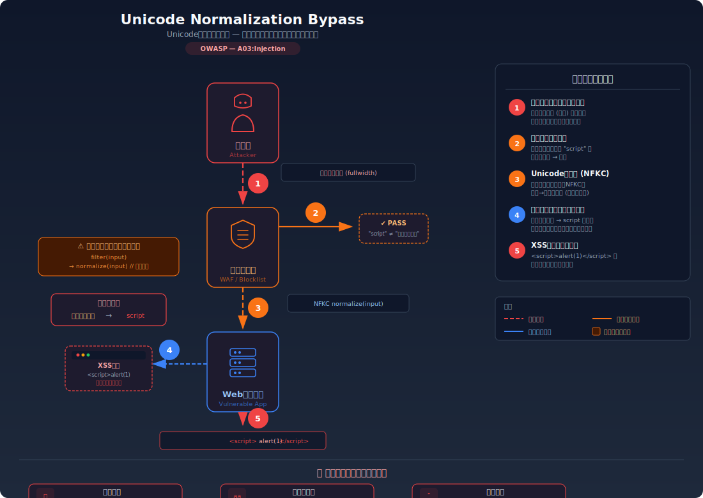
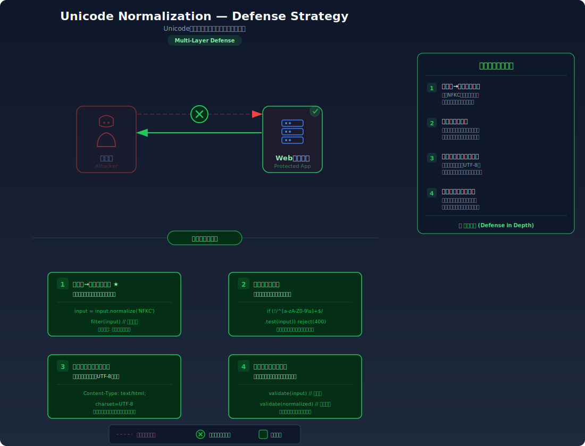

# Unicode Normalization Bypass — Unicode正規化によるフィルタ回避

> 入力フィルタをすり抜けるために、全角文字やホモグリフ（見た目が似た別の文字）を利用し、アプリケーションの正規化処理後にブロックリストを回避する攻撃を学びます。

---

## 対象ラボ

| 項目 | 内容 |
|------|------|
| **概要** | Unicode 正規化により、フィルタ時点では無害に見える文字列がアプリケーション処理後に危険な文字列に変換される。ブロックリスト方式のフィルタがバイパスされ、XSS やインジェクションが成立する |
| **攻撃例** | ブロックリストが `script` を検出するが、全角文字 `ｓｃｒｉｐｔ` を入力 → フィルタ通過後に NFKC 正規化で `script` に変換 → XSS 成立 |
| **技術スタック** | Hono API + React |
| **難易度** | ★★★ 上級 |
| **前提知識** | 文字エンコーディングの基本、Unicode正規化（NFC/NFD/NFKC/NFKD）、XSSフィルタの仕組み |

---

## この脆弱性を理解するための前提

### Unicode 正規化の仕組み

Unicode では、見た目が同じ（または似た）文字に対して複数のコードポイントが割り当てられている場合がある。例えば:

| 文字 | コードポイント | 種類 |
|------|---------------|------|
| `a` | U+0061 | ラテン小文字 a |
| `ａ` | U+FF41 | 全角ラテン小文字 a |
| `а` | U+0430 | キリル小文字 a |
| `a` + `◌̀` | U+0061 + U+0300 | ラテン a + 結合グレーブアクセント |
| `à` | U+00E0 | ラテン小文字 a グレーブ（合成済み） |

これらの「意味的に同等な文字列」を統一するために、Unicode は 4 つの正規化形式を定義している:

| 正規化形式 | 説明 | 特徴 |
|-----------|------|------|
| **NFC** (Canonical Decomposition + Composition) | 正準分解後に正準合成 | `a` + `◌̀` → `à`。最も一般的な形式 |
| **NFD** (Canonical Decomposition) | 正準分解のみ | `à` → `a` + `◌̀`。文字を分解する |
| **NFKC** (Compatibility Decomposition + Composition) | 互換分解後に正準合成 | `fi` → `fi`、`ｓ` → `s`。**全角→半角の変換が起きる** |
| **NFKD** (Compatibility Decomposition) | 互換分解のみ | NFKC と同様の分解だが合成しない |

```typescript
// Unicode 正規化の動作例
'ｓｃｒｉｐｔ'.normalize('NFKC');  // → 'script'（全角→半角）
'filter'.normalize('NFKC');       // → 'filter'（リガチャ→分解）
'＜'.normalize('NFKC');            // → '<'（全角記号→半角記号）
```

正規化そのものはセキュリティ機能ではなく、文字列の正規表現を統一するための仕組み。問題は、この正規化がフィルタリングの **前** と **後** のどちらで行われるかにある。

### どこに脆弱性が生まれるのか

脆弱性は「フィルタ → 正規化」の順序で処理が行われるときに発生する。フィルタは正規化前の文字列を見るため、全角文字やホモグリフを含む入力をブロックできない。その後の正規化で危険な文字列に変換されてしまう:

```typescript
// ⚠️ この部分が問題 — フィルタの後に正規化を行っている（normalize-after-filter パターン）
function processInput(input: string): string {
  // Step 1: ブロックリストでフィルタリング（正規化前の文字列に対して実行）
  const blocklist = ['script', 'onerror', 'onclick', 'javascript'];
  for (const word of blocklist) {
    if (input.toLowerCase().includes(word)) {
      throw new Error('禁止された文字列が含まれています');
    }
  }

  // Step 2: Unicode 正規化（フィルタ通過後に実行）
  // ⚠️ ここで 'ｓｃｒｉｐｔ' が 'script' に変換されるが、既にフィルタを通過済み
  const normalized = input.normalize('NFKC');

  return normalized;
}

// 攻撃例: 全角文字でフィルタをバイパス
processInput('＜ｓｃｒｉｐｔ＞alert(1)＜/ｓｃｒｉｐｔ＞');
// → フィルタ: 'ｓｃｒｉｐｔ' は 'script' と一致しない → 通過
// → 正規化: '<script>alert(1)</script>' に変換 → XSS 成立！
```

---

## 攻撃の仕組み



### 攻撃のシナリオ

#### シナリオ 1: 全角文字によるブロックリスト回避

1. **攻撃者** がブロックリストの対象語を全角文字に置き換えた入力を送信する

   ブロックリストが `script`、`onerror` 等の半角 ASCII 文字列をチェックしていることを把握し、同等の全角文字に変換する:

   ```bash
   # 全角文字でフィルタを回避
   curl -X POST http://localhost:3000/api/labs/unicode-normalization/vulnerable/comment \
     -H "Content-Type: application/json" \
     -d '{"body": "＜ｓｃｒｉｐｔ＞alert(document.cookie)＜/ｓｃｒｉｐｔ＞"}'
   ```

   全角の `ｓ`（U+FF53）は半角の `s`（U+0073）とは異なるコードポイントであるため、`input.includes('script')` の文字列比較では一致しない。

2. **サーバー** がブロックリストで検査する

   フィルタは入力文字列を半角のブロックリストと比較するが、全角文字はマッチしないためフィルタを通過する:

   ```
   入力: "＜ｓｃｒｉｐｔ＞alert(document.cookie)＜/ｓｃｒｉｐｔ＞"
   ブロックリスト検査: "script" を含むか？ → いいえ（全角なので不一致） → 通過
   ```

3. **サーバー** がフィルタ通過後に Unicode 正規化（NFKC）を適用する

   正規化により全角文字が半角文字に変換され、危険なHTML文字列が生成される:

   ```
   正規化後: "<script>alert(document.cookie)</script>"
   ```

4. **被害者のブラウザ** が正規化後の文字列をレンダリングし、スクリプトが実行される

   フィルタを通過した文字列がそのままHTMLに埋め込まれ、XSS が成立する。攻撃者は被害者の Cookie やセッション情報を窃取できる。

#### シナリオ 2: ホモグリフ（見た目が同じ別文字）による回避

1. **攻撃者** がキリル文字などのホモグリフを混ぜた入力を送信する

   見た目は同じだが、Unicode 上は別のコードポイントを持つ文字を使用する:

   ```bash
   # キリル文字の 'а'(U+0430) と 'е'(U+0435) をラテン文字に偽装
   # "jаvаsсript:" の 'а' と 'с' はキリル文字
   curl -X POST http://localhost:3000/api/labs/unicode-normalization/vulnerable/link \
     -H "Content-Type: application/json" \
     -d '{"url": "jаvаsсript:alert(1)"}'
   ```

   ブロックリストの `javascript` は ASCII のラテン文字だけを検査するため、キリル文字を含む入力はマッチしない。

2. **サーバー** がフィルタを通過させ、正規化またはレンダリング時に等価な文字列として解釈される

   一部のブラウザやフレームワークは、IDN（国際化ドメイン名）の処理やテキストのレンダリング時に文字を正規化するため、ホモグリフが元の文字と同等に扱われる場合がある。

#### シナリオ 3: 結合文字による回避

1. **攻撃者** が結合文字（Combining Characters）を利用してフィルタを回避する

   ```bash
   # 結合文字を挿入: s + U+0336 (結合長ストローク) + c + r + i + p + t
   # 見た目は 's̶cript' だが、正規化で結合文字が除去される場合がある
   curl -X POST http://localhost:3000/api/labs/unicode-normalization/vulnerable/comment \
     -H "Content-Type: application/json" \
     -d '{"body": "<s\u0336cript>alert(1)</s\u0336cript>"}'
   ```

   結合文字はベース文字に装飾を追加するが、一部の正規化やサニタイズ処理で除去されることがある。フィルタが結合文字を考慮しない場合、ブロックリストを回避できる。

### なぜ成功するのか

| 条件 | 説明 |
|------|------|
| 正規化がフィルタの後に行われる | フィルタは正規化前の文字列を検査するため、正規化で変換される文字をブロックできない。処理順序が「フィルタ → 正規化」になっている |
| ブロックリスト方式のフィルタ | ブロックリスト（拒否リスト）は既知の危険パターンのみを検出する。未知のバリエーション（全角、ホモグリフ、結合文字）には対応できない |
| Unicode の文字の多様性 | Unicode には同じ「見た目」を持つ異なるコードポイントが多数存在する。これら全てをブロックリストに網羅するのは事実上不可能 |
| 出力時のエスケープ不備 | フィルタに依存し、出力時の HTML エスケープを行っていない場合、フィルタをバイパスされた時点で XSS が成立する |

### 被害の範囲

- **機密性**: XSS を通じた Cookie・セッショントークンの窃取、個人情報の漏洩。被害者のブラウザで実行されるスクリプトが任意のデータを外部に送信可能
- **完全性**: XSS によるページ内容の改ざん、フィッシングフォームの挿入。ユーザーに偽のログインフォームを表示して認証情報を窃取
- **可用性**: 不正なスクリプトの実行によるページの破壊、リダイレクトループによる DoS

---

## 対策



### 根本原因

フィルタリングと正規化の **処理順序が逆転** していることが根本原因。フィルタが「正規化前の生の入力」を検査するため、正規化後に生成される危険文字列を検知できない。さらに、ブロックリスト方式そのものが Unicode の文字の多様性に対応しきれないという構造的な問題もある。

### 安全な実装

対策の核心は「**正規化をフィルタリングの前に行う**」こと。さらに、ブロックリストではなくアローリスト（許可リスト）方式を採用し、出力時のエスケープを必ず行う:

```typescript
// ✅ 安全な実装 — 正規化してからフィルタリング + アローリスト + 出力エスケープ
function processInputSecure(input: string): string {
  // Step 1: 最初に Unicode 正規化を行う（NFKC で互換文字を統一）
  // ✅ 正規化を最初に行うことで、全角文字やホモグリフが半角に変換された状態でフィルタできる
  const normalized = input.normalize('NFKC');

  // Step 2: アローリスト方式で許可する文字のみを通す
  // ✅ ブロックリストではなくアローリストを使うことで、未知の攻撃パターンにも対応できる
  const allowedPattern = /^[\p{L}\p{N}\s.,!?@#\-_()[\]{}:;"']+$/u;
  if (!allowedPattern.test(normalized)) {
    throw new Error('許可されていない文字が含まれています');
  }

  // Step 3: 出力時に HTML エスケープを行う（最終防衛線）
  // ✅ フィルタをバイパスされた場合でも、エスケープにより XSS が成立しない
  return escapeHtml(normalized);
}

// HTML エスケープ関数
function escapeHtml(str: string): string {
  return str
    .replace(/&/g, '&amp;')
    .replace(/</g, '&lt;')
    .replace(/>/g, '&gt;')
    .replace(/"/g, '&quot;')
    .replace(/'/g, '&#39;');
}
```

正規化を最初に行うことで、`ｓｃｒｉｐｔ` は `script` に変換された状態でフィルタリングされる。さらにアローリスト方式で許可する文字を明示的に定義することで、Unicode の無数のバリエーションに対して網羅的な対応が不要になる。出力時の HTML エスケープは最終防衛線として機能し、万が一フィルタをバイパスされても XSS の成立を防ぐ。

#### 脆弱 vs 安全: コード比較

```diff
  function processInput(input: string): string {
+   // ✅ 最初に正規化してから検査する
+   const normalized = input.normalize('NFKC');
+
-   // ブロックリストでフィルタ
-   const blocklist = ['script', 'onerror', 'onclick'];
-   for (const word of blocklist) {
-     if (input.toLowerCase().includes(word)) {
-       throw new Error('禁止された文字列が含まれています');
-     }
-   }
-   // 正規化（フィルタの後）
-   const normalized = input.normalize('NFKC');
-   return normalized;
+   // ✅ アローリスト方式で許可する文字のみ通す
+   const allowedPattern = /^[\p{L}\p{N}\s.,!?@#\-_()[\]{}:;"']+$/u;
+   if (!allowedPattern.test(normalized)) {
+     throw new Error('許可されていない文字が含まれています');
+   }
+   // ✅ 出力時にエスケープ
+   return escapeHtml(normalized);
  }
```

3 つの変更点: (1) 正規化をフィルタリングの前に移動し、全角文字がフィルタに掛かるようにする。(2) ブロックリストをアローリストに変更し、未知のバイパス手法に対応する。(3) 出力時の HTML エスケープを追加し、多層防御を実現する。

### その他の防御策

| 対策 | 種類 | 説明 |
|------|------|------|
| 正規化ファースト | 根本対策 | 入力を受け取ったら最初に NFKC 正規化を行い、その後にフィルタリング・バリデーションを実行する。処理順序を正しくすることが最も重要 |
| アローリスト方式 | 根本対策 | ブロックリスト（拒否リスト）ではなく、アローリスト（許可リスト）で許可する文字・パターンを明示的に定義する。Unicode の全バリエーションを拒否リストに網羅するのは不可能 |
| 出力エスケープ | 根本対策 | HTML コンテキストでは `<>&"'` をエスケープ、URL コンテキストでは `encodeURIComponent` を使用。コンテキストに応じた適切なエスケープが最終防衛線 |
| Content Security Policy (CSP) | 多層防御 | `script-src 'self'` で inline script の実行を禁止。XSS が成立してもスクリプトの実行を制限できる |
| WAF ルールの更新 | 検知 | Web Application Firewall に Unicode 正規化バイパスのパターンを追加し、全角文字やホモグリフを含む疑わしいリクエストを検知・ブロックする |

---

## ハンズオン手順

### Step 1: 脆弱バージョンで攻撃を体験

**ゴール**: 全角文字を使ってブロックリストを回避し、XSS を成立させることを確認する

1. 開発サーバーを起動する

   ```bash
   cd backend && pnpm dev
   ```

2. まず通常の XSS ペイロードがブロックされることを確認する

   ```bash
   # 半角の <script> タグ — ブロックリストで検出される
   curl -X POST http://localhost:3000/api/labs/unicode-normalization/vulnerable/comment \
     -H "Content-Type: application/json" \
     -d '{"body": "<script>alert(1)</script>"}'
   # → 403 Forbidden — { "error": "禁止された文字列が含まれています" }
   ```

3. 全角文字でブロックリストを回避する

   ```bash
   # 全角文字の ＜ｓｃｒｉｐｔ＞ — ブロックリストをバイパス
   curl -X POST http://localhost:3000/api/labs/unicode-normalization/vulnerable/comment \
     -H "Content-Type: application/json" \
     -d '{"body": "＜ｓｃｒｉｐｔ＞alert(document.cookie)＜/ｓｃｒｉｐｔ＞"}'
   # → 200 OK — コメントが保存され、正規化後に <script> として実行される
   ```

4. 全角 URL スキームでリンクフィルタを回避する

   ```bash
   # "javascript:" のブロックリストを全角文字で回避
   curl -X POST http://localhost:3000/api/labs/unicode-normalization/vulnerable/link \
     -H "Content-Type: application/json" \
     -d '{"url": "ｊａｖａｓｃｒｉｐｔ：alert(1)"}'
   # → 200 OK — リンクが保存され、正規化後に javascript: スキームとして実行される
   ```

5. 結果を確認する

   - ブラウザで `http://localhost:5173/labs/step08-advanced/unicode-normalization` にアクセスし、コメント一覧を表示する
   - 全角文字で投稿したコメントが正規化されてスクリプトが実行される
   - DevTools の Console タブでスクリプトの実行を確認する
   - **この結果が意味すること**: フィルタは半角の `script` しか検出できず、全角の `ｓｃｒｉｐｔ` をすり抜ける。正規化後に `script` になるが、フィルタは既に通過済み

### Step 2: 安全バージョンで防御を確認

**ゴール**: 同じ攻撃が失敗することを確認する

1. 同じ全角ペイロードを安全なエンドポイントに送信する

   ```bash
   # 全角文字の攻撃ペイロード
   curl -X POST http://localhost:3000/api/labs/unicode-normalization/secure/comment \
     -H "Content-Type: application/json" \
     -d '{"body": "＜ｓｃｒｉｐｔ＞alert(document.cookie)＜/ｓｃｒｉｐｔ＞"}'
   # → 403 Forbidden — { "error": "許可されていない文字が含まれています" }
   ```

2. 安全なバージョンの処理順序を確認する

   ```bash
   # 通常のテキスト（許可される文字のみ）
   curl -X POST http://localhost:3000/api/labs/unicode-normalization/secure/comment \
     -H "Content-Type: application/json" \
     -d '{"body": "これは安全なコメントです。Hello World!"}'
   # → 200 OK — 正常に保存される
   ```

3. コードの差分を確認する

   - `backend/src/labs/step08-advanced/unicode-normalization.ts` の脆弱版と安全版を比較
   - **処理順序の違い** に注目: 脆弱版は「フィルタ → 正規化」、安全版は「正規化 → フィルタ」
   - **フィルタ方式の違い** に注目: 脆弱版はブロックリスト、安全版はアローリスト
   - **出力処理の違い** に注目: 安全版は HTML エスケープを追加

### 確認ポイント

以下を自分の言葉で説明できれば、このラボは完了です:

- [ ] Unicode 正規化（特に NFKC）が全角文字やリガチャに対してどのような変換を行うか
- [ ] 「フィルタ → 正規化」の順序がなぜ脆弱なのか（具体的な入力例で説明できるか）
- [ ] ブロックリスト方式が Unicode の文字の多様性に対して根本的に弱い理由は何か
- [ ] 安全な実装の 3 つの防御層（正規化ファースト・アローリスト・出力エスケープ）がそれぞれ何を防いでいるか

---

## 実装メモ

| 項目 | パス |
|------|------|
| 脆弱エンドポイント (comment) | `/api/labs/unicode-normalization/vulnerable/comment` |
| 脆弱エンドポイント (link) | `/api/labs/unicode-normalization/vulnerable/link` |
| 安全エンドポイント (comment) | `/api/labs/unicode-normalization/secure/comment` |
| 安全エンドポイント (link) | `/api/labs/unicode-normalization/secure/link` |
| バックエンド | `backend/src/labs/step08-advanced/unicode-normalization.ts` |
| フロントエンド | `frontend/src/labs/step08-advanced/pages/UnicodeNormalization.tsx` |

- 脆弱版: ブロックリスト方式のフィルタを先に適用し、その後に NFKC 正規化を行う（normalize-after-filter パターン）
- 安全版: NFKC 正規化を最初に行い、アローリスト方式でバリデーション、さらに出力時に HTML エスケープ
- フロントエンドにはコメント投稿フォームとリンク投稿フォームを用意し、投稿結果をリアルタイムに表示する
- Unicode の正規化前後の文字列を比較表示するデバッグパネルを組み込むと学習効果が高い

---

## 現実世界での事例

| 年 | インシデント | 概要 |
|----|-------------|------|
| 2019 | Spotify アカウント乗っ取り | Unicode 正規化の違いを利用して、既存ユーザーと同一に見えるユーザー名を登録し、パスワードリセットを悪用してアカウントを乗っ取る攻撃が報告された |
| 2021 | GitHub Actions スクリプトインジェクション | Unicode 文字を含むブランチ名やコミットメッセージが正規化処理を経てスクリプトインジェクションに繋がる脆弱性パターンが報告された |

---

## 関連ラボ

| ラボ | 関連性 |
|------|--------|
| [Reflected XSS](../step02-xss/reflected-xss.md) | Unicode 正規化バイパスは XSS フィルタの回避手法の一つ。XSS の基本を理解した上で、フィルタ回避のテクニックとして学ぶ |
| [SSTI](../step08-advanced/ssti.md) | テンプレートインジェクションでも Unicode 正規化を使ったフィルタ回避が適用される場合がある。入力サニタイズのバイパス手法として共通 |

---

## 参考資料

- [OWASP - Input Validation Cheat Sheet](https://cheatsheetseries.owasp.org/cheatsheets/Input_Validation_Cheat_Sheet.html)
- [CWE-176: Improper Handling of Unicode Encoding](https://cwe.mitre.org/data/definitions/176.html)
- [Unicode Technical Report #36 - Unicode Security Considerations](https://www.unicode.org/reports/tr36/)
- [Unicode Technical Standard #39 - Unicode Security Mechanisms](https://www.unicode.org/reports/tr39/)
- [Unicode Normalization Forms (UAX #15)](https://www.unicode.org/reports/tr15/)
