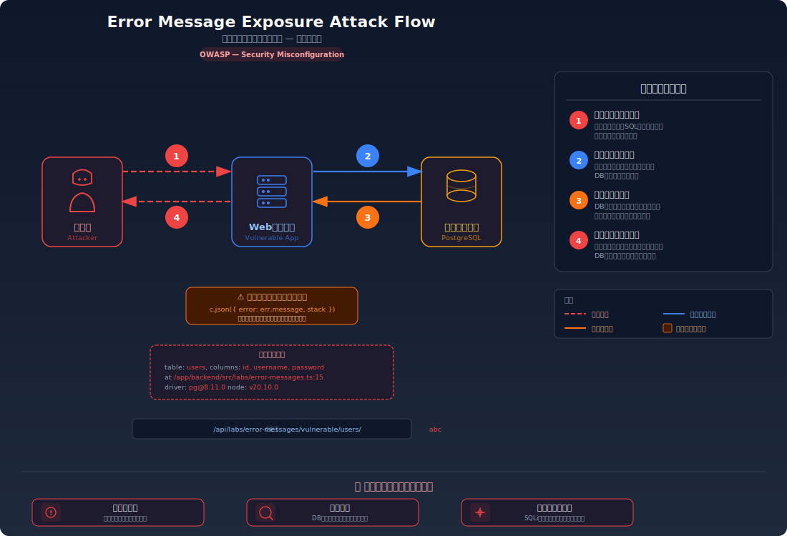
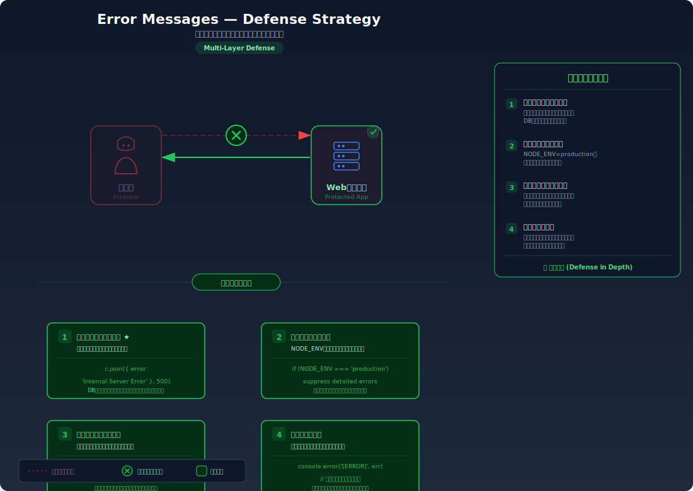

# 詳細エラーメッセージ露出 — デバッグ情報がそのまま攻撃者の手がかりになる

> エラーレスポンスにスタックトレースやDB構造などの内部情報が含まれることで、攻撃者がシステムの弱点を効率的に特定できてしまう脆弱性を学びます。

---

## 対象ラボ

### 1. デバッグ情報の漏洩

| 項目 | 内容 |
|------|------|
| **概要** | スタックトレースやDB構造がエラーレスポンスに含まれ、攻撃者に内部情報を提供してしまう |
| **攻撃例** | 不正なリクエストを送り、レスポンスからテーブル名やカラム名を取得 |
| **技術スタック** | Hono API + PostgreSQL |
| **難易度** | ★☆☆ 入門 |
| **前提知識** | HTTP リクエストの基本、エラーレスポンスの構造 |

---

## この脆弱性を理解するための前提

### エラーハンドリングの仕組み

Web アプリケーションでは、リクエストの処理中にさまざまなエラーが発生しうる:

1. データベースクエリの失敗（テーブルが存在しない、構文エラー等）
2. ファイルの読み込みエラー（パスの誤り、権限不足等）
3. 未処理の例外（null 参照、型エラー等）

開発環境では、これらのエラーの詳細情報（スタックトレース、SQL クエリ、変数の値など）が画面に表示されることが一般的。これは開発者がバグを素早く特定するために有用だが、本番環境でこの情報が公開されると深刻な問題になる。

### どこに脆弱性が生まれるのか

問題は、エラーハンドリングが **開発モードのまま本番環境にデプロイされている** 場合や、catch ブロックで例外の詳細をそのままレスポンスに含めてしまう場合に発生する。

```typescript
// ⚠️ この部分が問題 — エラーの詳細をそのままクライアントに返している
app.get('/api/users/:id', async (c) => {
  try {
    const result = await pool.query(`SELECT * FROM users WHERE id = ${c.req.param('id')}`);
    return c.json(result.rows[0]);
  } catch (error) {
    // エラーオブジェクトをそのまま返すと、スタックトレースやSQLクエリが漏洩する
    return c.json({ error: error.message, stack: error.stack }, 500);
  }
});
```

攻撃者が `/api/users/abc` のような不正な値を送信すると、レスポンスにはテーブル名、カラム名、ファイルパス、使用ライブラリのバージョンなどが含まれてしまう。

---

## 攻撃の仕組み



### 攻撃のシナリオ

1. **攻撃者** が意図的に不正なリクエストを送信する

   存在しないパス、不正な型の値、特殊文字などを含むリクエストを送り、アプリケーションにエラーを発生させる。

   ```bash
   # 不正な ID を送信してエラーを誘発
   curl http://localhost:3000/api/labs/error-messages/vulnerable/users/abc
   ```

2. **サーバー** がエラーの詳細をレスポンスに含めて返す

   未処理の例外や不適切な catch ブロックにより、エラーメッセージにスタックトレース、SQL クエリ、ファイルパスなどの内部情報が含まれる。

   ```json
   {
     "error": "invalid input syntax for type integer: \"abc\"",
     "query": "SELECT * FROM users WHERE id = abc",
     "stack": "Error: ...\n    at /app/backend/src/labs/step09-defense/error-messages.ts:15:30\n    at node_modules/pg/lib/client.js:512:26",
     "hint": "table: users, columns: id (integer), username (varchar), password (varchar), email (varchar)"
   }
   ```

3. **攻撃者** がレスポンスから情報を収集する

   - テーブル名 (`users`) とカラム名 (`id`, `username`, `password`, `email`) を特定
   - ファイルパス (`/app/backend/src/labs/...`) からプロジェクト構造を把握
   - 使用ライブラリ (`pg`) とそのバージョンを特定
   - これらの情報を使って SQL インジェクションなどの次の攻撃を組み立てる

### なぜ成功するのか

| 条件 | 説明 |
|------|------|
| エラー詳細の露出 | エラーオブジェクトの `message`, `stack`, `query` などの内部情報がフィルタリングされずにレスポンスに含まれている |
| 開発モードでの運用 | 本番環境でもデバッグモードが有効になっており、詳細なエラー情報が表示される設定のまま |
| エラーハンドリングの欠如 | グローバルなエラーハンドラーが設定されておらず、未処理の例外がそのままクライアントに到達する |

### 被害の範囲

- **機密性**: テーブル構造、ファイルパス、ライブラリバージョンなどの内部情報が漏洩し、攻撃者の偵察活動を支援してしまう
- **完全性**: 得られた情報を基にした SQL インジェクションやパストラバーサルなどの二次攻撃により、データの改ざんが可能になる
- **可用性**: 内部構造の露出により、攻撃者がシステムの弱点を特定しやすくなり、DoS 攻撃のポイントを絞れる

---

## 対策



### 根本原因

エラー発生時に **内部実装の詳細** がフィルタリングされずにクライアントに返されることが根本原因。開発者向けのデバッグ情報とユーザー向けのエラーメッセージが区別されていない。

### 安全な実装

エラーレスポンスには汎用的なメッセージのみを返し、詳細情報はサーバーサイドのログにのみ記録する。

```typescript
// ✅ 安全な実装 — エラーの詳細はログに記録し、クライアントには汎用メッセージを返す
app.get('/api/users/:id', async (c) => {
  try {
    const id = parseInt(c.req.param('id'), 10);
    if (isNaN(id)) {
      return c.json({ error: 'リクエストが不正です' }, 400);
    }
    const result = await pool.query('SELECT id, username, email FROM users WHERE id = $1', [id]);
    if (result.rows.length === 0) {
      return c.json({ error: 'ユーザーが見つかりません' }, 404);
    }
    return c.json(result.rows[0]);
  } catch (error) {
    // 詳細はサーバーログにのみ記録
    console.error('[ERROR] GET /api/users/:id', error);
    // クライアントには汎用メッセージのみ返す
    return c.json({ error: 'サーバーエラーが発生しました' }, 500);
  }
});
```

#### 脆弱 vs 安全: コード比較

```diff
  } catch (error) {
-   // エラーの詳細をそのままクライアントに返す
-   return c.json({ error: error.message, stack: error.stack }, 500);
+   // 詳細はサーバーログにのみ記録
+   console.error('[ERROR] GET /api/users/:id', error);
+   // クライアントには汎用メッセージのみ返す
+   return c.json({ error: 'サーバーエラーが発生しました' }, 500);
  }
```

脆弱なコードではエラーオブジェクトの内部情報をそのまま返しているため、攻撃者にシステムの構造を教えてしまう。安全なコードでは詳細をログファイルに記録し、クライアントには攻撃に利用できない汎用メッセージのみを返す。

### その他の防御策

| 対策 | 種類 | 説明 |
|------|------|------|
| グローバルエラーハンドラー | 根本対策 | フレームワークレベルでエラーハンドラーを設定し、未処理の例外が漏洩しないようにする |
| 環境変数による切り替え | 根本対策 | `NODE_ENV=production` で詳細エラーを自動的に抑制する設計にする |
| サーバーサイドログ | 多層防御 | エラーの詳細はログに記録し、インシデント調査に活用する |
| 入力バリデーション | 多層防御 | 不正な入力を早期に検出し、そもそもエラーを発生させない |
| カスタムエラーページ | UX | ユーザーに分かりやすいエラーメッセージを表示する |

---

## ハンズオン手順

### Step 1: 脆弱バージョンで攻撃を体験

**ゴール**: 不正なリクエストにより、内部情報（テーブル名、ファイルパス等）がレスポンスに含まれることを確認する

1. 開発サーバーを起動する

   ```bash
   cd backend && pnpm dev
   ```

2. 不正なリクエストを送信してエラーを誘発する

   ```bash
   # 不正な型の値を送信
   curl http://localhost:3000/api/labs/error-messages/vulnerable/users/abc
   ```

3. 結果を確認する

   - レスポンスにスタックトレース、SQL クエリ、テーブル名などが含まれている
   - ファイルパスからプロジェクト構成が推測できる
   - **この結果が意味すること**: 攻撃者はエラーを誘発するだけで、システムの内部構造を把握できてしまう

4. 存在しないエンドポイントや特殊文字でも試す

   ```bash
   curl http://localhost:3000/api/labs/error-messages/vulnerable/users/%27OR%201%3D1
   ```

### Step 2: 安全バージョンで防御を確認

**ゴール**: 同じリクエストでも内部情報が漏洩しないことを確認する

1. 安全なエンドポイントに同じリクエストを送信する

   ```bash
   curl http://localhost:3000/api/labs/error-messages/secure/users/abc
   ```

2. 結果を確認する

   - 汎用的なエラーメッセージのみが返される（「リクエストが不正です」等）
   - スタックトレースやテーブル名は含まれていない

3. サーバーログを確認する

   - サーバーのコンソールにはエラーの詳細が記録されている
   - 開発者はログからデバッグ可能だが、クライアントには情報が漏れない

4. コードの差分を確認する

   - `backend/src/labs/step09-defense/error-messages.ts` の脆弱版と安全版を比較
   - **どの行が違いを生んでいるか** に注目: catch ブロック内のレスポンス内容

### 確認ポイント

以下を自分の言葉で説明できれば、このラボは完了です:

- [ ] 詳細エラーメッセージが攻撃者にどのような情報を提供するか
- [ ] エラーの詳細をクライアントに返すことと、ログに記録することの違い
- [ ] `NODE_ENV` による環境切り替えがセキュリティにどう関わるか
- [ ] グローバルエラーハンドラーの役割と、個別の try-catch だけでは不十分な理由

---

## 実装メモ

| 項目 | パス |
|------|------|
| 脆弱エンドポイント | `/api/labs/error-messages/vulnerable/users/:id` |
| 安全エンドポイント | `/api/labs/error-messages/secure/users/:id` |
| バックエンド | `backend/src/labs/step09-defense/error-messages.ts` |
| フロントエンド | `frontend/src/labs/step09-defense/pages/ErrorMessages.tsx` |

- 脆弱版では catch ブロックでエラーオブジェクトの `message` と `stack` をそのままレスポンスに含める
- 安全版では汎用メッセージのみをレスポンスに返し、詳細は `console.error` でサーバーログに記録する
- グローバルエラーハンドラーの有無による違いも確認できるようにする

---

## 現実世界での事例

| 年 | インシデント | 概要 |
|----|-------------|------|
| 2017 | Equifax | エラーページにApache Struts のバージョン情報が含まれており、既知の脆弱性 (CVE-2017-5638) を特定する手がかりとなった。最終的に 1 億 4,700 万件の個人情報が漏洩 |
| 2019 | Capital One | エラーメッセージから AWS の内部メタデータエンドポイントの存在が判明し、SSRF 攻撃の足がかりとなった |
| 2021 | Microsoft Power Apps | 詳細なエラーレスポンスにより API の内部構造が露出し、3,800 万件のレコードが公開状態になっていた |

---

## 関連ラボ

| ラボ | 関連性 |
|------|--------|
| [スタックトレース漏洩](./stack-trace.md) | エラーメッセージの一種としてスタックトレースが漏洩するケース。本ラボではより広範な情報漏洩を扱う |
| [エラーメッセージからの情報漏洩](../step01-recon/error-message-leakage.md) | Step 01 の偵察ラボで扱ったエラーメッセージ漏洩の防御版 |
| [SQL Injection](../step02-injection/sql-injection.md) | 詳細エラーメッセージから得たテーブル構造の情報が SQL インジェクション攻撃を容易にする |

---

## 参考資料

- [OWASP - Improper Error Handling](https://owasp.org/www-community/Improper_Error_Handling)
- [CWE-209: Generation of Error Message Containing Sensitive Information](https://cwe.mitre.org/data/definitions/209.html)
