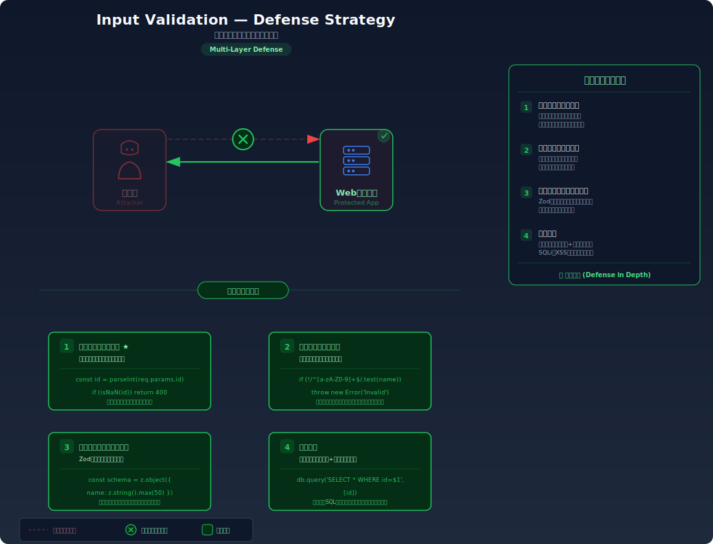

# Input Validation — 入力バリデーション設計の原則

> 「入力はすべて信頼しない」原則に基づき、ホワイトリスト方式のバリデーション、文字エンコーディング検証、型チェックを組み合わせた入力処理の設計パターンを学びます。

---

## 対象ラボ

### 1. バリデーション不備によるインジェクション

| 項目 | 内容 |
|------|------|
| **概要** | ユーザー登録 API でバリデーションが不十分なため、SQLi、XSS、パストラバーサル等の攻撃ペイロードがそのまま処理される |
| **攻撃例** | `{"username": "admin' OR 1=1 --", "email": "<script>alert(1)</script>"}` を送信 |
| **技術スタック** | Hono API + PostgreSQL + zod |
| **難易度** | ★★☆ 中級 |
| **前提知識** | HTTP リクエストの基本（POST / JSON）、SQL インジェクションと XSS の概要（Step 2） |

### 2. スキーマバリデーションによる防御

| 項目 | 内容 |
|------|------|
| **概要** | zod/valibot 等のスキーマバリデーションライブラリと Hono の validator ミドルウェアを使い、不正な入力をアプリケーション層に到達させない |
| **攻撃例** | 同じペイロードがバリデーションエラーで拒否される |
| **技術スタック** | Hono API + zod + @hono/zod-validator |
| **難易度** | ★★☆ 中級 |
| **前提知識** | TypeScript の型システム、JSON スキーマの概念 |

---

## この脆弱性を理解するための前提

### バリデーション・サニタイゼーション・エスケープの違い

入力データの安全な処理には3つの異なるアプローチがあり、それぞれ役割が異なる:

| アプローチ | タイミング | 目的 | 例 |
|-----------|-----------|------|-----|
| **バリデーション** | 入力受付時 | 不正な入力を**拒否**する | メールアドレスの形式チェック、文字数制限 |
| **サニタイゼーション** | 処理前 | 危険な部分を**除去・変換**する | HTML タグの除去、制御文字の削除 |
| **エスケープ** | 出力時 | 出力先で**特殊文字を無害化**する | `<` → `&lt;`、`'` → `''` |

これらは **代替ではなく補完** の関係にある。バリデーションは「入り口」、エスケープは「出口」の防御であり、両方が必要。

```
[ユーザー入力] → バリデーション(拒否) → サニタイゼーション(変換) → ビジネスロジック → エスケープ(出力時) → [レスポンス/DB]
```

### ブラックリスト vs ホワイトリスト（許可リスト）

入力バリデーションのアプローチには2つある:

**ブラックリスト方式**（拒否リスト）— 「危険な入力」を列挙して拒否する:

```typescript
// ⚠️ ブラックリスト方式 — 既知の攻撃パターンを拒否する
function validateInput(input: string): boolean {
  const blacklist = ['<script>', 'DROP TABLE', 'OR 1=1', '../', '%00'];
  return !blacklist.some(pattern => input.toLowerCase().includes(pattern));
}
```

この方式の致命的な弱点は、**攻撃パターンが無限にある** ことである。`<Script>`（大文字混在）、`<scr<script>ipt>`（分割）、`%3Cscript%3E`（エンコーディング）など、ブラックリストの回避手法は多数存在する。

**ホワイトリスト方式**（許可リスト）— 「許可する入力」を定義し、それ以外をすべて拒否する:

```typescript
// ✅ ホワイトリスト方式 — 許可する形式を正規表現で定義
function validateUsername(input: string): boolean {
  // 英数字とアンダースコアのみ、3-20文字
  return /^[a-zA-Z0-9_]{3,20}$/.test(input);
}
```

ホワイトリスト方式では「許可していない入力はすべて拒否」されるため、未知の攻撃パターンに対しても防御できる。

### どこに脆弱性が生まれるのか

問題は、バリデーションが **欠如** しているか、**不十分** な場合に発生する。開発者がユーザー入力を「想定どおりの形式である」と暗黙に信頼してしまうことが根本の原因。

```typescript
// ⚠️ この部分が問題 — 入力バリデーションなしで直接処理している
app.post('/register', async (c) => {
  const { username, email, age } = await c.req.json();

  // 1. 型チェックなし: age が文字列 "0; DROP TABLE users" でも受け入れる
  // 2. 形式チェックなし: email が "<script>alert(1)</script>" でも受け入れる
  // 3. 長さチェックなし: username が 10万文字でも受け入れる（DoS の可能性）
  // 4. 文字種チェックなし: username に SQL 特殊文字やヌルバイトが含まれていても受け入れる
  const result = await pool.query(
    `INSERT INTO users (username, email, age) VALUES ('${username}', '${email}', ${age})`
  );

  return c.json({ success: true });
});
```

このコードには **入力バリデーション** と **パラメータ化クエリ** の両方が欠如している。バリデーションは「不正な入力をそもそも受け付けない」ための防御であり、パラメータ化クエリは「入力がSQL構文として解釈されない」ための防御。どちらか一方ではなく、両方が必要。

### クライアント側バリデーションの限界

```html
<!-- クライアント側のバリデーション — ユーザビリティのためだが、セキュリティ対策にはならない -->
<form>
  <input type="email" name="email" required pattern="[^@]+@[^@]+\.[^@]+" />
  <input type="number" name="age" min="0" max="150" />
</form>
```

クライアント側のバリデーションは **DevTools でフォームを改ざん** したり、**curl で直接リクエスト** を送信することで完全にバイパスできる。クライアント側はユーザー利便性のため、**サーバー側のバリデーションがセキュリティ上必須** である。

---

## 攻撃の仕組み


### 攻撃のシナリオ

1. **攻撃者** がバリデーション不備のユーザー登録 API に悪意ある入力を送信する

   クライアント側のフォームを無視して直接 API にリクエストを送ることで、あらゆるバリデーションをバイパスできる。

   ```bash
   # SQL インジェクションペイロードを含む登録リクエスト
   curl -X POST http://localhost:3000/api/labs/input-validation/vulnerable/register \
     -H "Content-Type: application/json" \
     -d '{
       "username": "admin'\'' OR 1=1 --",
       "email": "attacker@evil.com",
       "age": "0; DROP TABLE users"
     }'
   ```

2. **サーバー** がバリデーションなしで入力をそのまま処理する

   入力値の型チェック、形式チェック、文字種チェックのいずれも行わず、ユーザー入力を信頼してSQLクエリに埋め込む。結果として生成されるSQLは:

   ```sql
   INSERT INTO users (username, email, age) VALUES ('admin' OR 1=1 --', 'attacker@evil.com', 0; DROP TABLE users)
   ```

   `age` フィールドに `0; DROP TABLE users` が渡されると、2つのSQL文が実行され、`users` テーブルが削除される可能性がある。

3. **攻撃者** が様々な攻撃ベクトルを試行する

   バリデーション不備は単独の脆弱性ではなく、複数の攻撃への入り口となる:

   - **SQL インジェクション**: `' OR 1=1 --` でクエリを改変
   - **XSS**: `<script>alert(1)</script>` がエスケープされずに保存・表示される
   - **パストラバーサル**: `../../etc/passwd` でファイルシステムにアクセス
   - **ヌルバイト攻撃**: `file.txt%00.jpg` でファイル拡張子チェックを回避

### ヌルバイト攻撃の仕組み

ヌルバイト（`\0` / `%00`）は C 言語系の文字列終端文字であり、一部の処理系で文字列を途中で切り詰める効果がある:

```typescript
// ⚠️ ヌルバイトによるバリデーション回避の例
const filename = 'malicious.php%00.jpg';

// 拡張子チェックは ".jpg" を見て通過する
if (filename.endsWith('.jpg')) {
  // ファイルシステムが %00 以降を無視し、"malicious.php" として保存する可能性
  saveFile(filename, data);
}
```

### 文字エンコーディングの問題

不正な UTF-8 シーケンスによるバリデーション回避も存在する:

```typescript
// ⚠️ オーバーロング UTF-8 エンコーディングによる回避
// "/" (U+002F) の正規エンコーディング: 0x2F
// オーバーロング: 0xC0 0xAF (不正な2バイト表現)
// バリデーションが "/../" をチェックしても、オーバーロングエンコーディングは検出されない

// ✅ 対策: 入力のUTF-8正当性を最初に検証する
function isValidUtf8(buffer: Buffer): boolean {
  try {
    const decoded = new TextDecoder('utf-8', { fatal: true }).decode(buffer);
    // 再エンコードして一致することを確認（正規化チェック）
    const reencoded = new TextEncoder().encode(decoded);
    return Buffer.compare(buffer, Buffer.from(reencoded)) === 0;
  } catch {
    return false; // 不正な UTF-8
  }
}
```

### なぜ成功するのか

| 条件 | 説明 |
|------|------|
| サーバー側バリデーションの欠如 | クライアント側のバリデーションのみに依存し、サーバー側で入力の形式・型・範囲を検証していない |
| ブラックリスト方式の限界 | 既知のパターンのみを拒否するアプローチでは、エンコーディングの変換や未知の攻撃パターンで回避される |
| 型変換の暗黙の信頼 | `age` フィールドが文字列で渡されても数値として処理しようとし、型の不一致が脆弱性につながる |
| エンコーディング検証の欠如 | 不正な UTF-8 シーケンスやヌルバイトが検証されず、下流の処理で予期しない動作を引き起こす |

### 被害の範囲

- **機密性**: SQL インジェクションによる全ユーザーのパスワードハッシュ・メールアドレスの取得、パストラバーサルによるサーバー設定ファイルの読み出し
- **完全性**: 保存型 XSS によるページ改ざん、SQL インジェクションによるデータ書き換え・削除、ヌルバイト攻撃によるファイル種別の偽装
- **可用性**: 極端に長い入力値やネストしたJSON構造によるメモリ枯渇（DoS）、`DROP TABLE` によるデータ消失

---

## 対策



### 根本原因

ユーザーからの入力が **信頼できるデータとして暗黙に受け入れられている** ことが根本原因。入力の型・形式・範囲・エンコーディングがアプリケーション層で検証されないまま、SQL クエリ、HTML 出力、ファイルパスなどの下流処理に渡っている。

### 安全な実装

#### 1. zod によるスキーマバリデーション

zod はランタイムで TypeScript の型に対応するバリデーションを行うライブラリ。スキーマを定義することで、型チェック・形式チェック・範囲チェックを宣言的に記述できる:

```typescript
import { z } from 'zod';

// ✅ スキーマ定義 — 許可する入力の形式を宣言的に定義
const registerSchema = z.object({
  // ユーザー名: 英数字とアンダースコアのみ、3-20文字（ホワイトリスト方式）
  username: z
    .string()
    .min(3, 'ユーザー名は3文字以上で入力してください')
    .max(20, 'ユーザー名は20文字以下で入力してください')
    .regex(/^[a-zA-Z0-9_]+$/, 'ユーザー名は英数字とアンダースコアのみ使用できます'),

  // メールアドレス: RFC 5322 に準拠した形式チェック
  email: z
    .string()
    .email('有効なメールアドレスを入力してください')
    .max(254, 'メールアドレスが長すぎます'),

  // 年齢: 整数、0-150 の範囲
  age: z
    .number({ invalid_type_error: '年齢は数値で入力してください' })
    .int('年齢は整数で入力してください')
    .min(0, '年齢は0以上で入力してください')
    .max(150, '年齢は150以下で入力してください'),
});

// スキーマから TypeScript の型を自動生成
type RegisterInput = z.infer<typeof registerSchema>;
// → { username: string; email: string; age: number; }
```

#### 2. Hono の validator ミドルウェアとの統合

`@hono/zod-validator` を使うことで、ルートハンドラに到達する前にバリデーションを自動的に実行できる:

```typescript
import { Hono } from 'hono';
import { zValidator } from '@hono/zod-validator';
import { z } from 'zod';

const app = new Hono();

const registerSchema = z.object({
  username: z.string().min(3).max(20).regex(/^[a-zA-Z0-9_]+$/),
  email: z.string().email().max(254),
  age: z.number().int().min(0).max(150),
});

// ✅ zValidator でリクエストボディを自動バリデーション
// バリデーションエラー時はハンドラに到達せず、400 エラーが返される
app.post(
  '/register',
  zValidator('json', registerSchema, (result, c) => {
    if (!result.success) {
      // バリデーションエラーの詳細を返す（攻撃者への情報提供にならない範囲で）
      return c.json(
        {
          error: '入力内容に問題があります',
          details: result.error.issues.map((issue) => ({
            field: issue.path.join('.'),
            message: issue.message,
          })),
        },
        400,
      );
    }
  }),
  async (c) => {
    // ここに到達した時点で input は型安全かつバリデーション済み
    const input = c.req.valid('json');

    // パラメータ化クエリで安全にDBに挿入（多層防御）
    const result = await pool.query(
      'INSERT INTO users (username, email, age) VALUES ($1, $2, $3) RETURNING id',
      [input.username, input.email, input.age],
    );

    return c.json({ success: true, id: result.rows[0].id }, 201);
  },
);
```

この実装には3層の防御がある:
1. **zod バリデーション**: 不正な形式の入力をルートハンドラに到達させない
2. **TypeScript 型チェック**: `input` の型が `RegisterInput` に強制される
3. **パラメータ化クエリ**: 仮にバリデーションを通過しても SQL インジェクションを防ぐ

#### 3. 安全な型変換

JavaScript の暗黙的型変換は予期しない結果を生むことがある:

```typescript
// ⚠️ 危険な型変換
parseInt('123abc');     // → 123（末尾の文字を無視）
Number('');             // → 0（空文字が0になる）
Number('0x1A');         // → 26（16進数として解釈）
+'Infinity';            // → Infinity

// ✅ zod による安全な型変換
const safeNumber = z.coerce.number().int().min(0).max(150);
safeNumber.parse('123abc');  // → ZodError（不正な数値）
safeNumber.parse('');        // → ZodError（不正な数値）
safeNumber.parse('42');      // → 42（安全に変換）
```

#### 脆弱 vs 安全: コード比較

```diff
- app.post('/register', async (c) => {
-   const { username, email, age } = await c.req.json();
-   // バリデーションなし、文字列結合によるSQL構築
-   const result = await pool.query(
-     `INSERT INTO users (username, email, age) VALUES ('${username}', '${email}', ${age})`
-   );
-   return c.json({ success: true });
- });
+ app.post(
+   '/register',
+   zValidator('json', registerSchema),
+   async (c) => {
+     // バリデーション済みの型安全な入力
+     const input = c.req.valid('json');
+     // パラメータ化クエリ
+     const result = await pool.query(
+       'INSERT INTO users (username, email, age) VALUES ($1, $2, $3) RETURNING id',
+       [input.username, input.email, input.age],
+     );
+     return c.json({ success: true, id: result.rows[0].id }, 201);
+   },
+ );
```

脆弱なコードでは入力がそのまま SQL 文に結合されるため、攻撃者が SQL 構文を注入できる。安全なコードでは zod がホワイトリスト方式でバリデーションし、さらにパラメータ化クエリが SQL インジェクションを防ぐ。

### その他の防御策

| 対策 | 種類 | 説明 |
|------|------|------|
| スキーマバリデーション (zod/valibot) | 根本対策 | ホワイトリスト方式で入力の型・形式・範囲を宣言的に定義し、不正入力を拒否する |
| パラメータ化クエリ | 根本対策 | SQL インジェクション対策。バリデーションとは独立した防御層として必須 |
| 出力エスケープ | 根本対策 | XSS 対策。バリデーションで通過した入力でも、出力先に応じたエスケープは必須 |
| UTF-8 正当性チェック | 多層防御 | 不正なバイトシーケンスやオーバーロングエンコーディングを入力の最初の段階で拒否する |
| リクエストサイズ制限 | 多層防御 | 極端に大きなリクエストボディを拒否し、DoS やメモリ枯渇を防ぐ |
| WAF (Web Application Firewall) | 検知 | 既知の攻撃パターンを検知・ブロック。バリデーションの代替にはならないが、追加の防御層になる |

---

## ハンズオン手順

### Step 1: 脆弱バージョンで攻撃を体験

**ゴール**: バリデーション不備の API に対して、不正な入力がそのまま処理されることを確認する

1. 開発サーバーを起動する

   ```bash
   cd backend && pnpm dev
   ```

2. 不正な入力を含む登録リクエストを送信する

   ```bash
   # SQL インジェクションペイロード
   curl -X POST http://localhost:3000/api/labs/input-validation/vulnerable/register \
     -H "Content-Type: application/json" \
     -d '{"username": "admin'\'' OR 1=1 --", "email": "not-an-email", "age": "not-a-number"}'
   ```

3. 結果を確認する

   - サーバーが入力をそのまま受け入れ、SQL エラーまたは意図しない処理が発生する
   - **この結果が意味すること**: バリデーションがないため、攻撃者は任意の文字列をアプリケーションに注入できる

4. 様々な攻撃ベクトルを試す

   ```bash
   # XSS ペイロード
   curl -X POST http://localhost:3000/api/labs/input-validation/vulnerable/register \
     -H "Content-Type: application/json" \
     -d '{"username": "<script>alert(1)</script>", "email": "test@test.com", "age": 25}'

   # 極端に長い入力（DoS）
   curl -X POST http://localhost:3000/api/labs/input-validation/vulnerable/register \
     -H "Content-Type: application/json" \
     -d "{\"username\": \"$(python3 -c "print('A'*100000)")\", \"email\": \"test@test.com\", \"age\": 25}"

   # 型の不一致
   curl -X POST http://localhost:3000/api/labs/input-validation/vulnerable/register \
     -H "Content-Type: application/json" \
     -d '{"username": 12345, "email": true, "age": [1, 2, 3]}'
   ```

### Step 2: 安全バージョンで防御を確認

**ゴール**: 同じ攻撃が zod バリデーションにより拒否されることを確認する

1. 安全なエンドポイントに同じリクエストを送信する

   ```bash
   # SQL インジェクションペイロード — バリデーションエラーで拒否される
   curl -X POST http://localhost:3000/api/labs/input-validation/secure/register \
     -H "Content-Type: application/json" \
     -d '{"username": "admin'\'' OR 1=1 --", "email": "not-an-email", "age": "not-a-number"}'
   ```

2. 結果を確認する

   - 400 Bad Request が返され、バリデーションエラーの詳細が表示される
   - 各フィールドごとに何が不正かが示される（ホワイトリストに合致しない文字種、不正なメール形式、数値でない age）

3. 正常な入力で登録が成功することを確認する

   ```bash
   # 正常な入力 — バリデーション通過して登録成功
   curl -X POST http://localhost:3000/api/labs/input-validation/secure/register \
     -H "Content-Type: application/json" \
     -d '{"username": "alice_123", "email": "alice@example.com", "age": 28}'
   ```

4. コードの差分を確認する

   - `backend/src/labs/step09-defense/input-validation.ts` の脆弱版と安全版を比較
   - **どの行が違いを生んでいるか** に注目: `zValidator` ミドルウェアの有無、`c.req.json()` vs `c.req.valid('json')` の違い

### 確認ポイント

以下を自分の言葉で説明できれば、このラボは完了です:

- [ ] ブラックリスト方式がホワイトリスト方式より劣る理由は何か
- [ ] クライアント側バリデーションだけでは不十分な理由を具体例で説明できるか
- [ ] バリデーション・サニタイゼーション・エスケープの違いと、なぜ3つとも必要なのか
- [ ] zod の `z.string().regex()` がホワイトリスト方式のバリデーションを実現する仕組み
- [ ] 入力バリデーションとパラメータ化クエリはなぜ「どちらか一方」ではなく「両方」必要なのか

---

## 実装メモ

| 項目 | パス |
|------|------|
| 脆弱エンドポイント | `/api/labs/input-validation/vulnerable/register` |
| 安全エンドポイント | `/api/labs/input-validation/secure/register` |
| バックエンド | `backend/src/labs/step09-defense/input-validation.ts` |
| フロントエンド | `frontend/src/labs/step09-defense/pages/InputValidation.tsx` |
| DB | `docker/db/init.sql` の `users` テーブルを使用 |

- 脆弱版では `c.req.json()` で入力を取得し、バリデーションなしで SQL 文に結合する
- 安全版では `@hono/zod-validator` の `zValidator` でリクエストボディをバリデーションし、パラメータ化クエリで DB に挿入する
- zod スキーマは別ファイル（`schemas/register.ts` など）に定義してフロントエンドと共有することも可能
- フロントエンド側でも同じ zod スキーマを使ったクライアント側バリデーションのデモを用意

---

## 現実世界での事例

| 年 | インシデント | 概要 |
|----|-------------|------|
| 2008 | Heartland Payment Systems | 入力バリデーション不備により SQL インジェクションが成立し、1 億 3,000 万件のクレジットカード情報が漏洩。当時最大規模のデータ侵害事件 |
| 2014 | Shellshock (CVE-2014-6271) | Bash の環境変数に対する入力バリデーション不備により、HTTP ヘッダ経由で任意のコマンドが実行可能に。CGI を使う Web サーバーが広範に影響を受けた |
| 2021 | Log4Shell (CVE-2021-44228) | Log4j のログ出力における入力処理の不備により、ログメッセージに JNDI ルックアップ文字列を注入するだけでリモートコード実行が可能に |

---

## 関連ラボ

| ラボ | 関連性 |
|------|--------|
| [XSS](../step02-injection/xss.md) | 入力バリデーションの欠如が XSS ペイロードの注入を許す。バリデーションは入力側、エスケープは出力側の防御 |
| [SQL インジェクション](../step02-injection/sql-injection.md) | バリデーション不備で SQL 特殊文字が処理に到達する。バリデーションとパラメータ化クエリの両方が必要 |
| [コマンドインジェクション](../step02-injection/command-injection.md) | シェルコマンドへの入力バリデーション不備により OS コマンドが注入される |
| [パストラバーサル](../step05-access-control/path-traversal.md) | ファイルパスのバリデーション不備で `../` による上位ディレクトリへのアクセスが可能になる |

---

## 参考資料

- [OWASP - Input Validation Cheat Sheet](https://cheatsheetseries.owasp.org/cheatsheets/Input_Validation_Cheat_Sheet.html)
- [CWE-20: Improper Input Validation](https://cwe.mitre.org/data/definitions/20.html)
- [zod - TypeScript-first schema validation](https://zod.dev/)
- [Hono - Validation](https://hono.dev/docs/guides/validation)
