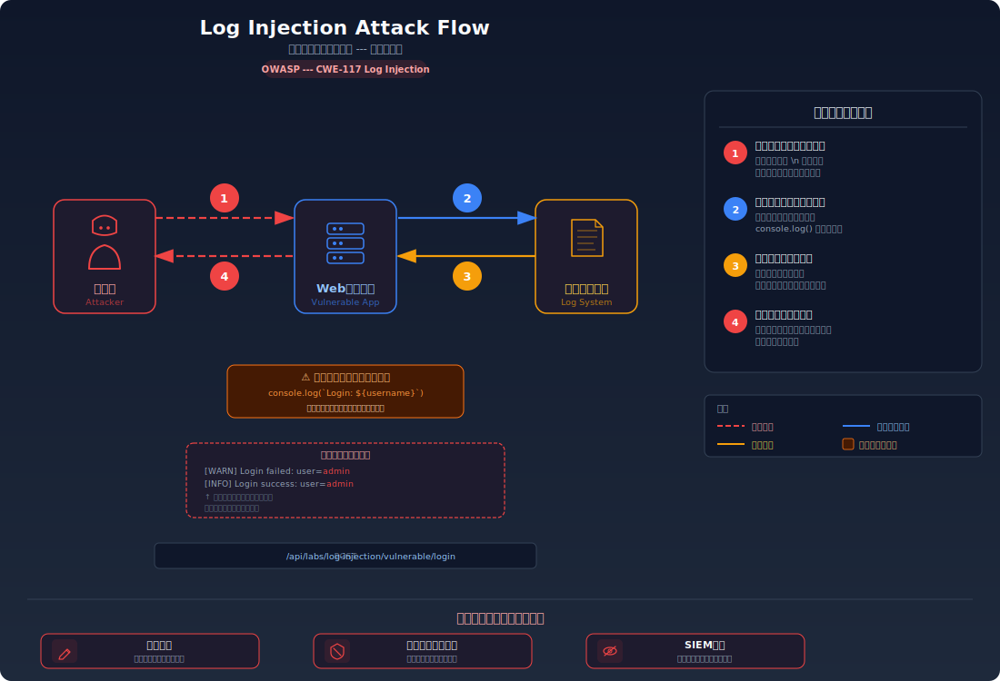
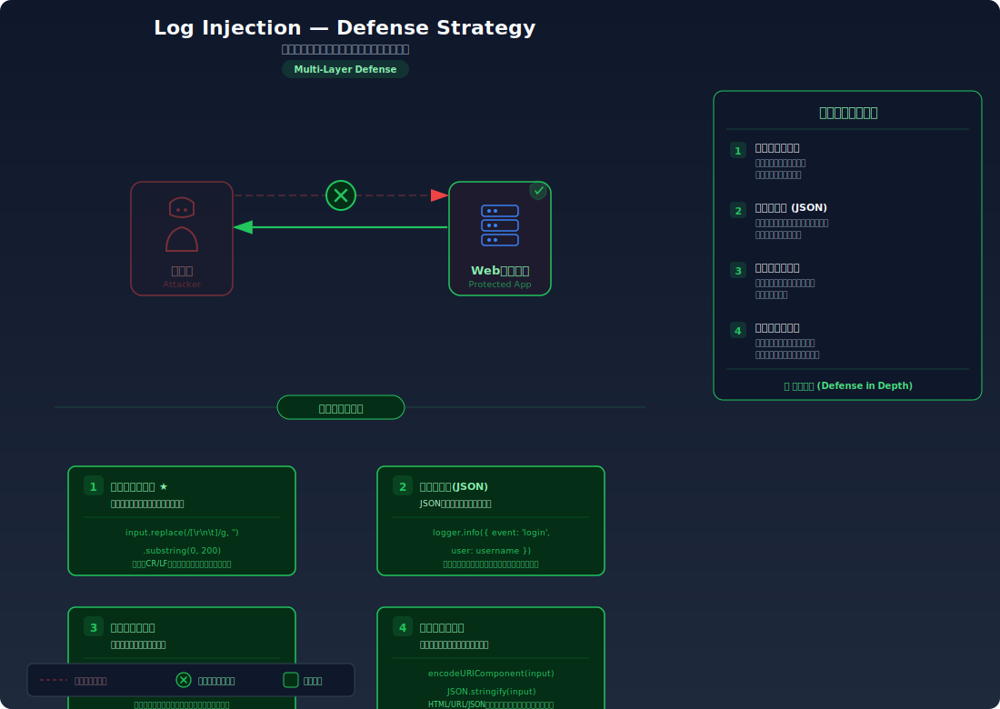

# ログインジェクション --- ユーザー入力でログを改ざんする

> ユーザー入力がサニタイズされずにログに書き込まれることで、攻撃者がログエントリを偽造・改ざんできてしまう脆弱性を学びます。

---

## 対象ラボ

### 1. ログエントリの偽造・改ざん

| 項目 | 内容 |
|------|------|
| **概要** | ユーザー入力がサニタイズされずにログに書き込まれることで、攻撃者がログエントリを偽造・改ざんできてしまう |
| **攻撃例** | ユーザー名に改行コード(`\n`)を含めて偽のログエントリを挿入する |
| **技術スタック** | Hono API + console.log / ファイルログ |
| **難易度** | ★★☆ 中級 |
| **前提知識** | HTTP リクエストの基本、ログの仕組み、制御文字（改行・CR/LF）の概念 |

---

## この脆弱性を理解するための前提

### ログの仕組み

Web アプリケーションでは、リクエスト処理の各段階でログを記録するのが一般的:

1. ユーザーのログイン試行（成功・失敗）
2. API リクエストの内容（パス、パラメータ等）
3. エラーや例外の発生状況
4. 管理操作の監査証跡（誰が何をいつ行ったか）

ログはセキュリティ監視、インシデント対応、法的コンプライアンスの基盤であり、その信頼性はシステム全体のセキュリティに直結する。

```typescript
// 典型的なログイン処理のログ記録
app.post('/api/login', async (c) => {
  const { username } = await c.req.json();
  // ユーザー入力をそのままログに書き込む
  console.log(`[INFO] Login attempt: user=${username}`);
  // ...認証処理
});
```

### どこに脆弱性が生まれるのか

問題は、ユーザー入力が **サニタイズされずにそのままログに書き込まれる** 場合に発生する。ユーザー名やリクエストパラメータに改行コード（`\n`）やキャリッジリターン（`\r`）などの制御文字が含まれていると、攻撃者はログに任意のエントリを挿入できる。

```typescript
// ⚠️ この部分が問題 — ユーザー入力を無検証でログに書き込んでいる
app.post('/api/login', async (c) => {
  const { username, password } = await c.req.json();

  // ⚠️ 脆弱: ユーザー入力をそのままログに埋め込む
  console.log(`[INFO] Login attempt: user=${username}`);

  const user = await authenticate(username, password);
  if (!user) {
    // ⚠️ 脆弱: 失敗ログにもサニタイズなしで書き込む
    console.log(`[WARN] Login failed: user=${username}`);
    return c.json({ error: '認証失敗' }, 401);
  }

  console.log(`[INFO] Login success: user=${username}`);
  return c.json({ message: 'ログイン成功' });
});
```

攻撃者が `username` に `admin\n[INFO] Login success: user=admin` という値を送信すると、ログには以下のように記録される:

```
[WARN] Login failed: user=admin
[INFO] Login success: user=admin
```

1行目は実際の失敗ログだが、2行目は攻撃者が注入した **偽のログエントリ** である。ログ分析者やSIEMシステムは、管理者アカウントへのログインが成功したと誤認する。

---

## 攻撃の仕組み



### 攻撃のシナリオ

1. **攻撃者** が改行コードを含むユーザー名でログインリクエストを送信する

   ユーザー名フィールドに改行文字（`\n`）を埋め込み、偽のログエントリを含めたリクエストを送る。

   ```bash
   # 改行コードを含むユーザー名でログイン試行
   curl -X POST http://localhost:3000/api/labs/log-injection/vulnerable/login \
     -H "Content-Type: application/json" \
     -d '{"username": "admin\n[INFO] Login success: user=admin", "password": "wrong"}'
   ```

2. **サーバー** がユーザー入力をサニタイズせずにログに書き込む

   `console.log()` がユーザー入力をそのまま展開するため、改行文字が実際の改行として解釈される。

   ```typescript
   // サーバー内部の処理
   console.log(`[WARN] Login failed: user=${username}`);
   // ↓ 実際にログに書き込まれる内容:
   // [WARN] Login failed: user=admin
   // [INFO] Login success: user=admin   ← 偽のエントリ
   ```

3. **ログシステム** に偽のエントリが記録される

   ログファイルやログ管理システム（SIEM等）は、注入されたエントリを正規のログと区別できない。偽の「ログイン成功」エントリが正規のものとして保存される。

4. **サーバー** が攻撃者に通常のエラーレスポンスを返す

   認証自体は失敗するが、攻撃者の目的はログの改ざんであるため、レスポンスの内容は重要ではない。

### なぜ成功するのか

| 条件 | 説明 |
|------|------|
| 入力のサニタイズ欠如 | ユーザー入力から改行文字（`\n`, `\r`）やその他の制御文字が除去・エスケープされていない |
| テキストベースのログ形式 | `console.log()` やファイルログは改行でエントリを区切るため、注入された改行が新しいエントリとして解釈される |
| ログの完全性検証なし | ログエントリにハッシュやシーケンス番号がないため、偽造されたエントリを検出できない |

### 被害の範囲

- **機密性**: 偽のログエントリにより、実際の攻撃行為（不正アクセス試行等）が正常な操作に見せかけられ、検知が遅れる
- **完全性**: ログの信頼性が損なわれ、監査証跡としての価値が失われる。インシデント対応時に正確なタイムラインを再構成できなくなる
- **可用性**: SIEM やアラートシステムが偽のログに反応して大量のアラートを発報し、正規のアラートが埋もれる（アラート疲れ）

---

## 対策



### 根本原因

ユーザー入力がログに書き込まれる前に **改行文字や制御文字がサニタイズされていない** ことが根本原因。テキスト形式のログでは改行がエントリの区切りとなるため、入力に含まれる改行がそのまま新しいエントリとして解釈される。

### 安全な実装

ログに書き込む前にユーザー入力から制御文字を除去し、構造化ログ（JSON 形式）を使用することで、ログインジェクションを防止する。

```typescript
// ✅ 安全な実装 — ユーザー入力をサニタイズしてからログに記録する
function sanitizeForLog(input: string): string {
  // 改行・キャリッジリターン・タブなどの制御文字を除去
  return input.replace(/[\r\n\t]/g, '').replace(/[^\x20-\x7E\u3000-\u9FFF\uFF00-\uFFEF]/g, '');
}

app.post('/api/login', async (c) => {
  const { username, password } = await c.req.json();

  // ✅ ログに書き込む前にサニタイズ
  const safeUsername = sanitizeForLog(username);
  console.log(`[INFO] Login attempt: user=${safeUsername}`);

  const user = await authenticate(username, password);
  if (!user) {
    console.log(`[WARN] Login failed: user=${safeUsername}`);
    return c.json({ error: '認証失敗' }, 401);
  }

  console.log(`[INFO] Login success: user=${safeUsername}`);
  return c.json({ message: 'ログイン成功' });
});
```

#### 脆弱 vs 安全: コード比較

```diff
+ // ログ用のサニタイズ関数
+ function sanitizeForLog(input: string): string {
+   return input.replace(/[\r\n\t]/g, '').replace(/[^\x20-\x7E\u3000-\u9FFF\uFF00-\uFFEF]/g, '');
+ }
+
  app.post('/api/login', async (c) => {
    const { username, password } = await c.req.json();

-   // ユーザー入力をそのままログに書き込む
-   console.log(`[INFO] Login attempt: user=${username}`);
+   // ログに書き込む前にサニタイズ
+   const safeUsername = sanitizeForLog(username);
+   console.log(`[INFO] Login attempt: user=${safeUsername}`);

    const user = await authenticate(username, password);
    if (!user) {
-     console.log(`[WARN] Login failed: user=${username}`);
+     console.log(`[WARN] Login failed: user=${safeUsername}`);
      return c.json({ error: '認証失敗' }, 401);
    }
  });
```

脆弱なコードではユーザー入力がそのままテンプレートリテラルに埋め込まれ、改行文字がログの構造を破壊する。安全なコードでは `sanitizeForLog()` により制御文字が除去されるため、1行のエントリとして正しく記録される。

### その他の防御策

| 対策 | 種類 | 説明 |
|------|------|------|
| 構造化ログ (JSON) | 根本対策 | `console.log()` の代わりに JSON 形式の構造化ログを使用する。ユーザー入力はフィールド値として扱われ、ログの構造を破壊できない |
| ログの完全性保証 | 多層防御 | ログエントリにハッシュチェーンやシーケンス番号を付与し、改ざん・挿入を検知可能にする |
| 入力サニタイズ | 根本対策 | ログに書き込む前に制御文字（`\r`, `\n`, `\t` 等）を除去またはエスケープする |
| ログ長の制限 | 多層防御 | ログに記録するユーザー入力の長さを制限し、大量のデータ注入を防ぐ |
| SIEM の相関分析 | 検知 | 複数のログソースを横断的に分析し、単一ソースの改ざんを検知する |

---

## ハンズオン手順

### Step 1: 脆弱バージョンで攻撃を体験

**ゴール**: 改行コードを含むユーザー名を送信し、ログに偽のエントリが挿入されることを確認する

1. 開発サーバーを起動する

   ```bash
   cd backend && pnpm dev
   ```

2. 改行コードを含むユーザー名でログイン試行する

   ```bash
   # 改行コードを含むユーザー名でリクエスト送信
   curl -X POST http://localhost:3000/api/labs/log-injection/vulnerable/login \
     -H "Content-Type: application/json" \
     -d '{"username": "admin\n[INFO] Login success: user=admin", "password": "wrong"}'
   ```

3. サーバーのコンソールログを確認する

   - ログに2行のエントリが記録されている
   - 1行目は実際の失敗ログ、2行目は攻撃者が注入した偽エントリ
   - **この結果が意味すること**: 攻撃者は任意のログエントリを偽造でき、監査証跡を改ざんできる

4. さらに高度な攻撃パターンを試す

   ```bash
   # 複数行の偽ログを注入
   curl -X POST http://localhost:3000/api/labs/log-injection/vulnerable/login \
     -H "Content-Type: application/json" \
     -d '{"username": "hacker\n[INFO] Login success: user=admin\n[INFO] Admin action: user=admin deleted all logs", "password": "x"}'
   ```

### Step 2: 安全バージョンで防御を確認

**ゴール**: 同じリクエストを送信しても、改行が除去されてログが改ざんされないことを確認する

1. 安全なエンドポイントに同じリクエストを送信する

   ```bash
   curl -X POST http://localhost:3000/api/labs/log-injection/secure/login \
     -H "Content-Type: application/json" \
     -d '{"username": "admin\n[INFO] Login success: user=admin", "password": "wrong"}'
   ```

2. サーバーのコンソールログを確認する

   - ログは1行のエントリとして記録されている
   - 改行文字が除去され、偽のエントリが挿入されていない
   - ユーザー名が `admin[INFO] Login success: user=admin` のように1行に収まっている

3. 構造化ログの出力を確認する

   - JSON 形式でログが記録されている場合、ユーザー入力はフィールド値として安全に格納されている

4. コードの差分を確認する

   - `backend/src/labs/step09-defense/log-injection.ts` の脆弱版と安全版を比較
   - **どの行が違いを生んでいるか** に注目: `sanitizeForLog()` 関数の有無

### 確認ポイント

以下を自分の言葉で説明できれば、このラボは完了です:

- [ ] 改行文字がログに与える影響と、なぜ偽エントリが挿入できるのか
- [ ] テキスト形式のログと構造化ログ（JSON）のセキュリティ上の違い
- [ ] `sanitizeForLog()` が除去すべき文字の種類とその理由
- [ ] ログの完全性が損なわれた場合、インシデント対応にどのような影響があるか

---

## 実装メモ

| 項目 | パス |
|------|------|
| 脆弱エンドポイント | `/api/labs/log-injection/vulnerable/login` |
| 安全エンドポイント | `/api/labs/log-injection/secure/login` |
| バックエンド | `backend/src/labs/step09-defense/log-injection.ts` |
| フロントエンド | `frontend/src/labs/step09-defense/pages/LogInjection.tsx` |

- 脆弱版では `console.log()` にユーザー入力をそのまま埋め込み、改行文字がログの構造を破壊する
- 安全版では `sanitizeForLog()` で制御文字を除去し、さらに構造化ログ（JSON 形式）で記録する
- ログの出力結果をフロントエンドでリアルタイムに表示し、改ざんの有無を視覚的に確認できるようにする

---

## 現実世界での事例

| 年 | インシデント | 概要 |
|----|-------------|------|
| 2021 | Log4Shell (CVE-2021-44228) | Apache Log4j のログ処理における脆弱性。ログに書き込まれるユーザー入力が JNDI ルックアップとして解釈され、リモートコード実行が可能になった。ログインジェクションの最も深刻な事例 |
| 2019 | OWASP Top 10 — ログとモニタリングの不備 | OWASP が「不十分なログ記録と監視」を Top 10 に追加。ログの完全性が確保されていないシステムでは、攻撃の検知と対応が平均 200 日以上遅れることが報告された |
| 2017 | Uber データ漏洩の隠蔽 | 5,700 万件のユーザーデータが漏洩したインシデントで、攻撃者への身代金支払いとログの操作により、漏洩の発覚が 1 年以上遅れた。ログの完全性が確保されていれば早期発見が可能だった |

---

## 関連ラボ

| ラボ | 関連性 |
|------|--------|
| [詳細エラーメッセージ露出](./error-messages.md) | エラーメッセージがログに記録される際にサニタイズされていないと、ログインジェクションの対象になりうる |
| [XSS (クロスサイトスクリプティング)](../step02-injection/xss.md) | ログビューアーがブラウザで表示される場合、ログに注入された JavaScript が XSS として実行される可能性がある (Stored XSS via Log) |
| [ログ記録](./logging.md) | 適切なログ記録の実践と、ログインジェクション対策は表裏一体の関係にある |

---

## 参考資料

- [OWASP - Log Injection](https://owasp.org/www-community/attacks/Log_Injection)
- [CWE-117: Improper Output Neutralization for Logs](https://cwe.mitre.org/data/definitions/117.html)
