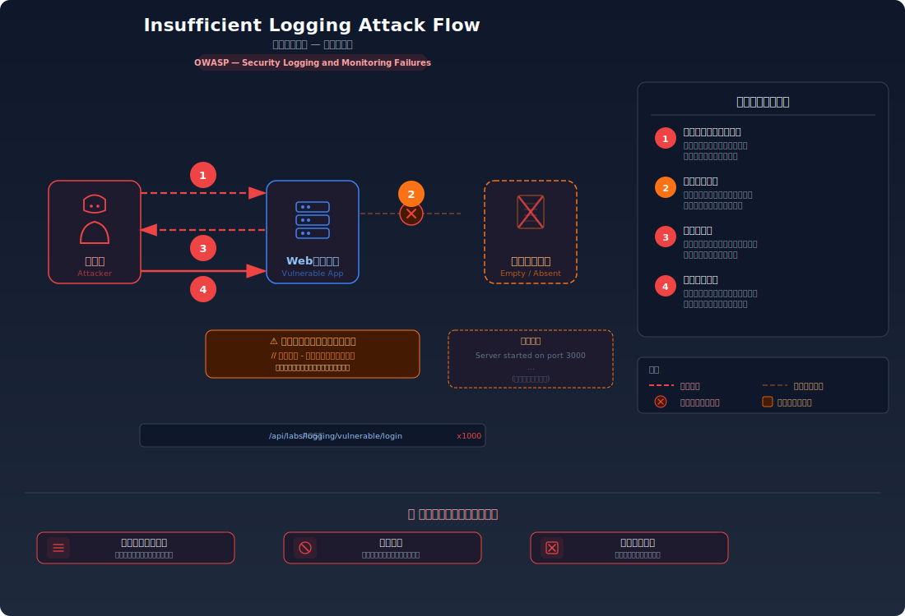
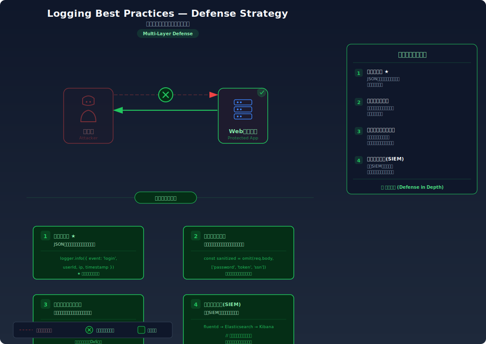

# ログなし / 不十分なログ — セキュリティイベントが記録されない

> ログイン失敗・権限エラー等のセキュリティイベントが記録されないことで、攻撃の検知・追跡が不可能になる脆弱性を学びます。

---

## 対象ラボ

| 項目 | 内容 |
|------|------|
| **概要** | セキュリティイベントの記録不備 — ログイン失敗・権限変更・不正アクセス等のセキュリティ上重要なイベントがログに記録されない |
| **攻撃例** | ブルートフォース攻撃を実行してもログに痕跡が残らない |
| **技術スタック** | Hono API |
| **難易度** | ★☆☆ 入門 |
| **前提知識** | HTTP リクエストの基本、認証の仕組み（Step 03 推奨） |

---

## この脆弱性を理解するための前提

### セキュリティログの仕組み

Web アプリケーションでは、通常のアクセスログ（リクエスト URL、ステータスコード等）とは別に、セキュリティに関わるイベントを専用のログとして記録することが求められる:

1. **認証イベント**: ログイン成功・失敗、ログアウト、パスワード変更
2. **認可イベント**: 権限変更、アクセス拒否、管理者操作
3. **データアクセス**: 機密データの参照・変更・削除
4. **異常検知**: レート制限超過、不正な入力パターン、セッション異常

OWASP は「Security Logging and Monitoring Failures」を Top 10 (A09:2021) に含めており、ログの欠如がインシデント対応を著しく遅延させると警告している。適切なログがなければ、攻撃が成功したかどうかすら判断できない。

```typescript
// 一般的なアクセスログ — これだけではセキュリティ監視に不十分
app.use('*', async (c, next) => {
  const start = Date.now();
  await next();
  const ms = Date.now() - start;
  console.log(`${c.req.method} ${c.req.path} ${c.res.status} ${ms}ms`);
});
```

上記のアクセスログでは「誰が」「何を試みたか」「なぜ失敗したか」がわからない。ブルートフォース攻撃で 1,000 回ログインに失敗しても、ログには `POST /api/login 401` が並ぶだけで、攻撃として認識するための文脈情報が欠落している。

### どこに脆弱性が生まれるのか

問題は、認証やアクセス制御のロジック内で **セキュリティイベントをログに記録する処理が存在しない** 場合に発生する。開発者はビジネスロジックの実装に集中し、ログ出力を後回しにする（あるいは完全に忘れる）ことが多い。

```typescript
// ⚠️ この部分が問題 — ログイン失敗をログに記録していない
app.post('/api/login', async (c) => {
  const { username, password } = await c.req.json();
  const user = await findUser(username);

  if (!user || !(await verifyPassword(password, user.passwordHash))) {
    // 失敗を返すだけで、誰が・いつ・何回失敗したかを記録していない
    return c.json({ error: '認証に失敗しました' }, 401);
  }

  // ログイン成功も記録していない — 不正ログインの検知ができない
  const token = generateToken(user);
  return c.json({ token });
});
```

攻撃者がブルートフォース攻撃を仕掛けても、サーバーにはその痕跡が一切残らない。管理者がインシデントに気づくのは、実害が発生してからになる。

---

## 攻撃の仕組み



### 攻撃のシナリオ

1. **攻撃者** がブルートフォース攻撃を開始する

   よく使われるパスワードリスト（rockyou.txt 等）を用いて、ターゲットユーザーのアカウントに対して大量のログイン試行を自動化する。

   ```bash
   # 攻撃ツールで大量のログイン試行を実行
   for password in $(cat wordlist.txt); do
     curl -s -X POST http://localhost:3000/api/labs/logging/vulnerable/login \
       -H "Content-Type: application/json" \
       -d "{\"username\": \"admin\", \"password\": \"$password\"}"
   done
   ```

2. **サーバー** がリクエストを処理するが、ログを一切記録しない

   各ログイン試行に対して認証チェックは行われるが、失敗イベントがログに記録されない。サーバーはリクエストを受け、`401` を返すだけの動作を黙々と繰り返す。

   ```
   # サーバーログ — 攻撃の痕跡が一切ない
   Server started on port 3000
   # ... 何も記録されない ...
   ```

3. **攻撃者** がパスワードを特定してログインに成功する

   数千回の試行の末、正しいパスワードを発見する。ログイン成功も記録されていないため、不正ログインとして検知されることがない。

4. **攻撃者** がシステム内で横展開（ラテラルムーブメント）を行う

   侵入後、他のユーザーのデータにアクセスしたり、権限昇格を試みたりする。これらの操作も記録されないため、攻撃者は長期間にわたって検知されずに活動を続けられる。

### なぜ成功するのか

| 条件 | 説明 |
|------|------|
| セキュリティイベント未記録 | ログイン失敗・成功が記録されないため、ブルートフォース攻撃のパターン（短時間に大量の失敗）を検知できない |
| アラートシステムの欠如 | ログが存在しないため、しきい値ベースのアラート（5分間に10回以上の失敗等）を設定しようがない |
| 監査証跡の不在 | 攻撃の事後分析（フォレンジック）に必要な証跡がなく、侵害の範囲・時期・経路を特定できない |

### 被害の範囲

- **機密性**: 不正ログインが検知されないため、攻撃者がユーザーのデータを長期間にわたって窃取し続けられる
- **完全性**: 侵害後のデータ改ざんがログに残らず、どのデータが改ざんされたか特定不能になる
- **可用性**: インシデント対応が遅延し、被害が拡大する。攻撃の開始時期すら不明なまま対処を迫られる

---

## 対策



### 根本原因

セキュリティ上重要なイベント（認証失敗、権限変更、データアクセス等）に対する **構造化されたログ出力が実装されていない** ことが根本原因。アクセスログだけでは「誰が」「何を試みたか」の文脈が欠落し、攻撃と正常な操作を区別できない。

### 安全な実装

セキュリティイベントを構造化 JSON 形式でログに記録し、攻撃の検知・追跡に必要な情報を含める。

```typescript
// ✅ 安全な実装 — セキュリティイベントを構造化ログとして記録する

// セキュリティログを出力するヘルパー関数
function securityLog(event: {
  type: string;          // イベント種別: 'AUTH_FAILURE', 'AUTH_SUCCESS', 'PRIVILEGE_CHANGE' 等
  username: string;      // 対象ユーザー
  ip: string;            // リクエスト元 IP
  userAgent?: string;    // User-Agent ヘッダー
  detail?: string;       // 追加情報
}) {
  const entry = {
    timestamp: new Date().toISOString(),
    level: 'SECURITY',
    ...event,
  };
  // 構造化 JSON で出力 — ログ集約ツールでパース可能
  console.log(JSON.stringify(entry));
}

app.post('/api/login', async (c) => {
  const { username, password } = await c.req.json();
  const ip = c.req.header('x-forwarded-for') || 'unknown';
  const userAgent = c.req.header('user-agent') || 'unknown';
  const user = await findUser(username);

  if (!user || !(await verifyPassword(password, user.passwordHash))) {
    // ✅ ログイン失敗を記録 — ブルートフォース検知の基礎データ
    securityLog({
      type: 'AUTH_FAILURE',
      username,
      ip,
      userAgent,
      detail: !user ? 'ユーザーが存在しない' : 'パスワード不一致',
    });
    return c.json({ error: '認証に失敗しました' }, 401);
  }

  // ✅ ログイン成功も記録 — 不正ログインの検知に必要
  securityLog({
    type: 'AUTH_SUCCESS',
    username,
    ip,
    userAgent,
  });

  const token = generateToken(user);
  return c.json({ token });
});
```

#### 記録すべきセキュリティイベント

| イベント | ログタイプ | 用途 |
|----------|-----------|------|
| ログイン失敗 | `AUTH_FAILURE` | ブルートフォース検知 |
| ログイン成功 | `AUTH_SUCCESS` | 不正ログインの追跡 |
| 権限変更 | `PRIVILEGE_CHANGE` | 権限昇格攻撃の検知 |
| アクセス拒否 | `ACCESS_DENIED` | 認可バイパスの試行検知 |
| 機密データアクセス | `DATA_ACCESS` | 情報漏洩の追跡 |
| パスワード変更 | `PASSWORD_CHANGE` | アカウント乗っ取りの検知 |

#### 脆弱 vs 安全: コード比較

```diff
  app.post('/api/login', async (c) => {
    const { username, password } = await c.req.json();
+   const ip = c.req.header('x-forwarded-for') || 'unknown';
    const user = await findUser(username);

    if (!user || !(await verifyPassword(password, user.passwordHash))) {
+     // セキュリティイベントとしてログに記録
+     securityLog({ type: 'AUTH_FAILURE', username, ip });
      return c.json({ error: '認証に失敗しました' }, 401);
    }

+   securityLog({ type: 'AUTH_SUCCESS', username, ip });
    const token = generateToken(user);
    return c.json({ token });
  });
```

脆弱なコードではログイン処理の結果が一切記録されないため、攻撃の痕跡が残らない。安全なコードでは成功・失敗の両方を構造化ログとして記録し、攻撃パターンの検知と事後分析を可能にしている。

### その他の防御策

| 対策 | 種類 | 説明 |
|------|------|------|
| 構造化セキュリティログ | 根本対策 | JSON 形式でイベントを記録し、ログ集約ツールで検索・分析可能にする |
| リアルタイムアラート | 検知 | 短時間の大量失敗など、異常パターンを検知してアラートを発報する |
| ログの保全 | 多層防御 | ログを改ざん不能な外部ストレージ（SIEM 等）に転送し、攻撃者による証拠隠滅を防ぐ |
| ログのローテーション | 運用 | ディスク容量の管理と長期保存ポリシーを設定する |
| レート制限との連携 | 多層防御 | ログに基づいてブルートフォース検知 → 自動ブロックの仕組みを構築する |

---

## ハンズオン手順

### Step 1: 脆弱バージョンで攻撃を体験

**ゴール**: ブルートフォース攻撃を実行しても、サーバーログに攻撃の痕跡が一切残らないことを確認する

1. 開発サーバーを起動する

   ```bash
   cd backend && pnpm dev
   ```

2. 複数回のログイン失敗を試みる

   ```bash
   # 異なるパスワードで連続してログインを試行
   curl -s -X POST http://localhost:3000/api/labs/logging/vulnerable/login \
     -H "Content-Type: application/json" \
     -d '{"username": "admin", "password": "password123"}'

   curl -s -X POST http://localhost:3000/api/labs/logging/vulnerable/login \
     -H "Content-Type: application/json" \
     -d '{"username": "admin", "password": "admin123"}'

   curl -s -X POST http://localhost:3000/api/labs/logging/vulnerable/login \
     -H "Content-Type: application/json" \
     -d '{"username": "admin", "password": "letmein"}'
   ```

3. サーバーのコンソール出力を確認する

   - ログイン失敗に関する記録が **一切表示されない**
   - 何回失敗しても、誰が試行しても、痕跡が残らない
   - **この結果が意味すること**: 攻撃者は検知を気にすることなく、無制限にブルートフォース攻撃を続けられる

4. ブラウザの UI からも確認する

   - `http://localhost:5173` でフロントエンドを開き、ラボページでログ出力エリアを確認する
   - 脆弱バージョンではログ欄が空のままであることを視覚的に確認する

### Step 2: 安全バージョンで防御を確認

**ゴール**: 同じ操作でセキュリティイベントが構造化ログとして記録されることを確認する

1. 安全なエンドポイントに同じリクエストを送信する

   ```bash
   curl -s -X POST http://localhost:3000/api/labs/logging/secure/login \
     -H "Content-Type: application/json" \
     -d '{"username": "admin", "password": "wrongpassword"}'
   ```

2. サーバーのコンソール出力を確認する

   - 構造化 JSON 形式でセキュリティイベントが記録されている
   - タイムスタンプ、IP アドレス、ユーザー名、イベント種別が含まれている

   ```json
   {"timestamp":"2024-01-15T10:30:45.123Z","level":"SECURITY","type":"AUTH_FAILURE","username":"admin","ip":"127.0.0.1","detail":"パスワード不一致"}
   ```

3. 正しいパスワードでログインし、成功ログも確認する

   - ログイン成功時にも `AUTH_SUCCESS` イベントが記録されることを確認する
   - 不正ログイン後の正規ログインとの比較が可能であることを理解する

4. コードの差分を確認する

   - `backend/src/labs/step09-defense/logging.ts` の脆弱版と安全版を比較
   - **どの行が違いを生んでいるか** に注目: `securityLog()` の呼び出しの有無

### 確認ポイント

以下を自分の言葉で説明できれば、このラボは完了です:

- [ ] アクセスログとセキュリティイベントログの違いは何か
- [ ] ログがない場合、ブルートフォース攻撃をどうやって検知するのか（できるのか）
- [ ] 構造化ログ（JSON 形式）が非構造化ログ（自由テキスト）より優れている理由
- [ ] ログイン成功もログに記録すべき理由は何か

---

## 実装メモ

| 項目 | パス |
|------|------|
| 脆弱エンドポイント | `/api/labs/logging/vulnerable/login` |
| 安全エンドポイント | `/api/labs/logging/secure/login` |
| バックエンド | `backend/src/labs/step09-defense/logging.ts` |
| フロントエンド | `frontend/src/labs/step09-defense/pages/Logging.tsx` |

- 脆弱版ではログイン処理の成功・失敗をログに記録しない
- 安全版では `securityLog()` ヘルパーを使い、全てのセキュリティイベントを構造化 JSON 形式で出力する
- フロントエンドではログ出力エリアを設け、脆弱版（空）と安全版（記録あり）の差を視覚的に比較できるようにする

---

## 現実世界での事例

| 年 | インシデント | 概要 |
|----|-------------|------|
| 2013 | Target | POS システムへのマルウェア感染が約 2 週間検知されず、4,000 万件のクレジットカード情報が漏洩。セキュリティ監視ツールはアラートを発報していたが、ログの監視体制が不十分で見逃された |
| 2020 | SolarWinds | サプライチェーン攻撃により約 18,000 組織が影響を受けた。攻撃者は約 9 ヶ月間検知されず活動を続けた。不十分なログ監視が長期潜伏を可能にした |
| 2021 | Colonial Pipeline | ランサムウェア攻撃により米国最大の燃料パイプラインが停止。VPN の認証ログの監視不足により、漏洩した認証情報を使った不正アクセスが検知されなかった |

---

## 関連ラボ

| ラボ | 関連性 |
|------|--------|
| [ブルートフォース](../step03-auth/brute-force.md) | ログがなければブルートフォース攻撃を検知できない。本ラボはその検知基盤を構築する |
| [ログインジェクション](./log-injection.md) | ログを記録していても、ログインジェクションにより改ざんされる可能性がある。入力値のサニタイズも必要 |
| [詳細エラーメッセージ露出](./error-messages.md) | エラーの詳細はクライアントに返さずログに記録すべき。本ラボのログ基盤はエラーログの安全な記録にも活用できる |

---

## 参考資料

- [OWASP - Logging Cheat Sheet](https://cheatsheetseries.owasp.org/cheatsheets/Logging_Cheat_Sheet.html)
- [CWE-778: Insufficient Logging](https://cwe.mitre.org/data/definitions/778.html)
- [OWASP Top 10 A09:2021 — Security Logging and Monitoring Failures](https://owasp.org/Top10/A09_2021-Security_Logging_and_Monitoring_Failures/)
