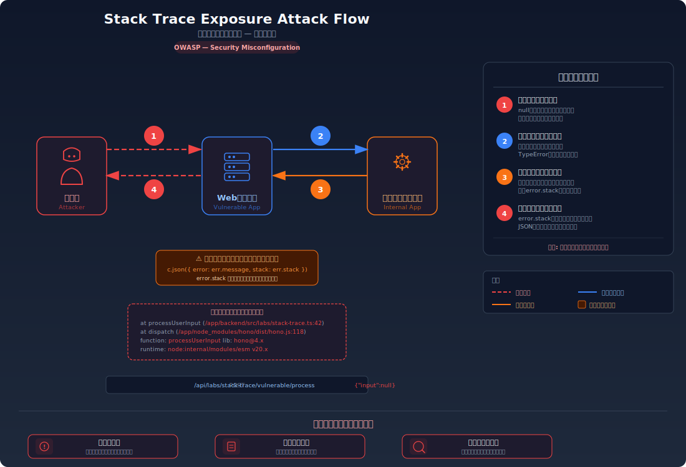
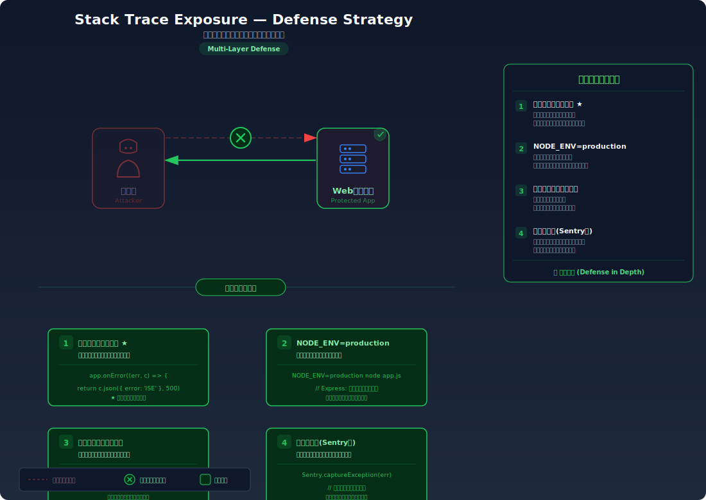

# スタックトレース漏洩 — エラー時にアプリの内部構造が丸見えになる

> エラー発生時にスタックトレースがそのままクライアントに返されることで、ファイルパス・ライブラリバージョン・内部ロジックが攻撃者に露出してしまう脆弱性を学びます。

---

## 対象ラボ

### 1. エラー時のスタックトレース公開

| 項目 | 内容 |
|------|------|
| **概要** | エラー発生時にスタックトレースがそのままクライアントに返され、ファイルパス・ライブラリバージョン・内部関数名が攻撃者に露出する |
| **攻撃例** | 不正な入力を送信してレスポンスからファイルパス・ライブラリバージョン等を取得 |
| **技術スタック** | Hono API + Node.js |
| **難易度** | ★☆☆ 入門 |
| **前提知識** | HTTP リクエストの基本、エラーレスポンスの構造、Node.js の基礎 |

---

## この脆弱性を理解するための前提

### スタックトレースとは何か

スタックトレースとは、プログラムの実行中にエラーが発生した時点での **関数の呼び出し履歴** を示す情報である。エラーがどこで、どのような経路で発生したかを一目で把握できるため、開発時のデバッグには欠かせない。

```
Error: Cannot read property 'name' of undefined
    at processUserInput (/app/backend/src/labs/step09-defense/stack-trace.ts:42:18)
    at /app/backend/src/labs/step09-defense/stack-trace.ts:28:5
    at dispatch (/app/node_modules/hono/dist/hono.js:118:23)
    at /app/node_modules/hono/dist/hono.js:95:20
    at Module.run (node:internal/modules/esm/module_job:193:25)
```

この例から読み取れる情報は多い:

1. **ファイルパス** (`/app/backend/src/labs/...`) — プロジェクトのディレクトリ構造
2. **行番号** (`:42:18`) — 脆弱なコードの正確な位置
3. **関数名** (`processUserInput`) — 内部ロジックの命名規則やビジネスロジック
4. **ライブラリ名とパス** (`hono/dist/hono.js`) — 使用フレームワークとバージョンの推定手がかり
5. **ランタイム情報** (`node:internal/modules/esm/`) — Node.js のバージョンと設定

### 開発時には有用、本番では危険

開発環境では、スタックトレースがあることで「どの関数の何行目でエラーが起きたか」を即座に特定でき、修正速度が大幅に上がる。フレームワークの多くはデフォルトで詳細なエラー情報を表示するように設計されている。

しかし、この情報が本番環境でそのままクライアントに返されると、攻撃者にとっての **偵察情報** になる。攻撃者はコードを読めなくても、スタックトレースからシステムの内部構造を逆算できてしまう。

### どこに脆弱性が生まれるのか

問題は、エラーハンドリングで `error.stack` をフィルタリングせずにクライアントへ返してしまうコードにある。開発中は便利なこの実装が、本番デプロイ後もそのまま残ることで脆弱性が生まれる。

```typescript
// ⚠️ この部分が問題 — スタックトレースをそのままクライアントに返している
app.post('/api/process', async (c) => {
  try {
    const body = await c.req.json();
    const result = processData(body.input);
    return c.json({ result });
  } catch (error) {
    // error.stack にはファイルパス・ライブラリ情報・行番号がすべて含まれる
    return c.json({
      error: error.message,
      stack: error.stack,  // ← これが問題
      timestamp: new Date().toISOString()
    }, 500);
  }
});
```

攻撃者が `{"input": null}` や空のボディを送信するだけで、スタックトレース全体がレスポンスに含まれて返される。ファイルパスからプロジェクト構成が把握でき、ライブラリ名からバージョンごとの既知の脆弱性を調査する手がかりが得られる。

---

## 攻撃の仕組み



### 攻撃のシナリオ

1. **攻撃者** が意図的にエラーを発生させるリクエストを送信する

   不正な型の値、未定義のフィールド、空のボディなど、アプリケーションが想定していない入力を送り込み、例外を発生させる。これは特別な知識を必要としない単純な操作である。

   ```bash
   # 不正なJSONを送信してエラーを誘発
   curl -X POST http://localhost:3000/api/labs/stack-trace/vulnerable/process \
     -H "Content-Type: application/json" \
     -d '{"input": null}'
   ```

2. **Webサーバー** がリクエストを処理し、内部でエラーが発生する

   アプリケーションコードは入力値のバリデーションが不十分なため、`null` や不正な型の値を処理しようとして例外をスローする。この例外にはスタックトレースが自動的に付与される。

3. **アプリケーション** の catch ブロックがスタックトレースをフィルタリングせずにレスポンスに含める

   エラーハンドラーが `error.stack` をそのままJSON レスポンスに設定してしまう。この結果、以下のような情報を含むレスポンスが生成される:

   ```json
   {
     "error": "Cannot read properties of null (reading 'trim')",
     "stack": "TypeError: Cannot read properties of null (reading 'trim')\n    at processUserInput (/app/backend/src/labs/step09-defense/stack-trace.ts:42:18)\n    at /app/backend/src/labs/step09-defense/stack-trace.ts:28:5\n    at dispatch (/app/node_modules/hono/dist/cjs/hono.js:118:23)\n    at /app/node_modules/hono/dist/cjs/compose.js:29:20",
     "timestamp": "2025-01-15T10:30:00.000Z"
   }
   ```

4. **攻撃者** がレスポンスから情報を収集し、次の攻撃を組み立てる

   - ファイルパス (`/app/backend/src/labs/step09-defense/stack-trace.ts`) からプロジェクト構造を把握
   - 内部関数名 (`processUserInput`) からビジネスロジックの構造を推測
   - ライブラリパス (`hono/dist/cjs/`) から使用フレームワークを特定し、既知の脆弱性を調査
   - 行番号 (`:42:18`) から脆弱なコードの正確な位置を特定
   - これらの情報を基に、パストラバーサルや既知の脆弱性を狙った二次攻撃を組み立てる

### なぜ成功するのか

| 条件 | 説明 |
|------|------|
| スタックトレースの未フィルタリング | `error.stack` がフィルタリングや加工なしにそのままレスポンスボディに含まれている |
| 環境による切り替えがない | `NODE_ENV` によるエラー出力の制御がなく、本番環境でも開発時と同じ詳細情報が返される |
| グローバルエラーハンドラーの欠如 | フレームワークレベルの統一的なエラーハンドラーが設定されておらず、各ルートの catch ブロックに依存している |

### 被害の範囲

- **機密性**: ファイルパス、内部関数名、ライブラリバージョン、ランタイム情報が漏洩し、攻撃者のシステム偵察を大幅に効率化する
- **完全性**: 漏洩した情報を基に、パストラバーサルや既知の脆弱性（CVE）を悪用した二次攻撃により、ファイルやデータの改ざんが可能になる
- **可用性**: 内部構造の露出により、攻撃者がアプリケーションの弱点を的確に特定し、DoS 攻撃やリソース枯渇を狙いやすくなる

---

## 対策



### 根本原因

エラー発生時に **スタックトレースを含む内部実装の詳細** がクライアント向けレスポンスとサーバー側ログの区別なく出力されていることが根本原因。開発者向けのデバッグ情報とユーザー向けのエラーメッセージが同じチャネルで送信されている。

### 安全な実装

スタックトレースを含むエラー詳細はサーバーサイドのログにのみ記録し、クライアントにはエラーIDと汎用メッセージだけを返す。エラーIDにより、運用チームはログと突き合わせて原因を特定できるため、デバッグ能力を犠牲にすることなくセキュリティを確保できる。

```typescript
// ✅ 安全な実装 — カスタムエラーハンドラーでスタックトレースを遮断
import { Hono } from 'hono';
import { randomUUID } from 'crypto';

const app = new Hono();

// グローバルエラーハンドラー: 全ての未処理例外をキャッチ
app.onError((err, c) => {
  const errorId = randomUUID();

  // 詳細はサーバーログにのみ記録（ファイルパス・行番号を含む）
  console.error(`[ERROR:${errorId}]`, {
    message: err.message,
    stack: err.stack,        // ログには記録する
    path: c.req.path,
    method: c.req.method,
  });

  // クライアントにはエラーIDと汎用メッセージのみ返す
  // NODE_ENV が development の場合のみ、メッセージを含める
  const isDev = process.env.NODE_ENV === 'development';
  return c.json({
    error: 'サーバー内部でエラーが発生しました',
    errorId,                 // 運用チームへの問い合わせ用ID
    ...(isDev && { detail: err.message }),  // 開発時のみ
  }, 500);
});

app.post('/api/process', async (c) => {
  const body = await c.req.json();
  if (!body.input || typeof body.input !== 'string') {
    // 入力バリデーション — エラーを発生させない
    return c.json({ error: 'リクエストが不正です' }, 400);
  }
  const result = processData(body.input);
  return c.json({ result });
});
```

#### 脆弱 vs 安全: コード比較

```diff
  } catch (error) {
-   // スタックトレースをそのままクライアントに返す
-   return c.json({
-     error: error.message,
-     stack: error.stack,
-   }, 500);
+   const errorId = randomUUID();
+   // 詳細はサーバーログにのみ記録
+   console.error(`[ERROR:${errorId}]`, error);
+   // クライアントにはエラーIDと汎用メッセージのみ返す
+   return c.json({
+     error: 'サーバー内部でエラーが発生しました',
+     errorId,
+   }, 500);
  }
```

脆弱なコードでは `error.stack` がそのままレスポンスに含まれ、ファイルパス・ライブラリ情報・行番号がすべて露出する。安全なコードでは `error.stack` はサーバーログにのみ記録し、クライアントにはエラーIDを返すことで、セキュリティとデバッグ能力を両立させている。

### その他の防御策

| 対策 | 種類 | 説明 |
|------|------|------|
| カスタムエラーハンドラー | 根本対策 | `app.onError()` でフレームワークレベルの統一エラーハンドラーを設定し、全ての未処理例外でスタックトレースが漏洩しないようにする |
| NODE_ENV による切り替え | 根本対策 | `NODE_ENV=production` 環境ではエラー詳細を自動的に抑制し、開発環境でのみ詳細を表示する |
| エラーID システム | 多層防御 | 各エラーにユニークIDを付与し、クライアントにはIDのみ返す。運用チームはIDでログを検索し原因特定が可能 |
| 入力バリデーション | 予防 | 不正な入力を早期に検出・拒否し、そもそもエラーを発生させない |
| エラーログ監視 | 検知 | 特定のエラーパターンの急増を監視し、攻撃の試みを早期に検知する |

---

## ハンズオン手順

### Step 1: 脆弱バージョンで攻撃を体験

**ゴール**: 不正なリクエストにより、スタックトレース（ファイルパス・内部関数名・ライブラリ情報）がレスポンスに含まれることを確認する

1. 開発サーバーを起動する

   ```bash
   cd backend && pnpm dev
   ```

2. 不正なリクエストを送信してエラーを誘発する

   ```bash
   # null を送信してスタックトレースを取得
   curl -X POST http://localhost:3000/api/labs/stack-trace/vulnerable/process \
     -H "Content-Type: application/json" \
     -d '{"input": null}'
   ```

3. 結果を確認する

   - レスポンスにスタックトレースが含まれている
   - ファイルパス (`/app/backend/src/labs/...`) からプロジェクト構成が推測できる
   - 内部関数名やライブラリ名が確認できる
   - **この結果が意味すること**: 攻撃者はエラーを誘発するだけで、アプリケーションの内部構造・使用技術・コードの配置を把握できてしまう

4. 他のパターンでも試す

   ```bash
   # 空のボディを送信
   curl -X POST http://localhost:3000/api/labs/stack-trace/vulnerable/process \
     -H "Content-Type: application/json" \
     -d '{}'

   # 型の不一致を送信
   curl -X POST http://localhost:3000/api/labs/stack-trace/vulnerable/process \
     -H "Content-Type: application/json" \
     -d '{"input": 12345}'
   ```

### Step 2: 安全バージョンで防御を確認

**ゴール**: 同じリクエストでもスタックトレースが漏洩せず、エラーIDのみ返されることを確認する

1. 安全なエンドポイントに同じリクエストを送信する

   ```bash
   curl -X POST http://localhost:3000/api/labs/stack-trace/secure/process \
     -H "Content-Type: application/json" \
     -d '{"input": null}'
   ```

2. 結果を確認する

   - 汎用的なエラーメッセージとエラーIDのみが返される
   - スタックトレース、ファイルパス、内部関数名は含まれていない
   - レスポンス例: `{"error": "サーバー内部でエラーが発生しました", "errorId": "a1b2c3d4-..."}`

3. サーバーログを確認する

   - サーバーのコンソールにはエラーの詳細（スタックトレース含む）が記録されている
   - エラーIDでログを検索すれば原因を特定できる
   - 開発者のデバッグ能力を犠牲にせず、クライアントへの情報漏洩を防いでいる

4. コードの差分を確認する

   - `backend/src/labs/step09-defense/stack-trace.ts` の脆弱版と安全版を比較
   - **どの行が違いを生んでいるか** に注目: catch ブロックでの `error.stack` の取り扱い
   - グローバルエラーハンドラー (`app.onError`) の有無による違い

### 確認ポイント

以下を自分の言葉で説明できれば、このラボは完了です:

- [ ] スタックトレースから攻撃者はどのような情報を得られるか（具体的に3つ以上）
- [ ] 開発環境と本番環境でエラーハンドリングを切り替える必要がある理由
- [ ] エラーID システムがセキュリティとデバッグをどう両立させるか
- [ ] グローバルエラーハンドラーが個別の try-catch だけよりも堅牢な理由

---

## 実装メモ

| 項目 | パス |
|------|------|
| 脆弱エンドポイント | `/api/labs/stack-trace/vulnerable/process` |
| 安全エンドポイント | `/api/labs/stack-trace/secure/process` |
| バックエンド | `backend/src/labs/step09-defense/stack-trace.ts` |
| フロントエンド | `frontend/src/labs/step09-defense/pages/StackTrace.tsx` |

- 脆弱版では catch ブロックで `error.message` と `error.stack` をそのままレスポンスに含める
- 安全版ではグローバルエラーハンドラー (`app.onError`) を使い、クライアントにはエラーIDと汎用メッセージのみを返す
- `NODE_ENV` による環境切り替えも実装し、開発環境では `detail` フィールドにメッセージを含める
- エラーIDは `crypto.randomUUID()` で生成し、サーバーログとの突き合わせに使用する

---

## 現実世界での事例

| 年 | インシデント | 概要 |
|----|-------------|------|
| 2017 | Equifax データ漏洩 | エラーページに Apache Struts のバージョン情報が含まれており、既知の脆弱性 (CVE-2017-5638) を特定する手がかりとなった。最終的に 1 億 4,700 万件の個人情報が漏洩する大規模インシデントに発展 |
| 2019 | Capital One | AWS 環境でのエラーレスポンスにスタックトレースと内部メタデータが含まれており、SSRF 攻撃の足がかりとなった。1 億件以上の個人情報が漏洩 |
| 2023 | MOVEit Transfer | ファイル転送ソフトウェアのエラーハンドリング不備により、スタックトレースからアプリケーション内部のクラス構造やDB接続情報が露出。SQL インジェクション攻撃の偵察に利用された |

---

## 関連ラボ

| ラボ | 関連性 |
|------|--------|
| [詳細エラーメッセージ露出](./error-messages.md) | スタックトレースはエラーメッセージ漏洩の一形態。本ラボではスタックトレースに特化し、error-messages ラボではDB構造やSQLクエリなどより広範な情報漏洩を扱う |
| [ヘッダー情報漏洩](../step01-recon/header-exposure.md) | HTTP レスポンスヘッダーからサーバー情報が漏洩するケース。スタックトレースと合わせて偵察に利用される |
| [SQL Injection](../step02-injection/sql-injection.md) | スタックトレースから得られたファイルパスやDB構造の情報が、SQL インジェクション攻撃を大幅に容易にする |

---

## 参考資料

- [OWASP - Improper Error Handling](https://owasp.org/www-community/Improper_Error_Handling)
- [CWE-209: Generation of Error Message Containing Sensitive Information](https://cwe.mitre.org/data/definitions/209.html)
